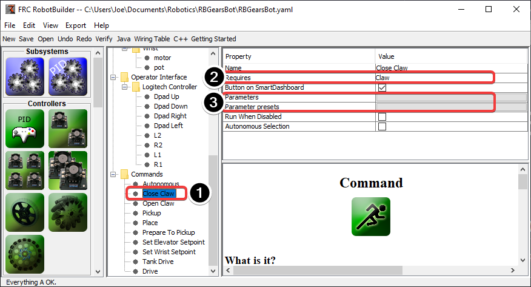
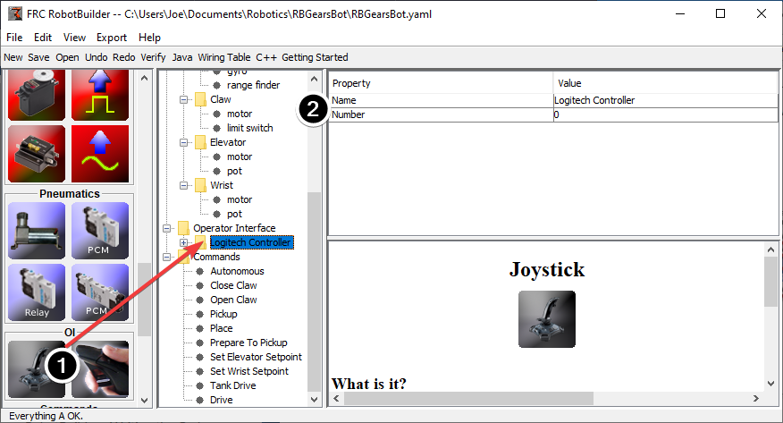
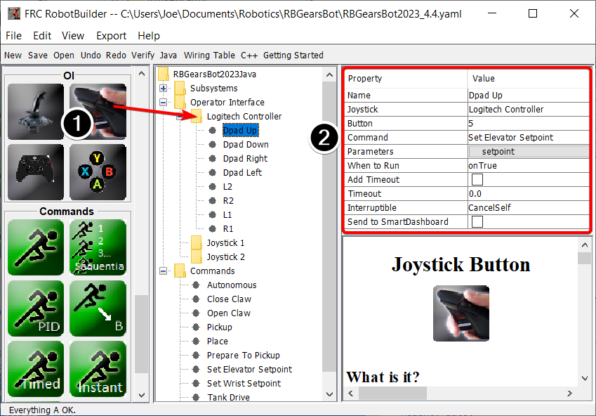

Connecting the Operator Interface to a Command
==============================================

Commands handle the behaviors for your robot. The command starts a subsystem to some operating mode like raising and elevator and continues running until it reaches some setpoint or timeout. The command then handles waiting for the subsystem to finish. That way commands can run in sequence to develop more complex behaviors.

RobotBuilder will also generate code to schedule a command to run whenever a button on your operator interface is pressed. You can also write code to run a command when a particular trigger condition has happened.

Run a Command with a Button Press
---------------------------------

In this example we want to schedule the "Close Claw" command to run whenever the dpad right direction button is pressed on a logitech gamepad (button 6) is pressed.

1. The command to run is called "Close Claw" and its function is to close the claw of the robot
2. Notice that the command requires the Claw subsystem. This will ensure that this command starts running even if there was another operation happening at the same time that used the claw. In this case the previous command would be interrupted.
3. Parameters make it possible for one command to do multiple things; presets let you define values you pass to the command and reuse them

Adding the Joystick to the Robot Program
----------------------------------------

Add the joystick to the robot program

1. Drag the joystick to the Operator Interface folder in the robot program
2. Name the joystick so that it reflects the use of the joystick and set the USB port number

Linking a Button to the "Move Elevator" Command
-----------------------------------------------

Add the button that should be pressed to the program

1. Drag the joystick button to the Joystick (Logitech Controller) so that it's under the joystick
2. Set the properties for the button: the button number, the command to run when the button is pressed, parameters the command takes, and the :guilabel:`When to run` property to :guilabel:`onTrue` to indicate that the command should run whenever the joystick button is pressed.

.. note:: Joystick buttons must be dragged to (under) a Joystick. You must have a joystick in the Operator Interface folder before adding buttons.
