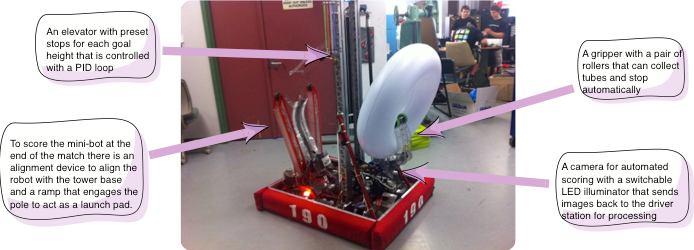
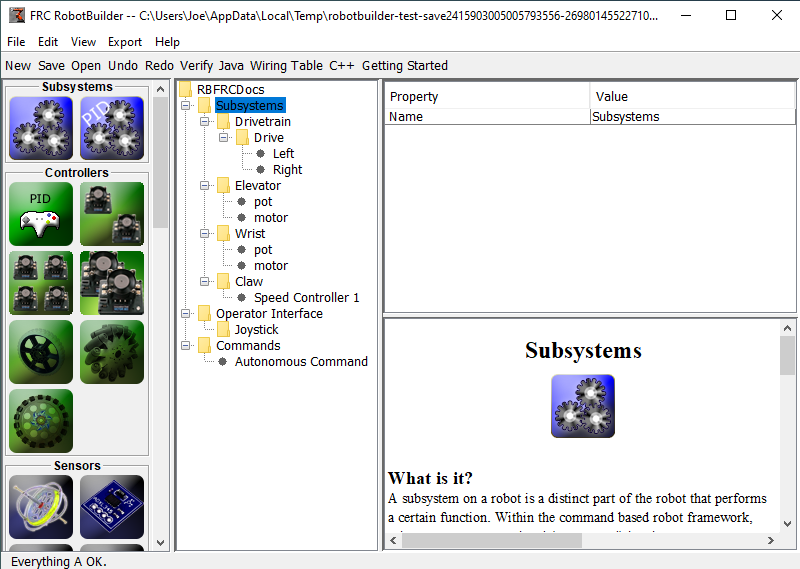
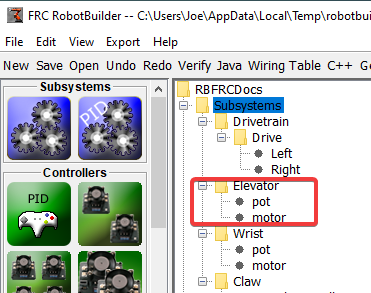
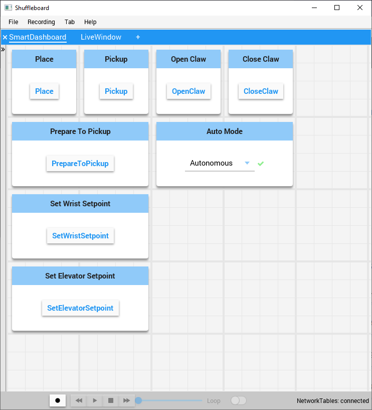
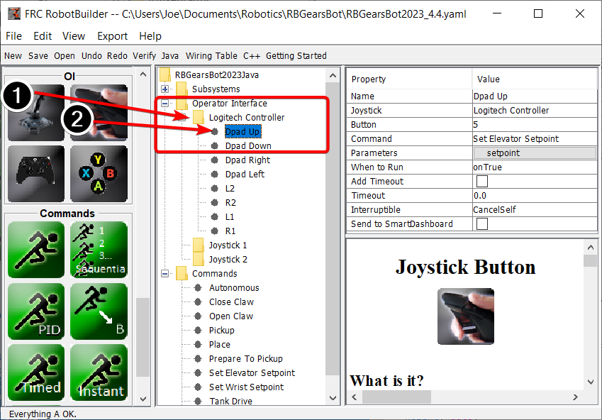
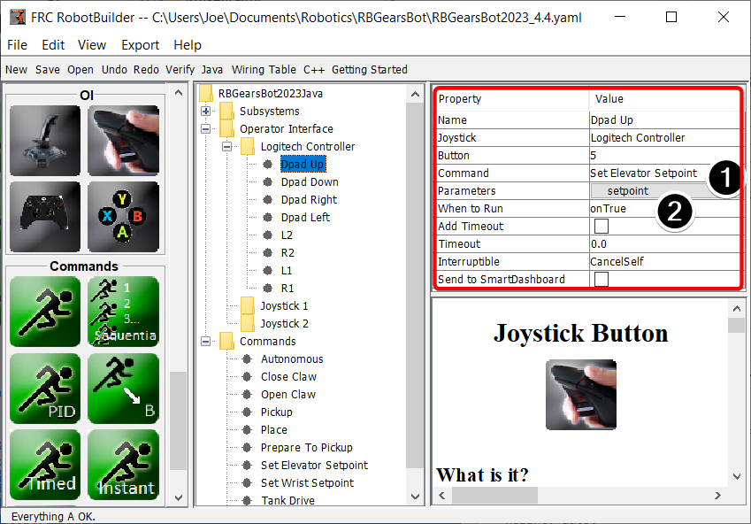
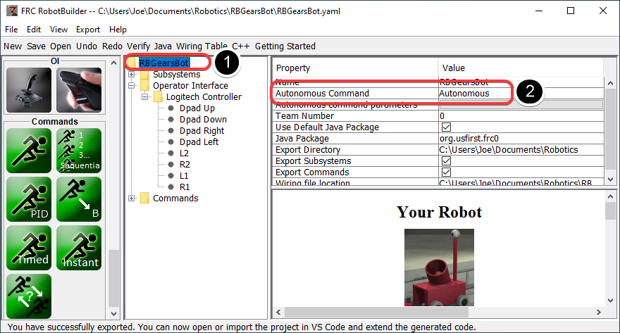
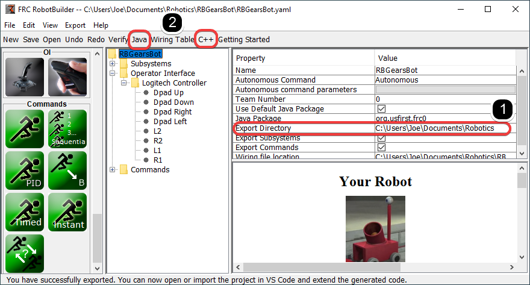

.. include:: <isonum.txt>

RobotBuilder Overview
=====================

RobotBuilder is an application designed to aid the robot development process. RobotBuilder can help you:

- Generating boilerplate code.
- Organize your robot and figure out what its key subsystems are.
- Check that you have enough channels for all of your sensors and actuators.
- Generate wiring diagrams.
- Easily modify your operator interface.
- More...

Creating a program with RobotBuilder is a very straight forward procedure by following a few steps that are the same for any robot. This lesson describes the steps that you can follow. You can find more details about each of these steps in subsequent sections of the document.

.. note:: RobotBuilder generates code using the new Command Framework. For more details on the new framework see :ref:`Command Based Programming <docs/software/commandbased/index:Command-Based Programming>`.

Divide the Robot into Subsystems
--------------------------------

Your robot is naturally made up of a number of smaller systems like the drive trains, arms, shooters, collectors, manipulators, wrist joints, etc. You should look at the design of your robot and break it up into smaller, separately operated subsystems. In this particular example there is an elevator, a minibot alignment device, a gripper, and a camera system. In addition one might include the drive base. Each of these parts of the robot are separately controlled and make good candidates for subsystems.

For more information see :doc:`Creating a Subsystem <robotbuilder-creating-subsystem>`.

Adding each Subsystem to the Project
------------------------------------

Each subsystem will be added to the "Subsystems" folder in the RobotBuilder and given a meaningful name. For each of the subsystems there are several attributes that get filled in to specify more information about the subsystems. In addition there are two types of subsystems that you might want to create:

1. PIDSubsystems - often it is desirable to control a subsystems operation with a PID controller. This is code in your program that makes the subsystem element, for example arm angle, more quickly to a desired position then stop when reaching it. PIDSubsystems have the PID Controller code built-in and are often more convenient then adding it yourself. PIDSubsystems have a sensor that determines when the device has reached the target position and an actuator (motor controller) that is driven to the setpoint.
2. Regular subsystem - these subsystems don't have an integrated PID controller and are used for subsystems without PID control for feedback or for subsystems requiring more complex control than can be handled with the default embedded PID controller.

As you look through more of this documentation the differences between the subsystem types will become more apparent.

For more information see :doc:`Creating a Subsystem <robotbuilder-creating-subsystem>` and :ref:`Writing Code for a Subsystem <docs/software/wpilib-tools/robotbuilder/writing-code/robotbuilder-writing-subsystem-code:Writing the Code for a Subsystem>`.

Adding Components to each of the Subsystems
-------------------------------------------

Each subsystem consists of a number of actuators, sensors and controllers that it uses to perform its operations. These sensors and actuators are added to the subsystem with which they are associated.  Each of the sensors and actuators comes from the RobotBuilder palette and is dragged to the appropriate subsystem. For each, there are usually other properties that must be set such as port numbers and other parameters specific to the component.

In this example there is an Elevator subsystem that uses a motor and a potentiometer (motor and pot) that have been dragged to the Elevator subsystem.

Adding Commands That Describe Subsystem Goals
---------------------------------------------

Commands are distinct goals that the robot will perform. These commands are added by dragging the command under the "Commands" folder. When creating a command, there are 7 choices (shown on the palette on the left of the picture):

- Normal commands - these are the most flexible command, you have to write all of the code to perform the desired actions necessary to accomplish the goal.
- Timed commands - these commands are a simplified version of a command that ends after a timeout
- Instant commands - these commands are a simplified version of a command that runs for one iteration and then ends
- Command groups - these commands are a combination of other commands running both in a sequential order and in parallel. Use these to build up more complicated actions after you have a number of basic commands implemented.
- Setpoint commands - setpoint commands move a PID Subsystem to a fixed setpoint, or the desired location.
- PID commands - these commands have a built-in PID controller to be used with a regular subsystem.
- Conditional commands - these commands select one of two commands to run at the time of initialization.

For more information see :doc:`Creating a Command <robotbuilder-creating-command>` and :ref:`Writing Command Code <docs/software/wpilib-tools/robotbuilder/writing-code/robotbuilder-writing-command-code:Writing the Code for a Command>`.

Testing each Command
--------------------

Each command can be run from Shuffleboard or SmartDashboard. This is useful for testing commands before you add them to the operator interface or to a command group. As long as you leave the "Button on SmartDashboard" property checked, a button will be created on the SmartDashboard. When you press the button, the command will run and you can check that it performs the desired action.

By creating buttons, each command can be tested individually. If all the commands work individually, you can be pretty sure that the robot will work as a whole.

For more information see :doc:`Testing with Smartdashboard <robotbuilder-testing-with-shuffleboard>`.

Adding Operator Interface Components
------------------------------------

The operator interface consists of joysticks, gamepads and other HID input devices. You can add operator interface components (joysticks, joystick buttons) to your program in RobotBuilder. It will automatically generate code that will initialize all of the components and allow them to be connected to commands.

The operator interface components are dragged from the palette to the "Operator Interface" folder in the RobotBuilder program. First (1) add Joysticks to the program then put buttons under the associated joysticks (2) and give them meaningful names, like ShootButton.

Connecting the Commands to the Operator Interface
-------------------------------------------------

Commands can be associated with buttons so that when a button is pressed the command is scheduled. This should, for the most part, handle most of the tele-operated part of your robot program.

This is simply done by (1) adding the command to the JoystickButton object in the RobotBuilder program, then (2) setting the condition in which the command is scheduled.

For more information see :doc:`Connecting the Operator Interface to a Command <robotbuilder-operator-interface-to-command>`.

Developing Autonomous Commands
------------------------------

Commands make it simple to develop autonomous programs. You simply specify which command should run when the robot enters the autonomous period and it will automatically be scheduled. If you have tested commands as discussed above, this should simply be a matter of choosing which command should run.

Select the robot at the root of the RobotBuilder project (1), then edit the Autonomous Command property (2) to choose the command to run. It's that simple!

For more information see :doc:`Setting the Autonomous Commands <robotbuilder-autonomous-command>`.

Generating Code
---------------

At any point in the process outlined above you can have RobotBuilder generate a C++ or Java program that will represent the project you have created. This is done by specifying the location of the project in the project properties (1), then clicking the appropriate toolbar button to generate the code (2).

For more information see :ref:`Generating RobotBuilder Code <docs/software/wpilib-tools/robotbuilder/writing-code/robotbuilder-generating-code:Generating Code for a Project>`.
