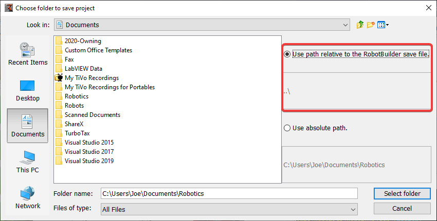

Setting up the Robot Project
============================

The RobotBuilder program has some default properties that need to be set up so the generated program and other generated files work properly. This setup information is stored in the properties for robot description (the first line).

Robot Project Properties
------------------------

The properties that describe the robot are:

* **Name** - The name of the robot project that is created

* **Autonomous Command** - the command that will run by default when the program is placed in autonomous mode

* **Autonomous Command Parameters** - Parameters for the Autonomous Command

* **Team Number** - The team number for the project, which will be used to locate the robot when deploying code.

* **Use Default Java Package** - If checked RobotBuilder will use the default package (frc.robot). Otherwise you can specify a custom package name to be used.

* **Java Package** - The name of the generated Java package used when generating the project code

* **Export Directory** - The folder that the project is generated into when Export to Java or C++ is selected

* **Export Subsystems** - Checked if RobotBuilder should export the Subsystem classes from your project

* **Export Commands** - Checked if RobotBuilder should export the Command classes from your project

* **Wiring File location** - the location of the html file to generate that contains the wiring diagram for your robot

* **Desktop Support** - Enables unit test and simulation. While WPILib supports this, third party software libraries may not. If libraries do not support desktop, then your code may not compile or may crash. It should be left unchecked unless unit testing or simulation is needed and all libraries support it.

Using Source Control with the RobotBuilder Project
--------------------------------------------------

When using source control the project will typically be used on a number of computers and the path to the project directory might be different from one users computer to another. If the RobotBuilder project file is stored using an absolute path, it will typically contain the user name and won't be usable across multiple computers. To make this work, select "relative path" and specify the path as an directory offset from the project files. In the above example, the project file is stored in the folder just above the project files in the file hierarchy. In this case, the user name is not part of the path and it will be portable across all of your computers.
