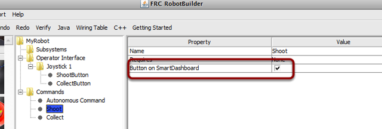

Using Shuffleboard to Test a Command
====================================

Commands are easily tested by adding a button to Shuffleboard/SmartDashboard to trigger the command. In this way, no integration with the rest of the robot program is necessary and commands can easily be independently tested. This is the easiest way to verify commands since with a single line of code in your program, a button can be created on Shuffleboard that will run the command. These buttons can then be left in place to verify subsystems and command operations in the future.

This has the added benefit of accommodating multiple programmers, each writing commands. As the code is checked into the main robot project, the commands can be individually tested.

Creating the Button on Shuffleboard
-----------------------------------

The button is created on the SmartDashboard by putting an instance of the command from the robot program to the dashboard. This is such a common operation that it has been added to RobotBuilder as a checkbox. When writing your commands, be sure that the box is checked, and buttons will be automatically generated for you.

Operating the Buttons
---------------------

.. image:: images/robotbuilder-overview-4.png
   :alt: Each of the created buttons has its own widget in Shuffleboard.

The buttons will be generated automatically and will appear on the dashboard screen. You can rearrange the buttons on Shuffleboard. In this example there are a number of commands, each with an associated button for testing. Pressing the commands button will run the command. Once it is pressed, pressing again it will interrupt the command causing the ``Interrupted()`` method to be called.

Adding Commands Manually
------------------------

.. tabs::

   .. code-tab:: java

      SmartDashboard.putData("Autonomous Command", new AutonomousCommand());
      SmartDashboard.putData("Open Claw", new OpenClaw(m_claw);
      SmartDashboard.putData("Close Claw", new CloseClaw(m_claw));

   .. code-tab:: cpp

      SmartDashboard::PutData("Autonomous Command", new AutonomousCommand());
      SmartDashboard::PutData("Open Claw", new OpenClaw(&m_claw));
      SmartDashboard::PutData("Close Claw", new CloseClaw(&m_claw));

Commands can be added to the Shuffleboard manually by writing the code yourself. This is done by passing instances of the command to the PutData method along with the name that should be associated with the button on the Shuffleboard. These instances are scheduled whenever the button is pressed. The result is exactly the same as RobotBuilder generated code, although clicking the checkbox in RobotBuilder is much easier than writing all the code by hand.
