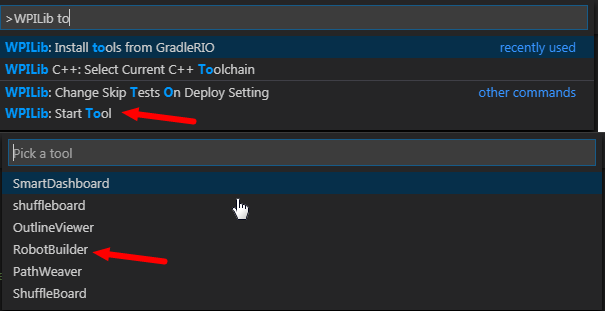
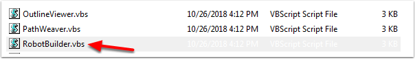

Starting RobotBuilder
=====================

.. note:: RobotBuilder is a Java program and as such should be able to run on any platform that is supported by Java. We have been running RobotBuilder on macOS, Windows, and various versions of Linux successfully.

Getting RobotBuilder
--------------------

RobotBuilder is downloaded as part of the WPILib Offline Installer. For more information, see the :ref:`Windows/macOS/Linux installation guides <docs/zero-to-robot/step-2/wpilib-setup:WPILib Installation Guide>`

Option 1 - Starting from Visual Studio Code
-------------------------------------------

Press :kbd:`Ctrl+Shift+P` and type "WPILib" or click the WPILib logo in the top right to launch the WPILib Command Palette.  Select :guilabel:`Start Tool`, then select :guilabel:`Robot Builder`.

Option 2 - Shortcuts
--------------------

Shortcuts are installed to the Windows Start Menu and the ``2023 WPILib Tools`` folder on the desktop.

Option 3 - Running from the Script
----------------------------------

The install process installs the tools to ``~/wpilib/YYYY/tools`` (where YYYY is the year and ~ is ``C:\Users\Public`` on Windows).

Inside this folder you will find ``.vbs`` (Windows) and ``.py`` (macOS/Linux) files that you can use to launch each tool. These scripts help launch the tools using the correct JDK and are what you should use to launch the tools.
