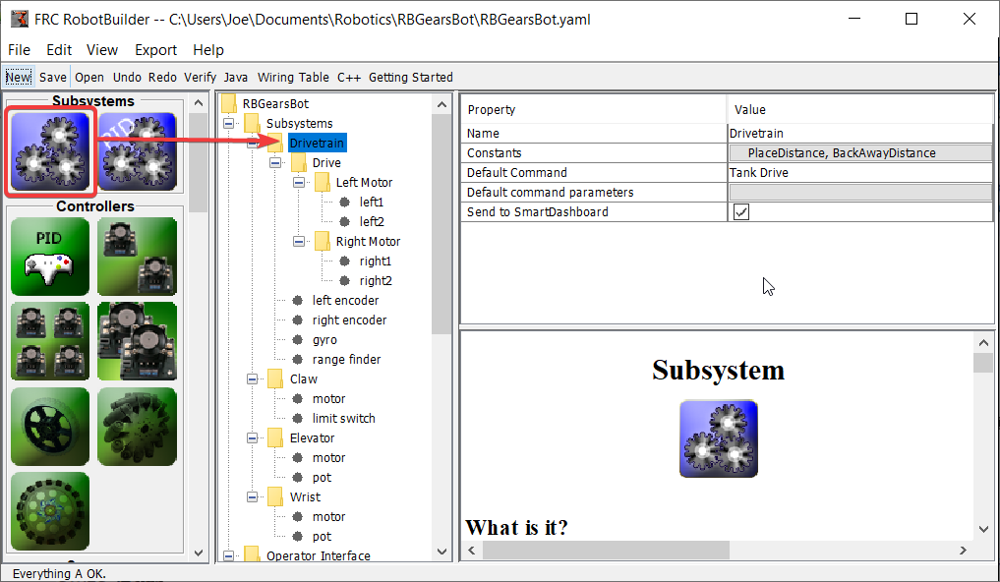
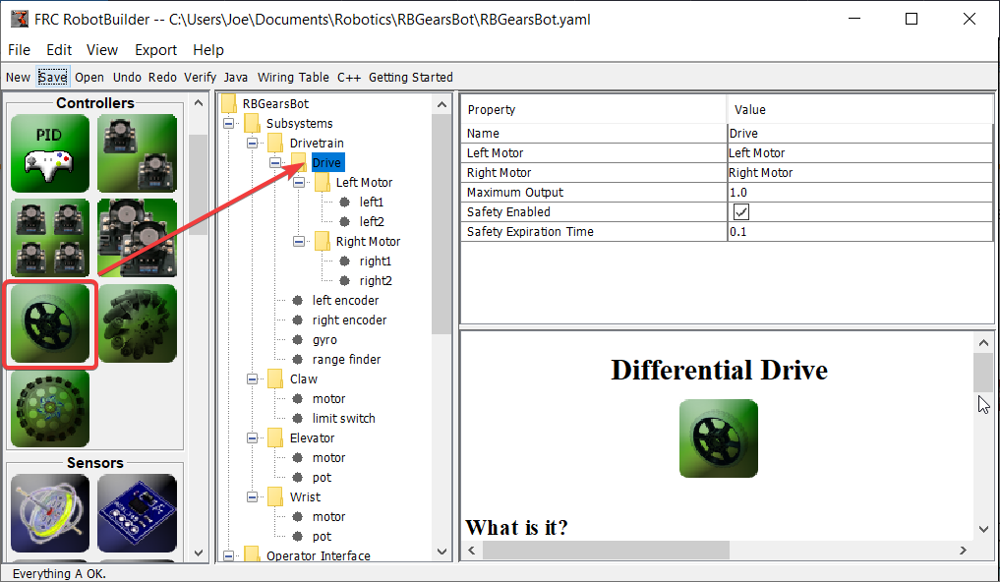
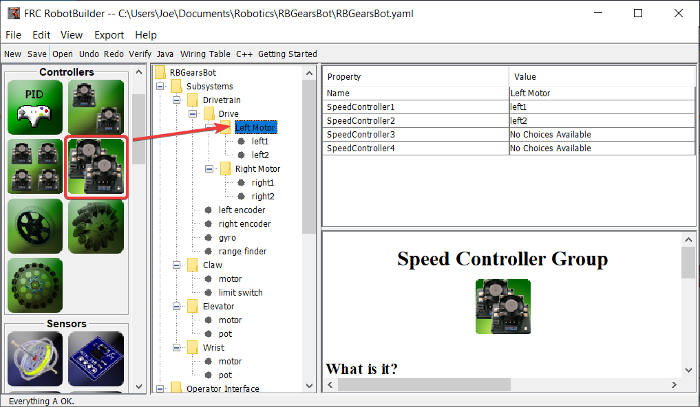
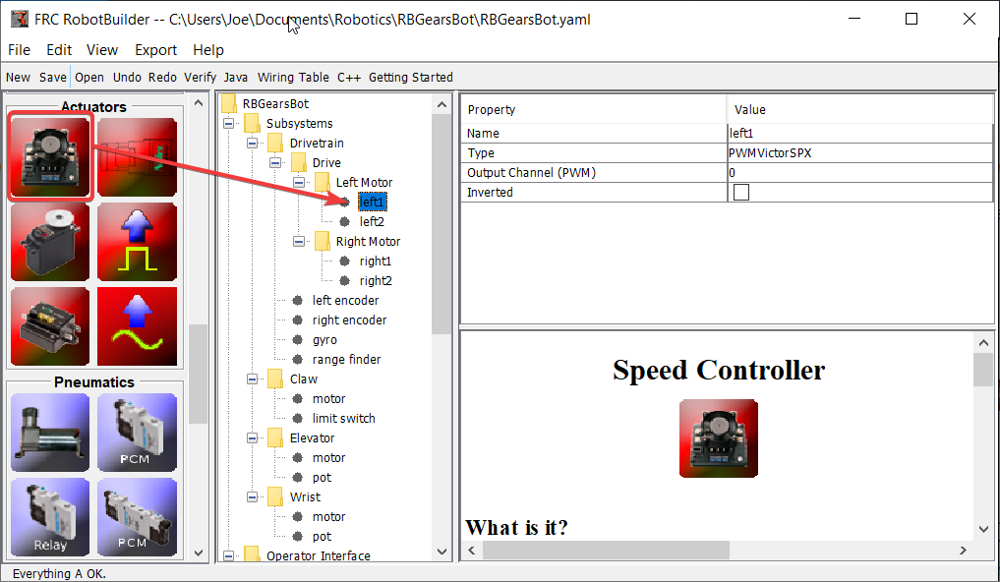
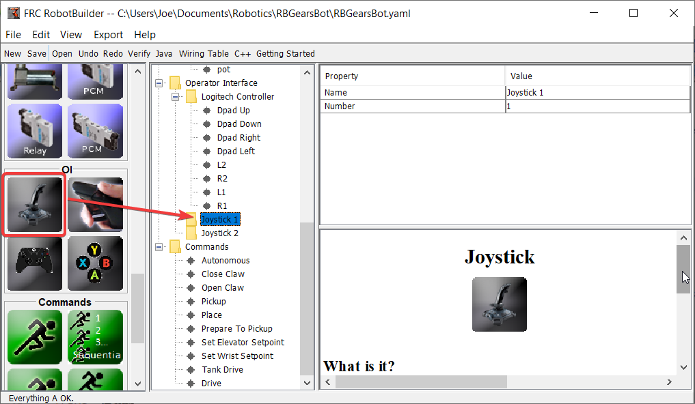
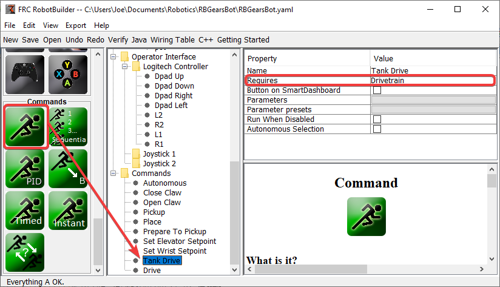
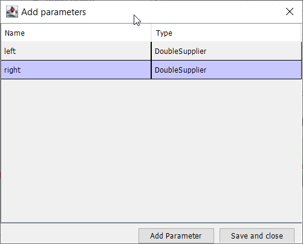
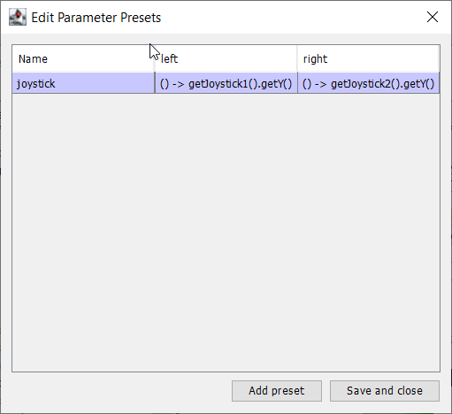
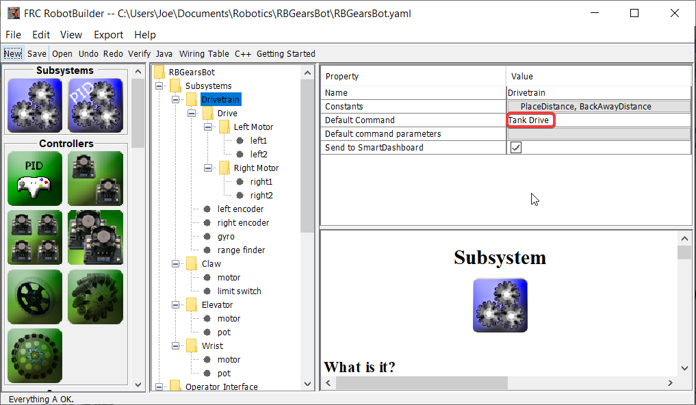
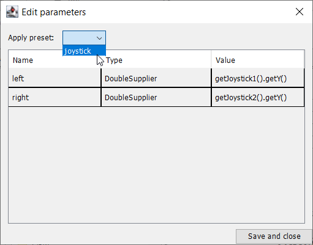

Driving the Robot with Tank Drive and Joysticks
===============================================

A common use case is to have a joystick that should drive some actuators that are part of a subsystem. The problem is that the joystick is created in the RobotContainer class and the motors to be controlled are in the subsystem. The idea is to create a command that, when scheduled, reads input from the joystick and calls a method that is created on the subsystem that drives the motors.

In this example a drive base subsystem is shown that is operated in tank drive using a pair of joysticks.

Create a Drive Train Subsystem
------------------------------

Create a subsystem called Drive Train. Its responsibility will be to handle the driving for the robot base.

Inside the Drive Train create a Differential Drive object for a two motor drive. There is a left motor and right motor as part of the Differential Drive class.

Since we want to use more then two motors to drive the robot, inside the Differential Drive, create two Motor Controller Groups. These will group multiple motor controllers so they can be used with Differential Drive.

Finally, create two Motor Controllers in each Motor Controller Group.

Add the Joysticks to the Operator Interface
-------------------------------------------

Add two joysticks to the Operator Interface, one is the left stick and the other is the right stick. The y-axis on the two joysticks are used to drive the robots left and right sides.

.. note:: Be sure to export your program to C++ or Java before continuing to the next step.

Create a Method to Write the Motors on the Subsystem
----------------------------------------------------

.. tabs::

   .. group-tab:: java

      .. code-block:: java
         :linenos:
         :lineno-start: 11
         :emphasize-lines: 119-121

         // ROBOTBUILDER TYPE: Subsystem.

         package frc.robot.subsystems;

         import frc.robot.commands.*;
         import edu.wpi.first.wpilibj.livewindow.LiveWindow;
         import edu.wpi.first.wpilibj2.command.SubsystemBase;

         // BEGIN AUTOGENERATED CODE, SOURCE=ROBOTBUILDER ID=IMPORTS
         import edu.wpi.first.wpilibj.AnalogGyro;
         import edu.wpi.first.wpilibj.AnalogInput;
         import edu.wpi.first.wpilibj.CounterBase.EncodingType;
         import edu.wpi.first.wpilibj.Encoder;
         import edu.wpi.first.wpilibj.drive.DifferentialDrive;
         import edu.wpi.first.wpilibj.motorcontrol.MotorController;
         import edu.wpi.first.wpilibj.motorcontrol.MotorControllerGroup;
         import edu.wpi.first.wpilibj.motorcontrol.PWMVictorSPX;

             // END AUTOGENERATED CODE, SOURCE=ROBOTBUILDER ID=IMPORTS

         /**
          *
          */
         public class Drivetrain extends SubsystemBase {
             // BEGIN AUTOGENERATED CODE, SOURCE=ROBOTBUILDER ID=CONSTANTS
         public static final double PlaceDistance = 0.1;
         public static final double BackAwayDistance = 0.6;

             // END AUTOGENERATED CODE, SOURCE=ROBOTBUILDER ID=CONSTANTS

             // BEGIN AUTOGENERATED CODE, SOURCE=ROBOTBUILDER ID=DECLARATIONS
         private PWMVictorSPX left1;
         private PWMVictorSPX left2;
         private MotorControllerGroup leftMotor;
         private PWMVictorSPX right1;
         private PWMVictorSPX right2;
         private MotorControllerGroup rightMotor;
         private DifferentialDrive drive;
         private Encoder leftencoder;
         private Encoder rightencoder;
         private AnalogGyro gyro;
         private AnalogInput rangefinder;

             // END AUTOGENERATED CODE, SOURCE=ROBOTBUILDER ID=DECLARATIONS

             /**
             *
             */
             public Drivetrain() {
                 // BEGIN AUTOGENERATED CODE, SOURCE=ROBOTBUILDER ID=CONSTRUCTORS
         left1 = new PWMVictorSPX(0);
          addChild("left1",left1);
          left1.setInverted(false);

         left2 = new PWMVictorSPX(1);
          addChild("left2",left2);
          left2.setInverted(false);

         leftMotor = new MotorControllerGroup(left1, left2  );
          addChild("Left Motor",leftMotor);

         right1 = new PWMVictorSPX(5);
          addChild("right1",right1);
          right1.setInverted(false);

         right2 = new PWMVictorSPX(6);
          addChild("right2",right2);
          right2.setInverted(false);

         rightMotor = new MotorControllerGroup(right1, right2  );
          addChild("Right Motor",rightMotor);

         drive = new DifferentialDrive(leftMotor, rightMotor);
          addChild("Drive",drive);
          drive.setSafetyEnabled(true);
         drive.setExpiration(0.1);
         drive.setMaxOutput(1.0);

         leftencoder = new Encoder(0, 1, false, EncodingType.k4X);
          addChild("left encoder",leftencoder);
          leftencoder.setDistancePerPulse(1.0);

         rightencoder = new Encoder(2, 3, false, EncodingType.k4X);
          addChild("right encoder",rightencoder);
          rightencoder.setDistancePerPulse(1.0);

         gyro = new AnalogGyro(0);
          addChild("gyro",gyro);
          gyro.setSensitivity(0.007);

         rangefinder = new AnalogInput(1);
          addChild("range finder", rangefinder);

             // END AUTOGENERATED CODE, SOURCE=ROBOTBUILDER ID=CONSTRUCTORS
             }

             @Override
             public void periodic() {
                 // This method will be called once per scheduler run

             }

             @Override
             public void simulationPeriodic() {
                 // This method will be called once per scheduler run when in simulation

             }

             // Put methods for controlling this subsystem
             // here. Call these from Commands.

             public void drive(double left, double right) {
                 drive.tankDrive(left, right);
             }
         }

   .. group-tab:: C++ (Header)

      .. code-block:: c++
         :linenos:
         :lineno-start: 11
         :emphasize-lines: 43

         // ROBOTBUILDER TYPE: Subsystem.
         #pragma once

         // BEGIN AUTOGENERATED CODE, SOURCE=ROBOTBUILDER ID=INCLUDES
         #include <frc2/command/SubsystemBase.h>
         #include <frc/AnalogGyro.h>
         #include <frc/AnalogInput.h>
         #include <frc/Encoder.h>
         #include <frc/drive/DifferentialDrive.h>
         #include <frc/motorcontrol/MotorControllerGroup.h>
         #include <frc/motorcontrol/PWMVictorSPX.h>

         // END AUTOGENERATED CODE, SOURCE=ROBOTBUILDER ID=INCLUDES

         /**
          *
          *
          * @author ExampleAuthor
          */
         class Drivetrain: public frc2::SubsystemBase {
         private:
             // It's desirable that everything possible is private except
             // for methods that implement subsystem capabilities
             // BEGIN AUTOGENERATED CODE, SOURCE=ROBOTBUILDER ID=DECLARATIONS
         frc::AnalogInput m_rangefinder{1};
         frc::AnalogGyro m_gyro{0};
         frc::Encoder m_rightencoder{2, 3, false, frc::Encoder::k4X};
         frc::Encoder m_leftencoder{0, 1, false, frc::Encoder::k4X};
         frc::DifferentialDrive m_drive{m_leftMotor, m_rightMotor};
         frc::MotorControllerGroup m_rightMotor{m_right1, m_right2  };
         frc::PWMVictorSPX m_right2{6};
         frc::PWMVictorSPX m_right1{5};
         frc::MotorControllerGroup m_leftMotor{m_left1, m_left2  };
         frc::PWMVictorSPX m_left2{1};
         frc::PWMVictorSPX m_left1{0};

             // END AUTOGENERATED CODE, SOURCE=ROBOTBUILDER ID=DECLARATIONS
         public:
         Drivetrain();

             void Periodic() override;
             void SimulationPeriodic() override;
             void Drive(double left, double right);
             // BEGIN AUTOGENERATED CODE, SOURCE=ROBOTBUILDER ID=CMDPIDGETTERS

             // END AUTOGENERATED CODE, SOURCE=ROBOTBUILDER ID=CMDPIDGETTERS
             // BEGIN AUTOGENERATED CODE, SOURCE=ROBOTBUILDER ID=CONSTANTS
         static constexpr const double PlaceDistance = 0.1;
         static constexpr const double BackAwayDistance = 0.6;

             // END AUTOGENERATED CODE, SOURCE=ROBOTBUILDER ID=CONSTANTS

         };

   .. group-tab:: C++ (Source)

      .. code-block:: c++
         :linenos:
         :lineno-start: 11
         :emphasize-lines: 71-73

         // ROBOTBUILDER TYPE: Subsystem.

         // BEGIN AUTOGENERATED CODE, SOURCE=ROBOTBUILDER ID=INCLUDES
         #include "subsystems/Drivetrain.h"
         #include <frc/smartdashboard/SmartDashboard.h>

         // END AUTOGENERATED CODE, SOURCE=ROBOTBUILDER ID=INCLUDES

         Drivetrain::Drivetrain(){
             SetName("Drivetrain");
             // BEGIN AUTOGENERATED CODE, SOURCE=ROBOTBUILDER ID=DECLARATIONS
             SetSubsystem("Drivetrain");

          AddChild("range finder", &m_rangefinder);

          AddChild("gyro", &m_gyro);
          m_gyro.SetSensitivity(0.007);

          AddChild("right encoder", &m_rightencoder);
          m_rightencoder.SetDistancePerPulse(1.0);

          AddChild("left encoder", &m_leftencoder);
          m_leftencoder.SetDistancePerPulse(1.0);

          AddChild("Drive", &m_drive);
          m_drive.SetSafetyEnabled(true);
         m_drive.SetExpiration(0.1_s);
         m_drive.SetMaxOutput(1.0);

          AddChild("Right Motor", &m_rightMotor);

          AddChild("right2", &m_right2);
          m_right2.SetInverted(false);

          AddChild("right1", &m_right1);
          m_right1.SetInverted(false);

          AddChild("Left Motor", &m_leftMotor);

          AddChild("left2", &m_left2);
          m_left2.SetInverted(false);

          AddChild("left1", &m_left1);
          m_left1.SetInverted(false);

             // END AUTOGENERATED CODE, SOURCE=ROBOTBUILDER ID=DECLARATIONS
         }

         void Drivetrain::Periodic() {
             // Put code here to be run every loop

         }

         void Drivetrain::SimulationPeriodic() {
             // This method will be called once per scheduler run when in simulation

         }

         // BEGIN AUTOGENERATED CODE, SOURCE=ROBOTBUILDER ID=CMDPIDGETTERS

         // END AUTOGENERATED CODE, SOURCE=ROBOTBUILDER ID=CMDPIDGETTERS

         // Put methods for controlling this subsystem
         // here. Call these from Commands.

             void Drivetrain::Drive(double left, double right) {
                 m_drive.TankDrive(left, right);
             }

Create a method that takes the joystick inputs, in this case the left and right driver joystick. The values are passed to the DifferentialDrive object that in turn does tank steering using the joystick values. Also create a method called stop() that stops the robot from driving, this might come in handy later.

.. note:: Some RobotBuilder output has been removed for this example for clarity

Read Joystick Values and Call the Subsystem Methods
---------------------------------------------------

Create a command, in this case called Tank Drive. Its purpose will be to read the joystick values and send them to the Drive Base subsystem. Notice that this command Requires the Drive Train subsystem. This will cause it to stop running whenever anything else tries to use the Drive Train.

Create two parameters (``DoubleSupplier`` for Java or ``std::function<double()>`` for C++) for the left and right speeds.

Create a parameter preset to retrive joystick values. Java: For the left parameter enter ``() -> getJoystick1().getY()`` and for right enter ``() -> getJoystick2().getY()``. C++: For the left parameter enter ``[this] {return getJoystick1()->GetY();}`` and for the right enter ``[this] {return getJoystick2()->GetY();}``

.. note:: Be sure to export your program to C++ or Java before continuing to the next step.

Add the Code to do the Driving
------------------------------

.. tabs::

   .. group-tab:: java

      .. code-block:: java
         :linenos:
         :lineno-start: 11
         :emphasize-lines: 48, 54

         // ROBOTBUILDER TYPE: Command.

         package frc.robot.commands;
         import edu.wpi.first.wpilibj.Joystick;
         import edu.wpi.first.wpilibj2.command.CommandBase;
         import frc.robot.RobotContainer;
         // BEGIN AUTOGENERATED CODE, SOURCE=ROBOTBUILDER ID=IMPORTS
         import frc.robot.subsystems.Drivetrain;

             // END AUTOGENERATED CODE, SOURCE=ROBOTBUILDER ID=IMPORTS

         /**
          *
          */
         public class TankDrive extends CommandBase {

             // BEGIN AUTOGENERATED CODE, SOURCE=ROBOTBUILDER ID=VARIABLE_DECLARATIONS
                 private final Drivetrain m_drivetrain;

             // END AUTOGENERATED CODE, SOURCE=ROBOTBUILDER ID=VARIABLE_DECLARATIONS

             // BEGIN AUTOGENERATED CODE, SOURCE=ROBOTBUILDER ID=CONSTRUCTORS

             public TankDrive(Drivetrain subsystem) {

             // END AUTOGENERATED CODE, SOURCE=ROBOTBUILDER ID=CONSTRUCTORS
                 // BEGIN AUTOGENERATED CODE, SOURCE=ROBOTBUILDER ID=VARIABLE_SETTING

             // END AUTOGENERATED CODE, SOURCE=ROBOTBUILDER ID=VARIABLE_SETTING
                 // BEGIN AUTOGENERATED CODE, SOURCE=ROBOTBUILDER ID=REQUIRES

                 m_drivetrain = subsystem;
                 addRequirements(m_drivetrain);

             // END AUTOGENERATED CODE, SOURCE=ROBOTBUILDER ID=REQUIRES
             }

             // Called when the command is initially scheduled.
             @Override
             public void initialize() {
             }

             // Called every time the scheduler runs while the command is scheduled.
             @Override
             public void execute() {
                 m_drivetrain.drive(m_left.getAsDouble(), m_right.getAsDouble());
             }

             // Called once the command ends or is interrupted.
             @Override
             public void end(boolean interrupted) {
                 m_drivetrain.drive(0.0, 0.0);
             }

             // Returns true when the command should end.
             @Override
             public boolean isFinished() {
                 return false;
             }

             @Override
             public boolean runsWhenDisabled() {
                 // BEGIN AUTOGENERATED CODE, SOURCE=ROBOTBUILDER ID=DISABLED
                 return false;

             // END AUTOGENERATED CODE, SOURCE=ROBOTBUILDER ID=DISABLED
             }
         }

   .. group-tab:: C++ (Header)

      .. code-block:: c++
         :linenos:
         :lineno-start: 11
         :emphasize-lines: 40-41

         // ROBOTBUILDER TYPE: Command.

         #pragma once

             // BEGIN AUTOGENERATED CODE, SOURCE=ROBOTBUILDER ID=INCLUDES

         #include <frc2/command/CommandHelper.h>
         #include <frc2/command/CommandBase.h>

         #include "subsystems/Drivetrain.h"

             // END AUTOGENERATED CODE, SOURCE=ROBOTBUILDER ID=INCLUDES
         #include "RobotContainer.h"
         #include <frc/Joystick.h>

         /**
          *
          *
          * @author ExampleAuthor
          */
         class TankDrive: public frc2::CommandHelper<frc2::CommandBase, TankDrive> {
         public:
             // BEGIN AUTOGENERATED CODE, SOURCE=ROBOTBUILDER ID=CONSTRUCTOR
             explicit TankDrive(Drivetrain* m_drivetrain);

             // END AUTOGENERATED CODE, SOURCE=ROBOTBUILDER ID=CONSTRUCTOR

         void Initialize() override;
         void Execute() override;
         bool IsFinished() override;
         void End(bool interrupted) override;
         bool RunsWhenDisabled() const override;

         private:
             // BEGIN AUTOGENERATED CODE, SOURCE=ROBOTBUILDER ID=VARIABLES

         Drivetrain* m_drivetrain;
         frc::Joystick* m_leftJoystick;
         frc::Joystick* m_rightJoystick;

             // END AUTOGENERATED CODE, SOURCE=ROBOTBUILDER ID=VARIABLES
         };

   .. group-tab:: C++ (Source)

      .. code-block:: c++
         :linenos:
         :lineno-start: 11
         :emphasize-lines: 25, 35

         // ROBOTBUILDER TYPE: Command.

         // BEGIN AUTOGENERATED CODE, SOURCE=ROBOTBUILDER ID=CONSTRUCTOR

         #include "commands/TankDrive.h"

         TankDrive::TankDrive(Drivetrain* m_drivetrain)
         :m_drivetrain(m_drivetrain){

             // Use AddRequirements() here to declare subsystem dependencies
             // eg. AddRequirements(m_Subsystem);
             SetName("TankDrive");
             AddRequirements({m_drivetrain});

         // END AUTOGENERATED CODE, SOURCE=ROBOTBUILDER ID=CONSTRUCTOR
         }

         // Called just before this Command runs the first time
         void TankDrive::Initialize() {

         }

         // Called repeatedly when this Command is scheduled to run
         void TankDrive::Execute() {
             m_drivetrain->Drive(m_left(),m_right());
         }

         // Make this return true when this Command no longer needs to run execute()
         bool TankDrive::IsFinished() {
             return false;
         }

         // Called once after isFinished returns true
         void TankDrive::End(bool interrupted) {
             m_drivetrain->Drive(0,0);
         }

         bool TankDrive::RunsWhenDisabled() const {
             // BEGIN AUTOGENERATED CODE, SOURCE=ROBOTBUILDER ID=DISABLED
             return false;

             // END AUTOGENERATED CODE, SOURCE=ROBOTBUILDER ID=DISABLED
         }

Add code to the execute method to do the actual driving. All that is needed is pass the for the left and right parameters to the Drive Train subsystem. The subsystem just uses them for the tank steering method on its DifferentialDrive object. And we get tank steering.

We also filled in the ``end()`` method so that when this command is interrupted or stopped, the motors will be stopped as a safety precaution.

Make Default Command
--------------------

The last step is to make the Tank Drive command be the "Default Command" for the Drive Train subsystem. This means that whenever no other command is using the Drive Train, the Joysticks will be in control. This is probably the desirable behavior. When the autonomous code is running, it will also require the drive train and interrupt the Tank Drive command. When the autonomous code is finished, the DriveWithJoysticks command will restart automatically (because it is the default command), and the operators will be back in control. If you write any code that does teleop automatic driving, those commands should also "require" the DriveTrain so that they too will interrupt the Tank Drive command and have full control.

The final step is to choose the joystick parameter preset previously set up.

.. note:: Be sure to export your program to C++ or Java before continuing.
