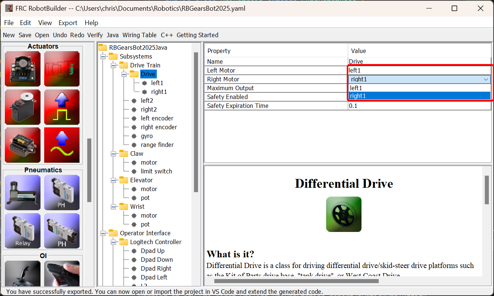
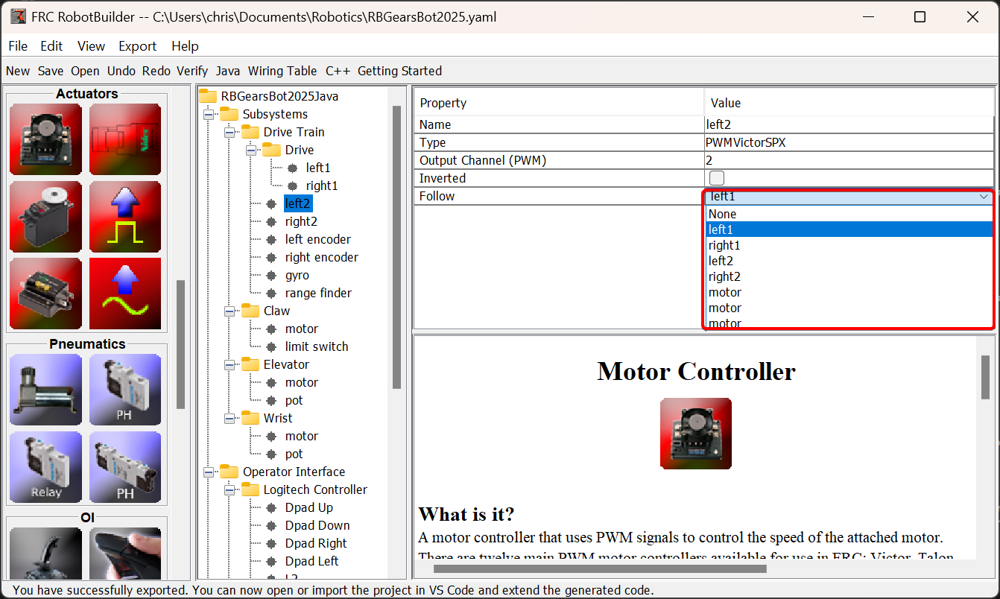

# Driving the Robot with Tank Drive and Joysticks

A common use case is to have a joystick that should drive some actuators that are part of a subsystem. The problem is that the joystick is created in the RobotContainer class and the motors to be controlled are in the subsystem. The idea is to create a command that, when scheduled, reads input from the joystick and calls a method that is created on the subsystem that drives the motors.

In this example a drive base subsystem is shown that is operated in tank drive using a pair of joysticks.

## Create a Drive Train Subsystem

.. image:: images/driving-with-joysticks-subsystem.png
   :alt: Dragging subsystem from palette to tree

Create a subsystem called Drive Train. Its responsibility will be to handle the driving for the robot base.

.. image:: images/driving-with-joysticks-differential-drive.png
   :alt: Dragging differential drive from palette to tree

Inside the Drive Train, create a Differential Drive object. The Differential Drive object can contain a left motor controller and a right motor controller.

.. image:: images/driving-with-joysticks-speed-controller.png
   :alt: Dragging motor controller from pallete to tree

Create two Motor Controllers in the Differential Drive, and two more outside the Differential Drive, inside the Drive Train subsystem.

In the Differential Drive, set the left and right motors to the appropriate motor controllers.

Finally, for the two motor controllers that aren't in the differential drive, set them to follow the motor controllers in the differential drive.

## Add the Joysticks to the Operator Interface

.. image:: images/driving-with-joysticks-joysticks.png
   :alt: dragging joystick from palette to tree

Add two joysticks to the Operator Interface, one is the left stick and the other is the right stick. The y-axis on the two joysticks are used to drive the robots left and right sides.

.. note:: Be sure to export your program to C++ or Java before continuing to the next step.

## Create a Method to Write the Motors on the Subsystem

.. tab-set::

   .. tab-item:: java
      :sync: java

      .. literalinclude:: ../resources/RBGearsBot2025Java/src/main/java/frc/robot/subsystems/DriveTrain.java
         :language: Java
         :lines: 11-
         :emphasize-lines: 109-115
         :lineno-match:

   .. tab-item:: C++ (Header)
      :sync: C++ (Header)

      .. literalinclude:: ../resources/RBGearsBot2025CPP/src/main/include/subsystems/DriveTrain.h
         :language: C++
         :lines: 11-
         :emphasize-lines: 40-41
         :lineno-match:

   .. tab-item:: C++ (Source)
      :sync: C++ (Header)

      .. literalinclude:: ../resources/RBGearsBot2025CPP/src/main/cpp/subsystems/DriveTrain.cpp
         :language: C++
         :lines: 11-
         :emphasize-lines: 69-75
         :lineno-match:

Create a method that takes the joystick inputs, in this case the left and right driver joystick. The values are passed to the DifferentialDrive object that in turn does tank steering using the joystick values. Also create a method called stop() that stops the robot from driving, this might come in handy later.

## Read Joystick Values and Call the Subsystem Methods

.. image:: images/driving-with-joysticks-command.png
   :alt: dragging a command from palette to the tree

Create a command, in this case called Tank Drive. Its purpose will be to read the joystick values and send them to the Drive Base subsystem. Notice that this command Requires the Drive Train subsystem. This will cause it to stop running whenever anything else tries to use the Drive Train.

.. image:: images/driving-with-joysticks-command-parameters.png
   :alt: parameter dialog box with DoubleSupplier parameters added

Create two parameters (``DoubleSupplier`` for Java or ``std::function<double()>`` for C++) for the left and right speeds.

.. image:: images/driving-with-joysticks-command-parameters-presets.png
   :alt: paramet preset dialog box with parameters entered

Create a parameter preset to retrieve joystick values. Java: For the left parameter enter ``() -> getJoystick1().getY()`` and for right enter ``() -> getJoystick2().getY()``. C++: For the left parameter enter ``[this] {return getJoystick1()->GetY();}`` and for the right enter ``[this] {return getJoystick2()->GetY();}``

.. note:: Be sure to export your program to C++ or Java before continuing to the next step.

## Add the Code to do the Driving

.. tab-set::

   .. tab-item:: java
      :sync: java

      .. literalinclude:: ../resources/RBGearsBot2025Java/src/main/java/frc/robot/commands/TankDrive.java
         :language: Java
         :lines: 11-
         :emphasize-lines: 51, 57
         :lineno-match:

   .. tab-item:: C++ (Header)
      :sync: C++ (Header)

      .. literalinclude:: ../resources/RBGearsBot2025CPP/src/main/include/commands/TankDrive.h
         :language: C++
         :lines: 11-
         :lineno-match:

   .. tab-item:: C++ (Source)
      :sync: C++ (Header)

      .. literalinclude:: ../resources/RBGearsBot2025CPP/src/main/cpp/commands/TankDrive.cpp
         :language: C++
         :lines: 11-
         :emphasize-lines: 29, 39
         :lineno-match:

Add code to the execute method to do the actual driving. All that is needed is pass the for the left and right parameters to the Drive Train subsystem. The subsystem just uses them for the tank steering method on its DifferentialDrive object. And we get tank steering.

We also filled in the ``end()`` method so that when this command is interrupted or stopped, the motors will be stopped as a safety precaution.

## Make Default Command

.. image:: images/driving-with-joysticks-default-command.png
   :alt: setting default command for subsystem

The last step is to make the Tank Drive command be the "Default Command" for the Drive Train subsystem. This means that whenever no other command is using the Drive Train, the Joysticks will be in control. This is probably the desirable behavior. When the autonomous code is running, it will also require the drive train and interrupt the Tank Drive command. When the autonomous code is finished, the DriveWithJoysticks command will restart automatically (because it is the default command), and the operators will be back in control. If you write any code that does teleop automatic driving, those commands should also "require" the DriveTrain so that they too will interrupt the Tank Drive command and have full control.

.. image:: images/driving-with-joysticks-default-command-parameters.png
   :alt: applying parameter preset to command

The final step is to choose the joystick parameter preset previously set up.

.. note:: Be sure to export your program to C++ or Java before continuing.
