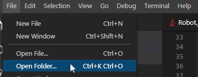

Generating Code for a Project
=============================

After you've set up your robot framework in RobotBuilder, you'll need to export the code and load it into Visual Studio Code. This article describes the process for doing so.

Generate the Code for the Project
---------------------------------

.. image:: ../introduction/images/robotbuilder-overview-8.png

Verify that the Export Directory points to where you want (1) and then click Java or C++ (2) to generate a VS Code project or update code.

Open the Project in Visual Studio Code
--------------------------------------

Open VS Code and select **File -> Open Folder**. Navigate to your Export location and click **Select Folder**.
