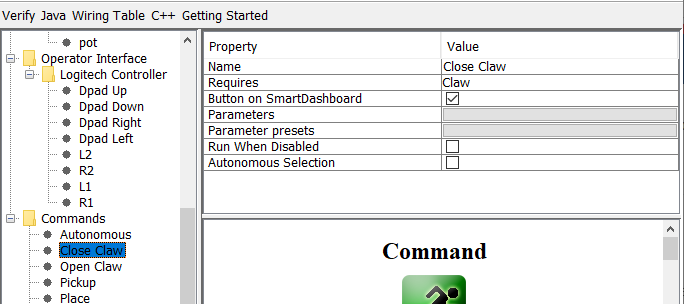

Writing the Code for a Command
==============================

Subsystem classes get the mechanisms on your robot moving, but to get it to stop at the right time and sequence through more complex operations you write Commands. Previously in :doc:`writing the code for a subsystem <robotbuilder-writing-subsystem-code>` we developed the code for the `Claw` subsystem on a robot to start the claw opening, closing, or to stop moving. Now we will write the code for a command that will actually run the claw motor for the right time to get the claw to open and close. Our claw example is a very simple mechanism where we run the motor for 1 second to open it or until the limit switch is tripped to close it.

Close Claw Command in RobotBuilder
----------------------------------

This is the definition of the `CloseClaw` command in RobotBuilder. Notice that it requires the `Claw` subsystem. This is explained in the next step.

Generated CloseClaw Class
-------------------------

.. tabs::

   .. group-tab:: Java

      .. code-block:: java
        :linenos:
        :lineno-start: 11
        :emphasize-lines: 42, 53, 59

         // ROBOTBUILDER TYPE: Command.

         package frc.robot.commands;
         import edu.wpi.first.wpilibj2.command.CommandBase;

         // BEGIN AUTOGENERATED CODE, SOURCE=ROBOTBUILDER ID=IMPORTS
         import frc.robot.subsystems.Claw;

             // END AUTOGENERATED CODE, SOURCE=ROBOTBUILDER ID=IMPORTS

         /**
          *
          */
         public class CloseClaw extends CommandBase {

             // BEGIN AUTOGENERATED CODE, SOURCE=ROBOTBUILDER ID=VARIABLE_DECLARATIONS
                 private final Claw m_claw;

             // END AUTOGENERATED CODE, SOURCE=ROBOTBUILDER ID=VARIABLE_DECLARATIONS

             // BEGIN AUTOGENERATED CODE, SOURCE=ROBOTBUILDER ID=CONSTRUCTORS

             public CloseClaw(Claw subsystem) {

             // END AUTOGENERATED CODE, SOURCE=ROBOTBUILDER ID=CONSTRUCTORS
                 // BEGIN AUTOGENERATED CODE, SOURCE=ROBOTBUILDER ID=VARIABLE_SETTING

             // END AUTOGENERATED CODE, SOURCE=ROBOTBUILDER ID=VARIABLE_SETTING
                 // BEGIN AUTOGENERATED CODE, SOURCE=ROBOTBUILDER ID=REQUIRES

                 m_claw = subsystem;
                 addRequirements(m_claw);

             // END AUTOGENERATED CODE, SOURCE=ROBOTBUILDER ID=REQUIRES
             }

             // Called when the command is initially scheduled.
             @Override
             public void initialize() {
                 m_claw.close(); // (1)
             }

             // Called every time the scheduler runs while the command is scheduled.
             @Override
             public void execute() {
             }

             // Called once the command ends or is interrupted.
             @Override
             public void end(boolean interrupted) {
                 m_claw.stop(); // (3)
             }

             // Returns true when the command should end.
             @Override
             public boolean isFinished() {
                 return m_claw.isGripping(); // (2)
             }

             @Override
             public boolean runsWhenDisabled() {
                 // BEGIN AUTOGENERATED CODE, SOURCE=ROBOTBUILDER ID=DISABLED
                 return false;

             // END AUTOGENERATED CODE, SOURCE=ROBOTBUILDER ID=DISABLED
             }
         }

   .. group-tab:: C++

      .. code-block:: cpp
         :linenos:
         :lineno-start: 11
         :emphasize-lines: 21, 31, 36

         // ROBOTBUILDER TYPE: Command.

         // BEGIN AUTOGENERATED CODE, SOURCE=ROBOTBUILDER ID=CONSTRUCTOR

         #include "commands/CloseClaw.h"

         CloseClaw::CloseClaw(Claw* m_claw)
         :m_claw(m_claw){

             // Use AddRequirements() here to declare subsystem dependencies
             // eg. AddRequirements(m_Subsystem);
             SetName("CloseClaw");
             AddRequirements({m_claw});

         // END AUTOGENERATED CODE, SOURCE=ROBOTBUILDER ID=CONSTRUCTOR

         }

         // Called just before this Command runs the first time
         void CloseClaw::Initialize() {
             m_claw->Close(); // (1)
         }

         // Called repeatedly when this Command is scheduled to run
         void CloseClaw::Execute() {

         }

         // Make this return true when this Command no longer needs to run execute()
         bool CloseClaw::IsFinished() {
             return m_claw->IsGripping(); // (2)
         }

         // Called once after isFinished returns true
         void CloseClaw::End(bool interrupted) {
             m_claw->Stop(); // (3)
         }

         bool CloseClaw::RunsWhenDisabled() const {
             // BEGIN AUTOGENERATED CODE, SOURCE=ROBOTBUILDER ID=DISABLED
             return false;

             // END AUTOGENERATED CODE, SOURCE=ROBOTBUILDER ID=DISABLED
         }

RobotBuilder will generate the class files for the `CloseClaw` command. The command represents the behavior of the claw, that is the operation over time. To operate this very simple claw mechanism the motor needs to operate in the close direction,. The `Claw` subsystem has methods to start the motor running in the right direction and to stop it. The commands responsibility is to run the motor for the correct time. The lines of code that are shown in the boxes are added to add this behavior.

1. Start the claw motor moving in the closing direction by calling the ``Close()`` method that was added to the `Claw` subsystem in the `CloseClaw` Initialize method.
2. This command is finished when the limit switch in the `Claw` subsystem is tripped.
3. The ``End()`` method is called when the command is finished and is a place to clean up. In this case, the motor is stopped since the time has run out.

