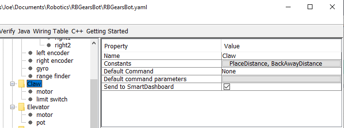

Writing the Code for a Subsystem
================================

Adding code to create an actual working subsystem is very straightforward. For simple subsystems that don't use feedback it turns out to be extremely simple. In this section we will look at an example of a Claw subsystem that operates the motor for some amount of time to open or close a claw on the robot arm.

RobotBuilder Representation of the Claw Subsystem
-------------------------------------------------

The claw at the end of a robot arm is a subsystem operated by a single Victor speed controller. There are three things we want the claw to do, start opening, start closing, and stop moving. This is the responsibility of the subsystem. The timing for opening and closing will be handled by a command later in this tutorial.

Adding Subsystem Capabilities
-----------------------------

.. tabs::

   .. code-tab:: java

      public class Claw extends Subsystem {
         // BEGIN AUTOGENERATED CODE, SOURCE=ROBOTBUILDER ID=DECLARATIONS
         Victor victor = RobotMap.CLAW_VICTOR;
         // END AUTOGENERATED CODE, SOURCE=ROBOTBUILDER ID=DECLARATIONS

         public void initDefaultCommand() {
            // BEGIN AUTOGENERATED CODE, SOURCE=ROBOTBUILDER ID=DEFAULT_COMMAND
            // END AUTOGENERATED CODE, SOURCE=ROBOTBUILDER ID=DEFAULT_COMMAND
         }

         public void openClaw() {
            victor.set(1.0);
         }

         public void closeClaw() {
            victor.set(-1.0);
         }

         public void stop() {
            victor.set(0.0);
         }
      }

   .. code-tab:: cpp

      Claw::Claw() :
         Subsystem("Claw") {
         // BEGIN AUTOGENERATED CODE, SOURCE=ROBOTBUILDER ID=DECLARATIONS
         victor = RobotMap::CLAW_VICTOR;
         // END AUTOGENERATED CODE, SOURCE=ROBOTBUILDER ID=DECLARATIONS
      }

      void Claw::InitDefaultCommand() {
         // BEGIN AUTOGENERATED CODE, SOURCE=ROBOTBUILDER ID=DEFAULT_COMMAND
         // END AUTOGENERATED CODE, SOURCE=ROBOTBUILDER ID=DEFAULT_COMMAND
      }

      void Claw::Open() {
         victor->Set(1);
      }

      void Claw::Close() {
         victor->Set(-1);
      }

      void Claw::Stop() {
         victor->Set(0);
      }

Add methods to the claw.java that will open, close, and stop the claw from moving. Those will be used by commands that actually operate the claw. The comments have been removed from this file to make it easier to see the changes for this document. Notice that a member variable called "victor" is created by RobotBuilder so it can be used throughout the subsystem. Each of your dragged-in palette items will have a member variable with the name given in RobotBuilder.

Adding the Method Declarations to the Header File (C++ Only)
------------------------------------------------------------

.. tabs::

   .. code-tab:: cpp

      #pragma once

      #include "frc/commands/Subsystem.h"
      #include "frc/Victor.h"

      class Claw: public Subsystem {
      private:
      public:
         //BEGIN AUTOGENERATED CODE, SOURCE=ROBOTBUILDER ID=DECLARATIONS
         Victor* victor;

         // END AUTOGENERATED CODE, SOURCE=ROBOTBUILDER ID=DECLARATIONS

         Claw();
         void InitDefaultCommand();

         void Open();
         void Close();
         void Stop();
      };

In addition to adding the methods to the class implementation file, Claw.cpp, the declarations for the methods need to be added to the header file, Claw.h. Those declarations that must be added are shown here.

To add the behavior to the claw subsystem to operate it to handle opening and closing you need to :doc:`define commands <../introduction/robotbuilder-creating-command>`.
