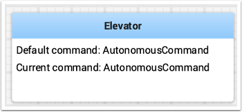
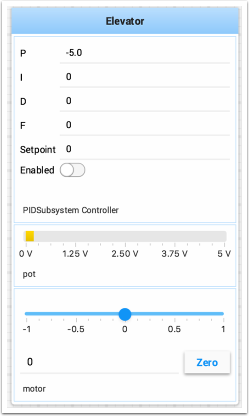
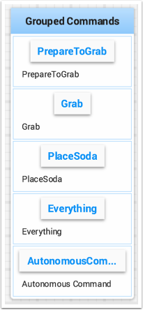

Commands and Subsystems
=======================

When using the command-based framework Shuffleboard makes it easier to understand what the robot is doing by displaying the state of various commands and subsystems in real-time.

Displaying Subsystems
---------------------

To see the status of a subsystem while the robot is operating in either autonomous or teleoperated modes, that is what its default command is and what command is currently using that subsystem, send a subsystem instance to Shuffleboard:

.. tabs::

   .. code-tab:: java

      SmartDashboard.putData(subsystem-reference);

   .. code-tab:: cpp

      SmartDashboard::PutData(subsystem-pointer);

Shuffleboard will display the subsystem name, the default command associated with this subsystem, and the currently running command. In this example the default command for the Elevator subsystem is called ``AutonomousCommand`` and it is also the current command that is using the Elevator subsystem.

Subsystems in Test Mode
-----------------------

In Test mode (Test/Enabled in the driver station) subsystems may be displayed in the LiveWindow tab with the sensors and actuators of the subsystem. This is ideal for verifying of sensors are working by seeing the values that they are returning. In addition, actuators can be operated. For example, motors can be operated using sliders to set their commanded speed and direction. For PIDSubsystems the P, I, D, and F constants are displayed along with the setpoint and an enable control. This is useful for tuning PIDSubsystems by adjusting the constants, putting in a setpoint, and enabling the embedded PIDController. Then the mechanism's response can be observed. This cycle (change parameters, enable, and observe) can be repeated until a reasonable set of parameters is found.

.. todo:: Add RobotBuilder links

More information on tuning PIDSubsystems can be found :doc:`here <shuffleboard-tuning-pid>`. Using RobotBuilder will automatically generate the code to get the subsystem displayed in Test mode. The code that is necessary to have subsystems displayed is shown below where subsystem-name is a string containing the name of the subsystem:

.. code-block:: java

   setName(subsystem-name);

Displaying Commands
-------------------

Using commands and subsystems makes very modular robot programs that can easily be tested and modified. Part of this is because commands can be written completely independently of other commands and can therefor be easily run from Shuffleboard. To write a command to Shuffleboard use the ``SmartDashboard.putData`` method as shown here:

.. tabs::

   .. code-tab:: java

      SmartDashboard.putData("ElevatorMove: up", new ElevatorMove(2.7));

   .. code-tab:: cpp

      SmartDashboard::PutData("ElevatorMove: up", new ElevatorMove(2.7));

Shuffleboard will display the command name and a button to execute the command. In this way individual commands and command groups can easily be tested without needing special test code in a robot program. In the image below there are a number of commands contained in a Shuffleboard list. Pressing the button once runs the command and pressing it again stops the command. To use this feature the robot must be enabled in teleop mode.

