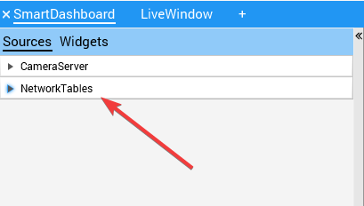
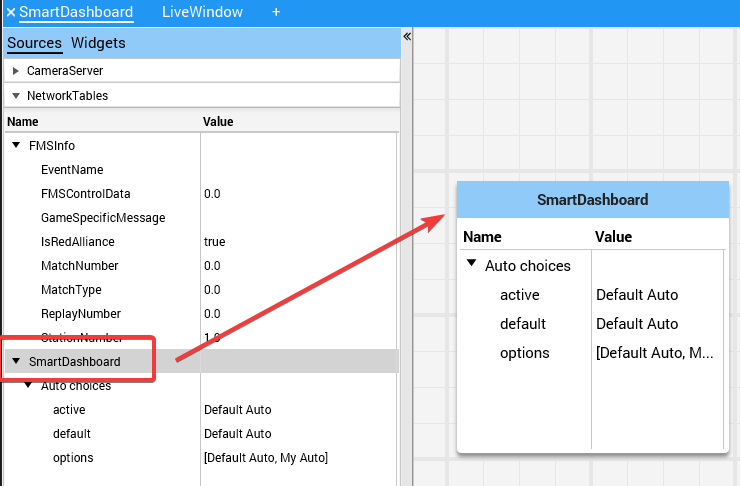

Viewing Hierarchies of Data
===========================

Dragging a key with other keys below it (deeper in the hierarchy) displays the hierarchy in a tree, similar to the NetworkTables sources on the left.

Select the data source:

Click and drag the NetworkTables key into the preferred tab.

