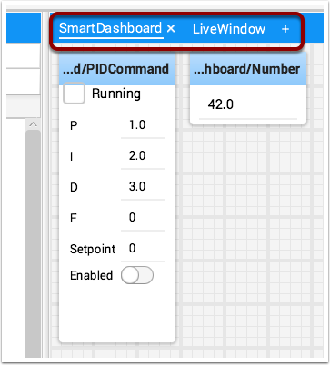
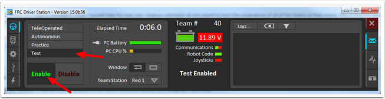
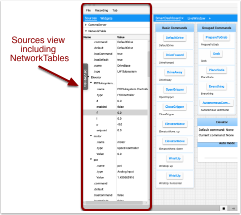

Displaying data from your robot
===============================

Your robot can display data in regular operating modes like Teleop and Autonomous modes but you can also display the status and operate all the robot subsystems when the robot is switched to Test mode. By default you'll see two tabs when you start Shuffleboard, one for Teleop/Autonomous and another for Test mode. The currently selected tab is underlined as can be seen in the picture below.

Often debugging or monitoring the status of a robot involves writing a number of values to the console and watching them stream by. With Shuffleboard you can put values to a GUI that is automatically constructed based on your program. As values are updated, the corresponding GUI element changes value - there is no need to try to catch numbers streaming by on the screen.

Displaying values in normal operating mode (autonomous or teleop)
-----------------------------------------------------------------

.. tabs::

    .. code-tab:: java

        protected void execute() {
            SmartDashboard.putBoolean("Bridge Limit", bridgeTipper.atBridge());
            SmartDashboard.putNumber("Bridge Angle", bridgeTipper.getPosition());
            SmartDashboard.putNumber("Swerve Angle", drivetrain.getSwerveAngle());
            SmartDashboard.putNumber("Left Drive Encoder", drivetrain.getLeftEncoder());
            SmartDashboard.putNumber("Right Drive Encoder", drivetrain.getRightEncoder());
            SmartDashboard.putNumber("Turret Pot", turret.getCurrentAngle());
            SmartDashboard.putNumber("Turret Pot Voltage", turret.getAverageVoltage());
            SmartDashboard.putNumber("RPM", shooter.getRPM());
        }

.. figure:: images/display-code-result.png
   :alt:

You can write Boolean, Numeric, or String values to Shuffleboard by simply calling the correct method for the type and including the name and the value of the data, no additional code is required.

-  Numeric types such as char, int, long, float or double call SmartDashboard.putNumber("dashboard-name", value).
-  String types call SmartDashboard.putString("dashboard-name", value)
-  Boolean types call SmartDashboard.putBoolean("dashboard-name", value)

Changing the display type of data
---------------------------------

Depending on the data type of the values being sent to Shuffleboard you can often change the display format. In the previous example you can see that number values were displayed as either decimal numbers, a dial to better represent angles, and as a voltage view for the turret potentiometer. To set the display type right-click on the tile and select "Show as...". You can choose display types from the list in the popup menu.

.. figure:: images/configuring-data.png
   :alt:

Displaying data in Test mode
----------------------------

You may add code to your program to display values for your sensors and actuators while the robot is in Test mode. This can be selected from the Driver Station whenever the robot is not on the field. The code to display these values is automatically generated by RobotBuilder or manually added to your program and is described in the next article. Test mode is designed to verify the correct operation of the sensors and actuators on a robot. In addition it can be used for obtaining setpoints from sensors such as potentiometers and for tuning PID loops in your code.

Setting test mode
~~~~~~~~~~~~~~~~~

Enable Test Mode in the Driver Station by clicking on the "Test" button and setting "Enable" on the robot. When doing this, Shuffleboard will display the status of any actuators and sensors used by your program organized by subsystem.

Getting data from the Sources view
----------------------------------

Normally :term:`NetworkTables` data automatically appears on one of the tabs and you just rearrange and use that data. Sometimes you might want to recover a value that was accidentally deleted from the tab or display a value that is not part of the SmartDashboard / NetworkTables key. For these cases the values can be dragged onto a pane from NetworkTables view under Sources on the left side of the window. Choose the value that you want to display and just drag it to the pane and it will be automatically created with the default type of widget for the data type.

.. note:: Sometimes the Sources view is not visible on the left - it is possible to drag the divider between the tabbed panes and the Sources so the sources is not visible. If this happens move the cursor over the left edge and look for a divider resizing cursor, then left click and drag out the view. In the two images below you can see where to click and drag, and when finished the divider is as shown in the second image.

.. figure:: images/data-sources-2.png
   :alt:
