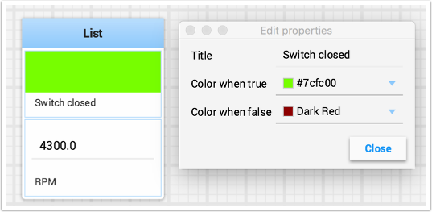

Working with widgets
====================

The visual displays that you manipulate on the screen in Shuffleboard are called widgets. Widgets are generally automatically displayed from values that the robot program publishes with NetworkTables.

Moving widgets
--------------

Widgets can be moved simply with drag and drop. Just move the cursor over the widget, left-click and drag it to the new position. When dragging you can only place widgets on grid squares and the size of the grid will effect the resolution of your display. When dragging a red or green outline will be displayed. Green generally means that there is enough room at the current location to drop the widget and red generally means that it will overlap or be too big to drop. In the example below a widget is being moved to a location where it doesn't fit.

.. figure:: images/widgets-1.png
   :alt:

Resizing widgets
----------------

Widgets can be resized by clicking and dragging the edge or corner of the widget image. The cursor will change to a resize-cursor when it is in the right position to resize the widget. As with moving widgets, a green or red outline will be drawn indicating that the widget can be resized or not. The example below shows a widget being resized to a larger area with the green outline indicating that there is no overlap with surrounding widgets.

.. figure:: images/widgets-2.png
   :alt:

Changing the display type of widgets
------------------------------------

Shuffleboard is very rich in display types depending on the data published from the robot. It will automatically choose a default display type, but you might want to change it depending on the application. To see what the possible displays are for any widget, right-click on the widget and select the "Show as..." and from the popup menu, choose the desired type. In the example below are two data values, one a number and the other a boolean. You can see the different types of display options that are available to each. The boolean value has only two possible values (true/false) it can be shown as a boolean box (the red/green color), or text, or a toggle button or toggle switch. The. number value can be displayed as a graph, number bar, number slider, dial, text, or a voltage view depending on the context of the value.

.. figure:: images/widgets-3.png
   :alt:

Changing the title of widgets
-----------------------------

You can change the title of widgets by double-clicking in their title bar and editing the title to the new value. If a widget is contained in a layout, then right-click on the widget and select the properties. From there you can change the widget title that is displayed.

Changing widget properties
--------------------------

You can change the appearance of a widget such as the range of values represented, colors or some other visual element. In cases where this is possible right-click on the widget and select "Edit properties" from the popup menu. In this boolean value widget shown below, the widget title, true color and false color can all be edited.

