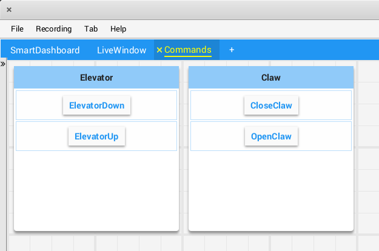

Organizing Widgets
==================

Setting Widget Size and Position
--------------------------------

Call ``withSize`` and ``withPosition`` to set the size and position of the widget in the tab.

``withSize`` sets the number of columns wide and rows high the widget should be. For example, calling ``withSize(1, 1)`` makes the widget occupy a single cell in the grid. Note that some widgets have a minimum size that may be greater than the specified size, in which case the widget will use the smallest supported size.

``withPosition`` sets the row and column of the top-left corner of the widget. Rows and columns are both 0-indexed, so the topmost row is number 0 and the leftmost column is also number 0. If the position of any widget in a tab is specified, every widget should also have its position set to avoid overlapping widgets.

.. tabs::

   .. code-tab:: java

      Shuffleboard.getTab("Pre-round")
        .add("Auto Mode", autoModeChooser)
        .withSize(2, 1) // make the widget 2x1
        .withPosition(0, 0); // place it in the top-left corner

   .. code-tab:: cpp

      frc::Shuffleboard::GetTab("Pre-round")
        .Add("Auto Mode", autoModeChooser)
        .WithSize(2, 1)
        .WithPosition(0,0);

Adding Widgets to Layouts
-------------------------

If there are many widgets in a tab with related data, it can be useful to place them into smaller subgroups instead of loose in the tab. Much like how the handle to a tab is retrieved with ``Shuffleboard.getTab``, a layout inside a tab (or even in another layout) can be retrieved with ``ShuffleboardTab.getLayout``.

.. tabs::

   .. code-tab:: java

      ShuffleboardLayout elevatorCommands = Shuffleboard.getTab("Commands")
        .getLayout("Elevator", BuiltInLayouts.kList)
        .withSize(2, 2)
        .withProperties(Map.of("Label position", "HIDDEN")); // hide labels for commands

      elevatorCommands.add(new ElevatorDownCommand());
      elevatorCommands.add(new ElevatorUpCommand());
      // Similarly for the claw commands

   .. code-tab:: cpp

      wpi::StringMap<std::shared_ptr<nt::Value>> properties{
        std::make_pair("Label position", nt::Value::MakeString("HIDDEN"))
      };

      frc::ShuffleboardLayout& elevatorCommands = frc::Shuffleboard::GetTab("Commands")
        .GetLayout("Elevator", frc::BuiltInLayouts::kList)
        .WithSize(2, 2)
        .WithProperties(properties);

      ElevatorDownCommand* elevatorDown = new ElevatorDownCommand();
      ElevatorUpCommand* elevatorUp = new ElevatorUpCommand();

      elevatorCommands.Add("Elevator Down", elevatorDown);
      elevatorCommands.Add("Elevator Up", elevatorUp);

