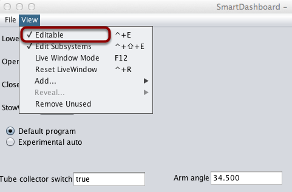
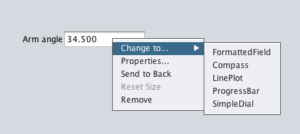
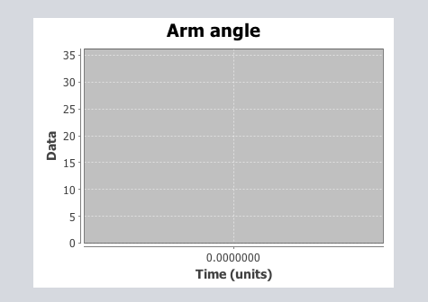

Changing the Display Widget Type for a Value
============================================

One can change the type of widget that displays values with the SmartDashboard. The allowable widgets depend on the type of the value being displayed.

Setting Edit Mode
-----------------

Make sure that the SmartDashboard is in edit mode. This is done by selecting ``Editable`` from the ``View menu``.

Choosing Widget Type
--------------------

Right-click on the widget and select ``Change to...``. Then, pick the type of widget to use for the particular value. In this case we choose ``LinePlot``.

Showing New Widget Type
-----------------------

The new widget type is displayed. In this case, a Line Plot, will show the values of the Arm angle value over time. You can set the properties of the graph to make it better fit your data by right-clicking and selecting ``Properties...``. See: :doc:`Changing the display properties of a value <changing-display-properties>`.
