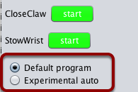

Choosing an Autonomous Program
==============================

Often teams have more than one autonomous program, either for competitive reasons or for testing new software. Programs often vary by adding things like time delays, different strategies, etc. The methods to choose the strategy to run usually involves switches, joystick buttons, knobs or other hardware based inputs.

With the SmartDashboard you can simply display a widget on the screen to choose the autonomous program that you would like to run. And with command based programs, that program is encapsulated in one of several commands. This article shows how to select an autonomous program with only a few lines of code and a nice looking user interface.

.. note:: The code snippets shown below are part of the HatchbotTraditional example project (`Java <https://github.com/wpilibsuite/allwpilib/tree/main/wpilibjExamples/src/main/java/edu/wpi/first/wpilibj/examples/hatchbottraditional>`__, `C++ <https://github.com/wpilibsuite/allwpilib/tree/main/wpilibcExamples/src/main/cpp/examples/HatchbotTraditional>`__):

Creating the SendableChooser Object
-----------------------------------

In ``RobotContainer``, create a variable to hold a reference to a ``SendableChooser`` object. Two or more commands can be created and stored in new variables. Using the ``SendableChooser``, one can choose between them. In this example, ``SimpleAuto`` and ``ComplexAuto`` are shown as options.

.. tabs::

  .. group-tab:: Java

    .. remoteliteralinclude:: https://raw.githubusercontent.com/wpilibsuite/allwpilib/v2020.3.2/wpilibjExamples/src/main/java/edu/wpi/first/wpilibj/examples/hatchbottraditional/RobotContainer.java
      :language: java
      :lines: 43-52

  .. group-tab:: C++ (Header)

    .. remoteliteralinclude:: https://raw.githubusercontent.com/wpilibsuite/allwpilib/v2020.3.2/wpilibcExamples/src/main/cpp/examples/HatchbotTraditional/include/RobotContainer.h
      :language: c++
      :lines: 41-47

Setting up SendableChooser
--------------------------

Imagine that you have two autonomous programs to choose between and they are encapsulated in commands ``SimpleAuto`` and ``ComplexAuto``. To choose between them:

In ``RobotContainer``, create a ``SendableChooser`` object and add instances of the two commands to it. There can be any number of commands, and the one added as a default (``setDefaultOption``), becomes the one that is initially selected. Notice that each command is included in an ``setDefaultOption()`` or ``addOption()`` method call on the ``SendableChooser`` instance.

.. tabs::

  .. code-tab:: java

      // Add commands to the autonomous command chooser
      m_chooser.setDefaultOption("Simple Auto", m_simpleAuto);
      m_chooser.addOption("Complex Auto", m_complexAuto);

      // Put the chooser on the dashboard
      SmartDashboard.putData(m_chooser);

  .. code-tab:: c++

      // Add commands to the autonomous command chooser
      m_chooser.SetDefaultOption("Simple Auto", &m_simpleAuto);
      m_chooser.AddOption("Complex Auto", &m_complexAuto);

      // Put the chooser on the dashboard
      frc::SmartDashboard::PutData(&m_chooser);

Starting an Autonomous Command
------------------------------

In ``Robot.java``, when the autonomous period starts, the ``SendableChooser`` object is polled to get the selected command and that command must be scheduled.

.. tabs::

  .. group-tab:: Java

    .. remoteliteralinclude:: https://raw.githubusercontent.com/wpilibsuite/allwpilib/v2020.3.2/wpilibjExamples/src/main/java/edu/wpi/first/wpilibj/examples/hatchbottraditional/RobotContainer.java
      :language: java
      :lines: 106-108

    .. remoteliteralinclude:: https://raw.githubusercontent.com/wpilibsuite/allwpilib/v2020.3.2/wpilibjExamples/src/main/java/edu/wpi/first/wpilibj/examples/hatchbottraditional/Robot.java
      :language: java
      :lines: 67-68,77-81

  .. group-tab:: C++ (Source)

    .. remoteliteralinclude:: https://raw.githubusercontent.com/wpilibsuite/allwpilib/v2020.3.2/wpilibcExamples/src/main/cpp/examples/HatchbotTraditional/cpp/RobotContainer.cpp
      :language: c++
      :lines: 57-60

    .. remoteliteralinclude:: https://raw.githubusercontent.com/wpilibsuite/allwpilib/v2020.3.2/wpilibcExamples/src/main/cpp/examples/HatchbotTraditional/cpp/Robot.cpp
      :language: c++
      :lines: 38-44

Running the Scheduler during Autonomous
---------------------------------------

In ``Robot.java``, this will run the scheduler every driver station update period (about every 20ms) and cause the selected autonomous command to run.

.. note:: Running the scheduler can occur in the ``autonomousPeriodic()`` function or ``robotPeriodic()``, both will function similarly in autonomous mode.

.. tabs::

  .. group-tab:: Java

    .. remoteliteralinclude:: https://raw.githubusercontent.com/wpilibsuite/allwpilib/v2020.3.2/wpilibjExamples/src/main/java/edu/wpi/first/wpilibj/examples/hatchbottraditional/Robot.java
      :language: java
      :lines: 44,49-50

  .. group-tab:: C++ (Source)

    .. remoteliteralinclude:: https://raw.githubusercontent.com/wpilibsuite/allwpilib/v2020.3.2/wpilibcExamples/src/main/cpp/examples/HatchbotTraditional/cpp/Robot.cpp
      :language: c++
      :lines: 23

Canceling the Autonomous Command
---------------------------------

In ``Robot.java``, when the teleop period begins, the autonomous command will be canceled.

.. tabs::

  .. group-tab:: Java

    .. remoteliteralinclude:: https://raw.githubusercontent.com/wpilibsuite/allwpilib/v2020.3.2/wpilibjExamples/src/main/java/edu/wpi/first/wpilibj/examples/hatchbottraditional/Robot.java
      :language: java
      :lines: 91-99

  .. group-tab:: C++ (Source)

    .. remoteliteralinclude:: https://raw.githubusercontent.com/wpilibsuite/allwpilib/v2020.3.2/wpilibcExamples/src/main/cpp/examples/HatchbotTraditional/cpp/Robot.cpp
      :language: c++
      :lines: 48-57

SmartDashboard Display
----------------------

When the SmartDashboard is run, the choices from the ``SendableChooser`` are automatically displayed. You can simply pick an option before the autonomous period begins and the corresponding command will run.
