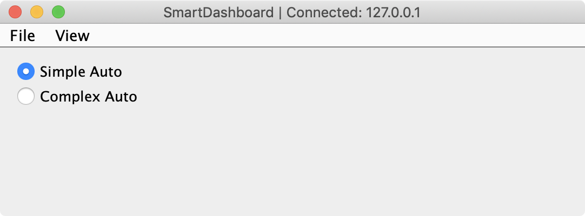

Choosing an autonomous program from SmartDashboard
==================================================

Often teams have more than one autonomous program, either for competitive reasons or for testing new software. Programs often vary by adding things like time delays, different strategies, etc. The methods to choose the strategy to run usually involves switches, joystick buttons, knobs or other hardware based inputs.

With the SmartDashboard you can simply display a widget on the screen to choose the autonomous program that you would like to run. And with command based programs, that program is encapsulated in one of several commands. This article shows how to select an autonomous program with only a few lines of code and a nice looking user interface.

Creating the SendableChooser object
-----------------------------------

.. image:: images/choosing-an-autonomous-program-from-smartdashboard/creating-sendablechooser.png

Create a variable to hold a reference to a ``SendableChooser`` object. This example also uses a ``RobotBuilder`` variable to hold the Autonomous command.

Set up the SendableChooser in the robotInit() method
----------------------------------------------------

.. image:: images/choosing-an-autonomous-program-from-smartdashboard/setup-sendablechooser.png

Imagine that you have two autonomous programs to choose between and they are encapsulated in commands ``Pickup`` and ``ElevatorPickup``. To choose between them:

1. Create a ``SendableChooser`` object and add instances of the two commands to it. There can be any number of commands, and the one added as a default (``addDefault``), becomes the one that is initially selected. Notice that each command is included in an ``addDefault()`` or ``addObject()`` method call on the ``SendableChooser`` instance.
2. When the autonomous period starts the ``SendableChooser`` object is polled to get the selected command and that command is scheduled.

Run the scheduler during the autonomous period
----------------------------------------------

.. image:: images/choosing-an-autonomous-program-from-smartdashboard/run-scheduler.png

RobotBuilder will generate code automatically that runs the scheduler every driver station update period (about every 20ms). This will cause the selected autonomous command to run.

SmartDashboard Display
----------------------

When the SmartDashboard is run, the choices from the SendableChooser are automatically displayed. You can simply pick an option before the autonomous period begins and the corresponding command will run.

Creating a SendableChooser in C++
---------------------------------

.. image:: images/choosing-an-autonomous-program-from-smartdashboard/sendablechooser-c++.png

This is an example of creating a ``SendableChooser`` object and using it to select between a Defensive and Offensive autonomous command to run when the autonomous period of the match starts. Just as in the Java example:

1. Create variables to hold the ``autonomousCommand`` pointer and the ``SendableChooser`` pointer.
2. The ``SendableChooser`` is created and initialized in the ``RobotInit()`` method.
3. In the ``AutonomousInit()`` method just before the Autonomous code starts running, the chosen command is retrieved from the SmartDashboard and scheduled.
4. In the ``AutonomousPeriodic()`` method, the scheduler is repeatedly run.
