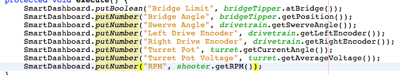

Displaying Expressions from a Robot Program
===========================================

.. note:: Often debugging or monitoring the status of a robot involves writing a number of values to the console and watching them stream by. With SmartDashboard you can put values to a GUI that is automatically constructed based on your program. As values are updated, the corresponding GUI element changes value - there is no need to try to catch numbers streaming by on the screen.

Writing values to the SmartDashboard
------------------------------------

You can write Boolean, Numeric, or String values to the SmartDashboard by simply calling the correct method for the type and including the name and the value of the data, no additional code is required. Any time in your program that you write another value with the same name, it appears in the same UI element on the screen on the driver station or development computer. As you can imagine this is a great way of debugging and getting status of your robot as it is operating.

Creating widgets on SmartDashboard
----------------------------------

.. todo:: add references

Widgets are populated on the SmartDashboard automatically, no user intervention is required. Note that the widgets are only populated when the value is first written, you may need to enable your robot in a particular mode or trigger a particular code routine for an item to appear. To alter the appearance of the widget, see the next two sections Changing the Display Properties of a Value and Changing the Display Widget Type for a Value.
