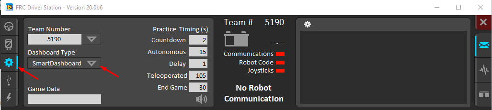

SmartDashboard Introduction
===========================

.. image:: images/smartdashboard-intro-1.png

The SmartDashboard is a Java program that will display robot data in real time. The SmartDashboard helps you with these things:

- Displays robot data of your choice while the program is running. It can be displayed as simple text fields or more elaborately in many other display types like graphs, dials, etc.
- Displays the state of the robot program such as the currently executing commands and the status of any subsystems
- Displays buttons that you can press to cause variables to be set on your robot
- Allows you to choose startup options on the dashboard that can be read by the robot program

The displayed data is automatically formatted in real-time as the data is sent from the robot, but you can change the format or the display widget types and then save the new screen layouts to be used again later. And with all these options, it is still extremely simple to use. To display some data on the dashboard, simply call one of the SmartDashboard methods with the data and its name and the value will automatically appear on the dashboard screen.

Installing the SmartDashboard
-----------------------------

The SmartDashboard is packaged with the WPILib Installer and can be launched directly from the Driver Station by selecting the **SmartDashboard** button on the Setup tab.

Configuring the Team Number
---------------------------

.. image:: images/smartdashboard-intro-3.png

The first time you launch the SmartDashboard you should be prompted for your team number. To change the team number after this: click **File > Preferences** to open the Preferences dialog. Double-click the box to the right of **Team Number** and enter your FRC Team Number, then click outside the box to save.

.. note:: SmartDashboard will take a moment to configure itself for the team number, do not be alarmed.

Setting a Custom NetworkTables Server Location
^^^^^^^^^^^^^^^^^^^^^^^^^^^^^^^^^^^^^^^^^^^^^^

By default, SmartDashboard will look for NetworkTables instances running on a connected RoboRIO, but it's sometimes useful to look for NetworkTables at a different IP address. This can be accomplished with adding a ``-ip`` parameter to the startup options of the ``smartdashboard.jar``. This file can be found in he WPILib tools directory (``~/wpilib/YYYY/tools`` where YYYY is the year and ``~`` is ``C:\Users\Public``).

.. image:: images/smartdashboard-intro-custom-networktables-location.png

Then, open a Powershell or Bash window on Windows or Terminal window on macOS and run the following commands:

.. tabs::

  .. tab:: Windows

    .. code-block:: powershell

      frcvars2020
      java -jar smartdashboard.jar -ip [IP address]

  .. tab:: macOS

    .. code-block:: bash

      java -jar smartdashboard.jar -ip [IP address]

This option is incredibly useful for using SmartDashboard with :doc:`WPILib simulation </docs/software/wpilib-tools/robot-simulation/introduction>`. Simply run ``java -jar smartdashboard.jar -ip localhost`` and SmartDashboard will detect your locally hosted robot!

Locating the Save File
----------------------

.. image:: images/smartdashboard-intro-4.png

Users may wish to customize the save location of the SmartDashboard. To do this click the box next to **Save File** then browse to the folder where you would like to save the configuration. Files saved in the installation directories for the WPILib components will likely be overwritten on updates to the tools.

Adding a Connection Indicator
-----------------------------

.. image:: images/smartdashboard-intro-5.png

It is often helpful to see if the SmartDashboard is connected to the robot. To add a connection indicator, select **View > Add > Connection Indicator**. This indicator will be red when disconnected and green when connected. To move or resize this indicator, select **View > Editable** to toggle the SmartDashboard into editable mode, then drag the center of the indicator to move it or the edges to resize. Select the **Editable** item again to lock it in place.

Adding Widgets to the SmartDashboard
------------------------------------

.. image:: images/smartdashboard-intro-1.png

Widgets are automatically added to the SmartDashboard for each "key" sent by the robot code. For instructions on adding robot code to write to the SmartDashboard see :doc:`Displaying Expressions from Within the Robot Program <displaying-expressions>`.
