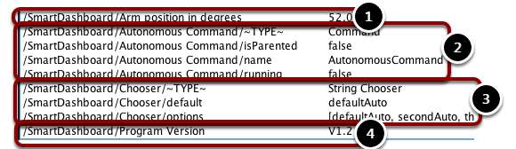
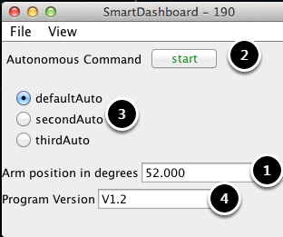
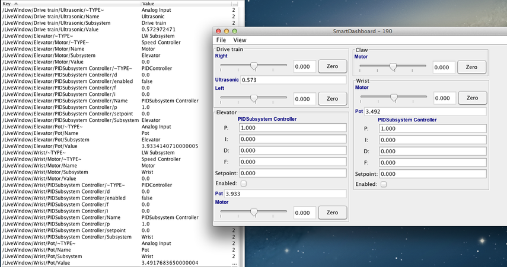

SmartDashboard Namespace
========================

SmartDashboard uses NetworkTables to send data between the robot and the Dashboard (Driver Station) computer. NetworkTables sends data as name, value pairs, like a distributed hashtable between the robot and the computer. When a value is changed in one place, its value is automatically updated in the other place. This mechanism and a standard set of name (keys) is how data is displayed on the SmartDashboard.

There is a hierarchical structure in the name space creating a set of tables and subtables. SmartDashboard data is in the SmartDashboard subtable and LiveWindow data is in the LiveWindow subtable as shown below.

For informational purposes, the names and values can be displayed using the OutlineViewer application that is installed in the same location as the SmartDashboard. It will display all the NetworkTable keys and values as they are updated.

SmartDashboard data values
--------------------------

SmartDashboard values are created with key names that begin with ``SmartDashboard/``. The above values viewed with OutlineViewer correspond to data put to the SmartDashboard with the following statements:

.. code-block:: java

  chooser = new SendableChooser();
  chooser.addDefault("defaultAuto", new AutonomousCommand());
  chooser.addObject("secondAuto", new AutonomousCommand());
  chooser.addObject("thirdAuto", new AutonomousCommand());
  SmartDashboard.putData("Chooser", chooser);
  SmartDashboard.putNumber("Arm position in degrees", 52.0);
  SmartDashboard.putString("Program Version", "V1.2");

The ``Arm position`` is created with the ``putNumber()`` call. The ``AutonomousCommand`` is written with a ``putData("Autonomous Command", command)`` that is not shown in the above code fragement. The chooser is created as a ``SendableChooser`` object and the string value, ``Program Version`` is created with the ``putString()`` call.

View of the SmartDashboard
--------------------------

The code from the previous step generates the table values as shown and the SmartDashboard display as shown here. The numbers correspond to the NetworkTable variables shown in the previous step.

LiveWindow Data Values
----------------------

LiveWindow data is automatically grouped by subsystem. The data is viewable in the SmartDashboard when the robot is in Test mode (set on the Driver Station). If you are not writing a command based program, you can still cause sensors and actuators to be grouped for easy viewing by specifying the subsystem name. In the above display you can see the key names and the resultant output in Test mode on the SmartDashboard. All the strings start with ``/LiveWindow`` then the Subsystem name, then a group of values that are used to display each element. The code that generates this LiveWindow display is shown below:

.. code-block:: java

  drivetrainLeft = new Talon(1, 2);
  LiveWindow.addActuator("Drive train", "Left", (Talon) drivetrainLeft);
  drivetrainRight = new Talon(1, 1);
  LiveWindow.addActuator("Drive train", "Right", (Talon) drivetrainRight);
  drivetrainRobotDrive = new RobotDrive(drivetrainLeft, drivetrainRight);
  drivetrainRobotDrive.setSafetyEnabled(false);
  drivetrainRobotDrive.setExpiration(0.1);
  drivetrainRobotDrive.setSensitivity(0.5);
  drivetrainRobotDrive.setMaxOutput(1.0);
  drivetrainUltrasonic = new AnalogChannel(1, 3);
  LiveWindow.addSensor("Drive train", "Ultrasonic", drivetrainUltrasonic);
  elevatorMotor = new Victor(1, 6);
  LiveWindow.addActuator("Elevator", "Motor", (Victor) elevatorMotor);
  elevatorPot = new AnalogChannel(1, 4);
  LiveWindow.addSensor("Elevator", "Pot", elevatorPot);
  wristPot = new AnalogChannel(1, 2);
  LiveWindow.addSensor("Wrist", "Pot", wristPot);
  wristMotor = new Victor(1, 3);
  LiveWindow.addActuator("Wrist", "Motor", (Victor) wristMotor);
  clawMotor = new Victor(1, 5);
  LiveWindow.addActuator("Claw", "Motor", (Victor) clawMotor);

Values that correspond to actuators are not only displayed, but can be set using sliders created in the SmartDashboard in Test mode.
