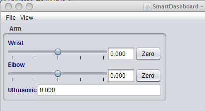

Displaying LiveWindow Values
============================

.. note:: LiveWindow will automatically add your sensors for you. There is no need to do it manually.

LiveWindow values may also be displayed by writing the code yourself and adding it to your robot program. LiveWindow will display values grouped in subsystems. This is a convenient method of displaying whether they are actual command based program subsystems or just a grouping that you decide to use in your program.

Adding the Necessary Code to your Program
-----------------------------------------

1. First, get a reference (Java) or pointer (C++) to the LiveWindow object.

.. tabs::

    .. code-tab:: java

        LiveWindow lw = LiveWindow.getInstance();

    .. code-tab:: cpp

        frc::LiveWindow lw = frc::LiveWindow::GetInstance();

2. Then for each sensor or actuator that is created, add it to the LiveWindow display by either calling ``AddActuator`` or ``AddSensor`` (``addActuator`` or ``addSensor`` in Java). When the SmartDashboard is put into LiveWindow mode, it will display the sensors and actuators.

.. tabs::

    .. code-tab:: java

        Ultrasonic ultrasonic = new Ultrasonic(1, 2);
        lw.addSensor("Arm", "Ultrasonic", ultrasonic);

        Jaguar elbow = new Jaguar(1);
        lw.addActuator("Arm", "Elbow", elbow);

        Victor wrist = new Victor(2);
        lw.addActuator("Arm", "Wrist", wrist);

    .. code-tab:: cpp

        frc::Ultrasonic ultrasonic{1, 2};
        lw->AddSensor("Arm", "Ultrasonic", ultrasonic);

        frc::Jaguar elbow{1};
        lw->AddActuator("Arm", "Elbow", elbow);

        frc::Victor wrist{2};
        lw->AddActuator("Arm", "Wrist", wrist);

Viewing the Display in SmartDashboard
-----------------------------------------

The sensors and actuators added to the LiveWindow will be displayed grouped by subsystem. The subsystem name is just an arbitrary grouping the helping to organize the display of the sensors. Actuators can be operated by operating the slider for the two motor controllers.
