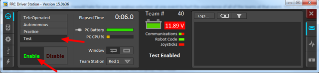
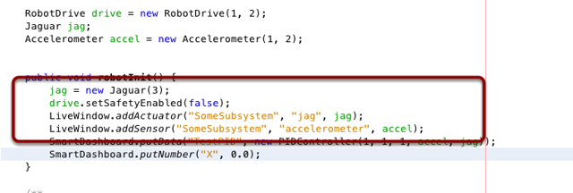
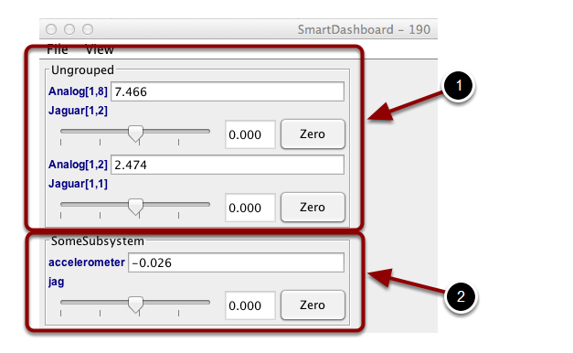

Enabling Test mode (LiveWindow)
===============================

You may add code to your program to display values for your sensors and actuators while the robot is in Test mode. This can be selected from the Driver Station whenever the robot is not on the field. The code to display these values is automatically generated by RobotBuilder and is described in the next article. Test mode is designed to verify the correct operation of the sensors and actuators on a robot. In addition it can be used for obtaining setpoints from sensors such as potentiometers and for tuning PID loops in your code.

Setting Test mode with the Driver Station
-----------------------------------------

Enable Test Mode in the Driver Station by clicking on the "Test" button and setting "Enable" on the robot. When doing this, the SmartDashboard display will switch to test mode (LiveWindow) and will display the status of any actuators and sensors used by your program.

Explicitly vs. implicit test mode display
-----------------------------------------

All sensors and actuators will automatically be displayed on the SmartDashboard in test mode and will be named using the object type (such as Jaguar, Analog, Victor, etc.) with the module number and channel number with which the object was created. In addition, the program can explicitly add sensors and actuators to the test mode display, in which case programmer-defined subsystem and object names can be specified making the program clearer. This example illustrates explicitly defining those sensors and actuators in the highlighted code.

Understanding what is displayed in Test mode
--------------------------------------------

This is the output in the SmartDashboard display when the robot is placed into test mode. In the display shown above the objects listed as Ungrouped were implicitly created by WPILib when the corresponding objects were created. These objects are contained in a subsystem group called "Ungrouped" **(1)** and are named with the device type (Analog, Jaguar in this case), and the module and channel numbers. The objects shown in the "SomeSubsystem" **(2)** group are explicitly created by the programmer from the code example in the previous section. These are named in the calls to ``LiveWindow.addActuator()`` and ``LiveWindow.AddSensor()``. Explicitly created sensors and actuators will be grouped by the specified subsystem.
