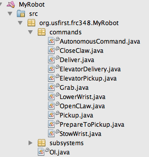
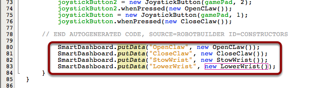

Testing commands
================

Commands represent robot behaviors such as moving an elevator to a position, collecting balls, shooting, or other tasks. It is desirable to test commands on the robot as they are written before combining them into more complex commands or incorporating them into other parts of the robot program. With a single line of code you can display commands on the SmartDashboard that appear as buttons that run the commands when pressed. This makes robot debugging a much simpler process.

Robot project with a number of commands that need testing
---------------------------------------------------------

One of the features of commands is that it allows the program to be broken down into separate testable units. Each command can be run independently of any of the others. By writing commands to the SmartDashboard, they will appear on the screen as buttons that, when pressed, schedule the particular command. This allows any command to be tested individually by pressing the button and observing the operation.

Adding command instances to the SmartDashboard
----------------------------------------------

Commands are written to the SmartDashboard simply by adding a line for each command to your program. In the above example 4 commands are written to the SmartDashboard by specifying the command name and an instance of the command.

Commands in the SmartDashboard
------------------------------

.. image:: images/testing-commands/commands-in-the-smartdashboard.png

Here you can see the resultant buttons on the SmartDashboard that appear corresponding to each command that was sent. Pressing the button will run the command until the isFinished() method in the command returns true. While the command is running, the "start" button will change to "cancel" giving you an opportunity to cancel the command if it isn't working properly. The "Wrist pot value" is just a numeric value that was written to the dashboard and is not part of the output from writing the commands.
