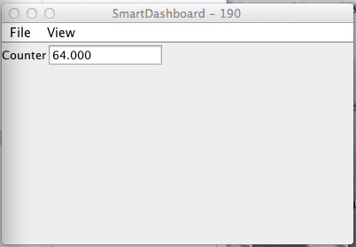
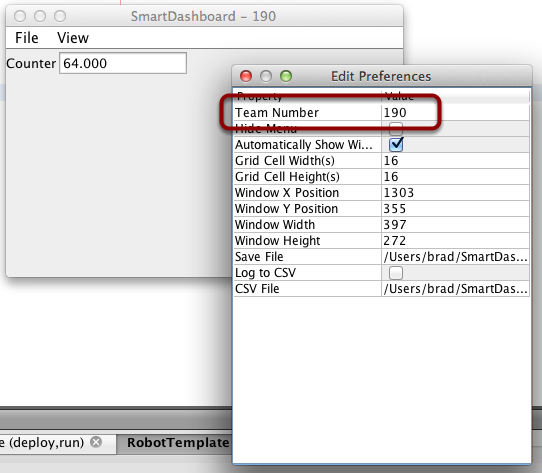
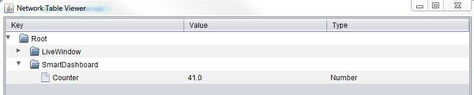

Verifying SmartDashboard is working
===================================

Minimal robot program
---------------------

.. tabs::

  .. code-tab:: java

    public class Robot extends TimedRobot {
      double counter = 0.0;

      public void teleopPeriodic() {
        SmartDashboard.putNumber("Counter", counter++);
      }
    }

  .. code-tab:: c++

    #include "Robot.h"
    float counter = 0.0;

    void Robot::TeleopPeriodic() {
        frc::SmartDashboard::PutNumber("Counter", counter++);
    }

This is a minimal robot program that writes a value to the SmartDashboard. It simply increments a counter 50 times per second to verify that the connection is working. However, to minimize bandwidth usage, NetworkTables by default will throttle the updates to 10 times per second.

SmartDashboard output for the sample program
--------------------------------------------

The SmartDashboard display should look like this after about 6 seconds of the robot being enabled in Teleop mode. If it doesn't, then you need to check that the connection is correctly set up.

Verifying the IP address in SmartDashboard
------------------------------------------

If the display of the value is not appearing, verify that the team number is correctly set as shown in this picture. The preferences dialog can be viewed by selecting ``File``, then ``Preferences``.

Using OutlineViewer to verify that the program is working
---------------------------------------------------------

You can verify that the robot program is generating SmartDashboard values by using the OutlineViewer program. This is a java program, ``OutlineViewer.jar``, that is located in ``~/wpilib/YYYY/tools`` (where YYYY is the year and ~ is ``C:\Users\Public`` on Windows).

OutlineViewer is downloaded as part of the WPILib Offline Installer. For more information, see the :ref:`Windows/macOS/Linux installation guides <docs/getting-started/getting-started-frc-control-system/wpilib-setup:WPILib Installation Guide>`. In Visual Studio Code, press **Ctrl + Shift + P** and type WPILib or click the WPILib logo in the top right to launch the WPILib Command Palette and select **Start Tool**, then select **OutlineViewer**.

In the host box, enter your roboRIO hostname (``roboRIO-####.local`` where ``####`` is your team number with no leading zeroes). Then, click ``Start Client``.

Look at the second row in the table, the value ``SmartDashboard/Counter`` is the variable written to the SmartDashboard via NetworkTables. As the program runs you should see the value increasing (``41.0`` in this case). If you don't see this variable in the OutlineViewer, look for something wrong with the robot program or the network configuration.

