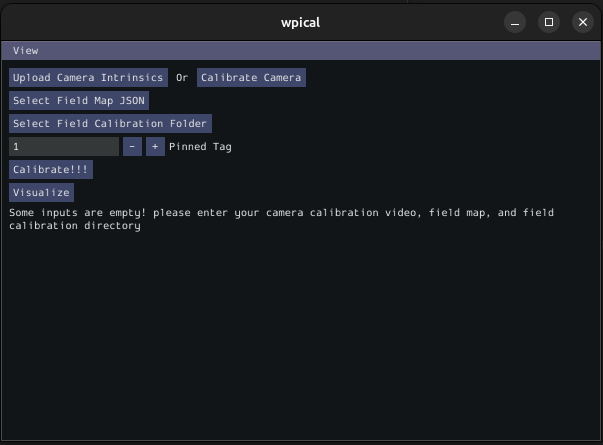

# WPIcal
WPIcal (inspired by `cowlibration from FRC 1538 <https://github.com/TheHolyCows/cowlibration-field>`_) is a cross-platform utility that can be used to empirically measure the position and orientation of Apriltags. The primary use case for WPIcal is to make sure robots can perform as they would on an event field, but on a practice field that may have imperfect Apriltags setup.



In Visual Studio Code, press :kbd:`Ctrl+Shift+P` and type ``WPILib`` or click the WPILib logo in the top right to launch the WPILib Command Palette. Select :guilabel:`Start Tool`, then select :guilabel:`WPIcal`.

.. warning:: Before using this tool, it is important to understand that this tool is not a "silver bullet" of computer vision accuracy. The primary use case for WPIcal is to help detect and correct for incorrect Apriltag placement. While this tool can detect minor errors in precise tag positioning on a competition field, these corrections offer limited benefit and only for teams that have rigorously implemented all other good localization practices. With that said, this tool is exceedingly helpful in correcting for minor errors in practice fields, which are generally not within the normal field tolerance.

## Overview
Conceptually, if you know how far tags are away from each other, and you know the field-relative coordinates of one of the tags, (the "pinned" tag) you can figure out the field-relative coordinates of the other tags. WPIcal achieves this by running an optimization on frames from videos that the user takes of the field. WPIcal is field-agnostic, meaning it will work with any FRC apriltag layout, as well as custom apriltag layouts.

## Video Capture
The best way to obtain videos for both camera and field calibration is with a phone/tablet. Users can then transfer these videos to the computer running WPIcal for processing.

Alternatively, users can use other devices to capture videos, such as a laptop cameras. Users who opt to capture videos this way should use `OBS Studio <https://obsproject.com/>`_.

OBS Users should set the resolution of the video capture and the base video resolution in the OBS settings:

.. image:: images/OBSCaptureSettings.png
    :alt: OBS capture settings screenshot showing proper resolution settings.
.. image:: images/OBSVideoSettings.png
    :alt: OBS video settings screenshot showing proper resolution settings.

## Camera Calibration
To measure the distance between tags in a video, you need the camera's intrinsics to account for things like distortion. WPIcal allows users to upload a video file to calibrate the camera in the tool, or upload a JSON file with your camera's intrinsics.

### In-App Calibration
#### Linux Users Only:
Linux users must transcode all videos to MJPEG codec without an audio stream in an .avi file before uploading to WPIcal. This can be done with an ffmpeg command:
``ffmpeg -i <video_file.mp4> -f avi -c:v mjpeg -b:v 20m -an <video_file.avi>``

.. note :: The ``-b:v 20m`` flag is optional, but it is recommended to use it to ensure the video quality is high enough for the calibration process. If you find the output .avi file is too grainy, you can increase the value of the flag.

#### All Users:
To calibrate your camera from a video file, click on :guilabel:`Calibrate Camera`


There are two options for calibrating your camera, :guilabel:`OpenCV` and :guilabel:`MRcal`. It is generally recommended to calibrate with :guilabel:`MRcal`, as it has slightly better accuracy and is more robust against bad calibration data. WPIcal uses a 5x5 aruco dictionary ChArUco board for camera calibration. You can generate a ChArUco board here: `calib.io <https://calib.io/pages/camera-calibration-pattern-generator>`_

.. warning:: If generating a ChArUco board with calib.io, make sure the height of the board is an odd number of squares. There is a `bug in OpenCV <https://github.com/opencv/opencv_contrib/issues/3291>`_ which effects calib.io boards with an even number of rows.
.. note:: Regardless of which calibration option you use, make sure your calibration board has not been bent or creased, and is lying on a flat surface. It does not matter if you use the exact same board as shown in the images, as there are fields in each calibration option to customize the calibration for your specific board.

There are a couple of common fields that both :guilabel:`OpenCV` and :guilabel:`MRcal` calibration options use:

* :guilabel:`Select Camera Calibration Video` is the button to select your video file.

* :guilabel:`Square Width` is the width of the squares (in inches) of the board.

* :guilabel:`Marker Width` is the width of the ChArUco markers (in inches) on the board

* :guilabel:`Board Width` is the width (in squares) of the board

* :guilabel:`Board Height` is the height (in squares) of the board

For :guilabel:`MRcal`, there are two more options to fill in:

* :guilabel:`Image Width` is the width (in pixels) of the video's resolution
* :guilabel:`Image Height` is the height (in pixels) of the video's resolution

.. image:: images/MRcal.png
    :alt: Camera calibration window with MRcal options filled in.

.. important:: For the calibration to work properly, it is important that you enter the exact width of the squares and markers. It is recommended to use calipers to accurately measure these widths.

When all the calibration fields have been entered, select :guilabel:`Calibrate` to run the calibration. A window will appear showing you the corner detection process (except on Linux, see below):

.. image:: images/ChArUcoDetection.png
    :alt: Example ChArUco detection window.

.. warning:: The corner detection window will not appear on Linux machines. WPIcal may show a ``not responding`` warning during the calibration, which is safe to ignore. The warning will disappear after calibration is complete.

.. warning:: If any frames from the camera calibration look suspect, take a new video of the calibration board and try again.

The camera calibration will automatically load the generated camera intrinsics JSON into WPIcal to continue to field calibration, but will also output the JSON file so it can be used for future calibrations. The calibration JSON will be saved as ``cameracalibration.json`` in the directory containing the calibration video you provided to WPIcal.

### External Camera Calibration
As opposed to calibrating cameras in the tool, WPIcal also allows you to upload a camera intrinsics JSON.

#### CalibDB
One common method for external camera calibration is `CalibDB.net <https://calibdb.net/>`_. WPIcal allows you to directly upload the generated CalibDB JSON without any modification. Make sure to download the OpenCV format JSON:

.. image:: images/CalibdbDownload.png
    :alt: Calibdb Download Button.

Then:

.. image:: images/CalibdbOpenCVFormat.png
    :alt: Calibdb OpenCV Format Option.

.. important:: When uploading a CalibDB JSON, ensure that you download the calibration with the proper resolution selected.

.. warning:: CalibDB calibrations have been known to fail when bad snapshots are taken. If your calibration data looks suspect, repeat calibration process again.

#### Custom JSON
There are a three things each calibration JSON needs:

* ``avg_reprojection_error``
* ``camera_matrix``
* ``distortion_coefficients``

Example:

```json

    {
        "avg_reprojection_error": 0.3989609373420966,
        "camera_matrix": [
            1767.912766105077,          // fx
            0.0,
            989.4346078930205,          // cx
            0.0,
            1763.5161174120185,         // fy
            540.7047848580446,          // cy
            0.0,
            0.0,
            1.0
        ],
        "distortion_coefficients": [
            0.3878712310541597,         // k1
            -2.565991238351721,         // k2
            -0.0011767048240595168,     // p1
            0.0017341455009923185,      // p2
            5.70562560518866,           // k3
            0.03694246896004978,        // k4
            0.11811204683668342,        // k5
            -0.2274481545065017,        // k6
            0.0,                        // s1
            0.0,                        // s2
            0.0,                        // s3
            0.0,                        // s4
            0.0,                        // tx
            0.0                         // ty
        ]
    }
```

## Field Calibration
After calibrating the camera, you can use the camera model to find the relative positions of the Apriltags. The calibration process will generate a WPILib field layout .json file and a .fmap for use on coprocessors and in robot code. WPIcal will prompt the user to specify a location to save the generated .json and .fmap field layouts to when the :guilabel:`Calibrate!!!` button is pressed.


### Field Video Tips
In order to get a good field calibration, it is important use follow these tips:

* Make sure to use the same camera as was used in the camera calibration.

* WPIcal can take in a directory of videos to calibrate the field. It is recommended to take videos from multiple angles on the tags of interest to get the best calibration.

* Tags of interest should clearly link back to the pinned tag. For example if tag 1 is pinned:

+-----------------+-----------------+
|     Video 1     |     Video 2     |
+-----------------+-----------------+
|  tag 1, tag 2   |  tag 2, tag 3   |
+-----------------+-----------------+


### Upload Ideal Field Map
WPIcal uses an "ideal" field map JSON as an initial guess point for the optimization. It is recommended to upload the json file included with WPILib, which can be found here: `Field JSON <https://github.com/wpilibsuite/allwpilib/tree/2027/apriltag/src/main/native/resources/org/wpilib/vision/apriltag>`_. If using a custom map, it must follow these rules:

* Translation components (in meters) are measured relative to the blue alliance origin.
* Rotations are represented as Quaternions.

Example:

```json
    {
        "ID": 1,
        "pose": {
            "translation": {
                "x": 15.079471999999997,
                "y": 0.24587199999999998,
                "z": 1.355852
            },
            "rotation": {
                "quaternion": {
                    "W": 0.5000000000000001,
                    "X": 0.0,
                    "Y": 0.0,
                    "Z": 0.8660254037844386
                }
            },
        },
    }
```

### Select Field Calibration Directory
WPIcal can calibrate a field based on one or more videos. All the calibration videos must be stored in their own directory, separate from any other files.

### Pinned Tag
The pinned tag is the tag that other tags are transformed relative to. This tag should be the tag that is the most accurate on the field.

## View Field Calibration
After the calibration is completed, you can view the difference between the reference tags and the calibrated tags to double check that your calibrated values look reasonable.

Differences are shown in meters and degrees. The differences are calculated by taking the difference between the pose of the tag in the ideal map and the pose of the tag in the calibrated map.

References show the pose of the calibrated tag in relation to another calibrated tag to aid in double checking the tag's position relative to others.

:guilabel:`Focused Tag` is the tag that WPIcal is calculating the position error of.

:guilabel:`Reference Tag` is the tag that the :guilabel:`Focused Tag` is being compared to.


.. important:: WPIcal is meant to correct for SMALL variations in tag placement. It is still important that you set up your Apriltags in mostly the correct location and orientation, so WPIcal performs the optimal calibration.
.. important:: Make sure that you verify the results of each calibration thoroughly to ensure that your calibration matches your field setup accurately.

## Combine Field Calibrations

WPIcal can combine multiple field calibrations into a single field calibration. This is useful in cases where fields are split into multiple sections. To combine field calibrations, select the :guilabel:`Combine Calibrations` button.


Load in the ideal field map JSON and the field calibration JSONs you want to combine.


WPIcal will prompt you to select which tags you would like to add to your combined field calibration. Change :guilabel:`Tag ID` to the ID of the tag you would like to add or remove from the combined field calibration. Press :guilabel:`Add` to add the tag to the combined field calibration, or :guilabel:`Remove` to remove the tag from the combined field calibration.

.. image:: images/CombineCalibrationsPostSelection.png
    :alt: Image of WPIcal's combine calibrations window after selecting field maps.

.. tip:: Any tags that you do not include in the combination will fall back to the ideal field map.

After selecting the tags you would like to add to your combined field calibration, drag and drop the calibrated fields to the tags you wish to associate them with.


After dragging and dropping the field maps, press :guilabel:`Download` to generate the combined field calibration .json and .fmap. If you have not yet selected a download directory from the field calibration process, WPIcal will prompt you to save the combined field calibration to a directory.
