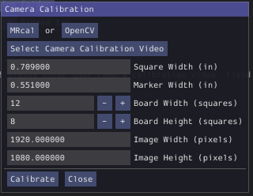
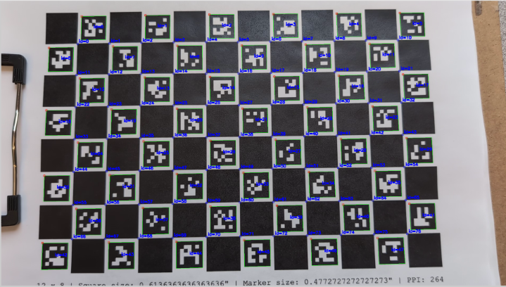

WPIcal
======
.. image:: images/WPIcal.png
    :alt: WPIcal

WPIcal is a cross-platform utility that can be used to empirically measure the position and orientation of Apriltags. The primary use case for WPIcal is to make sure robots can perform as they would on an event field, but on a practice field that may have imperfect Apriltags setup.

In Visual Studio Code, press :kbd:`Ctrl+Shift+P` and type ``WPILib`` or click the WPILib logo in the top right to launch the WPILib Command Palette. Select :guilabel:`Start Tool`, then select :guilabel:`WPIcal`.

.. warning:: Before using this tool, it is important to understand that this tool is not the end-all-be-all of computer vision accuracy. Knowing the exact location of Apriltags on the field is useful, but it isn't the most important factor that goes into consistent precision for localization. In order to get accurate localization, good camera placement, proper filtering, and well tuned standard deviations are a necessity, whereas knowing the precise locations of the apriltags is not.

Overview
--------
Conceptually, if you know how far tags are away from each other, and you know the field-relative coordinates of one of the tags, (the "pinned" tag) you can figure out the field-relative coordinates of the other tags. WPIcal achieves this by running an optimization on frames from videos that the user takes of the field. WPIcal is field-agnostic, meaning it will work with any FRC apriltag layout, as well as custom apriltag layouts, as long as they conform to the WPILib standard field layout.

.. important:: WPIcal is meant to correct for SMALL variations in tag placement. It is still important that you set up your Apriltags in mostly the correct location and orientation, so WPIcal performs the optimal calibration.
.. important:: Make sure that you verify the results of each calibration thoroughly to ensure that your calibration matches your field setup accurately.

Camera Calibration
------------------
To measure the distance between tags in a video, you need the camera's intrinsics to account for things like distortion. WPIcal allows users to upload a video file to calibrate the camera in the tool, or upload a JSON file with your camera's intrinsics

In-App Calibration
^^^^^^^^^^^^^^^^^^
To calibrate your camera from a video file, click on :guilabel:`Calibrate Camera`

.. image:: images/Calibrate.png
    :alt: Calibrate

There are two options for calibrating your camera, :guilabel:`OpenCV` and :guilabel:`MRcal`. It is generally recommended to calibrate with :guilabel:`MRcal`, as it has slightly better accuracy and is more robust against bad calibration data. The calibration option you use will dictate the type of board you calibrate with.

:guilabel:`OpenCV` calibration uses a ChArUco board:

.. image:: images/ChArUco.png
    :alt: ChArUco

:guilabel:`MRcal` uses a Checkerboard pattern:

.. image:: images/Chessboard.png
    :alt: Checkerboard

.. note:: Regardless of which calibration option you use, make sure your calibration board has not been bent or creased, and is lying on a flat surface.
.. note:: It does not matter if you use the exact same board as shown in the images, as there are fields in each calibration option to customize the calibration for your specific board.

There are a couple of common fields that both :guilabel:`OpenCV` and :guilabel:`MRcal` calibration options use:

* :guilabel:`Select Camera Calibration Video` is the button to select your video file.

* :guilabel:`Square Width` is the width of the squares (in inches) of the board.

* :guilabel:`Board Width` is the width (in squares) of the board

* :guilabel:`Board Height` is the height (in squares) of the board

For :guilabel:`OpenCV`, there is one more option to fill in:

* :guilabel:`Marker Width` is the width of the ChArUco markers (in inches) on the board

For :guilabel:`MRcal`, there are three more options to fill in:

* :guilabel:`Image Width` is the width (in pixels) of the video's resolution
* :guilabel:`Image Height` is the height (in pixels) of the video's resolution
* :guilabel:`Focal Length` is the focal length (in pixels) of the camera.

.. important:: For the calibration to work properly, it is important that you enter the exact width of the squares (and markers for ChArUco). It is recommended to use calipers to accurately measure these widths.

When all the calibration fields have been entered, select :guilabel:`Calibrate` to run the calibration. A window will appear showing you the corner detection process:

ChArUco:

Checkerboard:

.. image:: images/ChessboardDetection.png
    :alt: CheckerboardDetection

.. warning:: If any frames from the camera calibration look suspect, take a new video of the calibration board and try again.

The camera calibration will automatically load the generated camera intrinsics JSON into WPIcal to continue to field calibration, but will also output the JSON file so it can be used for future calibrations.

Upload Calibration JSON
^^^^^^^^^^^^^^^^^^^^^^^

As opposed to calibrating cameras in the tool, WPIcal also allows you to upload a camera intrinsics JSON. There are a three things each calibration JSON needs:

* ``avg_reprojection_error``
* ``camera_matrix``
* ``distortion_coefficients``

Example:

.. code-block:: json
    
    {
        "avg_reprojection_error": 0.3989609373420966,
        "camera_matrix": [
            1767.912766105077,          // fx
            0.0,
            989.4346078930205,          // cx
            0.0,
            1763.5161174120185,         // fy
            540.7047848580446,          // cy
            0.0,
            0.0,
            1.0
        ],
        "distortion_coefficients": [
            0.3878712310541597,         // k1
            -2.565991238351721,         // k2
            -0.0011767048240595168,     // p1
            0.0017341455009923185,      // p2
            5.70562560518866,           // k3
            0.03694246896004978,        // k4
            0.11811204683668342,        // k5
            -0.2274481545065017,        // k6
            0.0,                        // s1
            0.0,                        // s2
            0.0,                        // s3
            0.0,                        // s4
            0.0,                        // tx
            0.0                         // ty
        ]
    }

The best method for external camera calibration is `CalibDB.net <https://calibdb.net/>`_. WPIcal allows you to directly upload the generated CalibDB JSON without any modification. Make sure to download the OpenCV format JSON:

Then:

.. important:: When uploading a CalibDB JSON, ensure that you download the calibration with the proper resolution selected.

Field Calibration
-----------------

After calibrating the camera, you can use the camera model to find the relative positions of the Apriltags. The calibration process will generate a .json file and a .fmap for use on coprocessors and in robot code.

Upload Ideal Field Map
^^^^^^^^^^^^^^^^^^^^^^

WPIcal uses an "ideal" field map JSON as an initial guess point for the optimization. It is recommended to upload the json file included with WPILib.

Select Field Calibration Directory
^^^^^^^^^^^^^^^^^^^^^^^^^^^^^^^^^^

WPIcal can calibrate a field based on one or more videos. All the calibration videos must be stored in their own directory, separate from any other files. 

Pinned Tag
^^^^^^^^^^

The pinned tag is the tag that other tags are transformed relative to. This tag should be the tag that is the most accurate on the field.

Calibration FPS
^^^^^^^^^^^^^^^

The calibration FPS is the number of frames WPIcal uses for calibration per second of video. It is important that this setting is set to a value less than the frame rate of the calibration videos.

View Field Calibration
^^^^^^^^^^^^^^^^^^^^^^

After the calibration is completed, you can view the difference between the reference tags and the calibrated tags to double check that your calibrated values look reasonable.