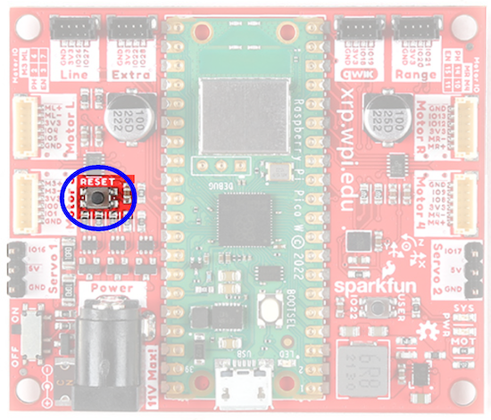
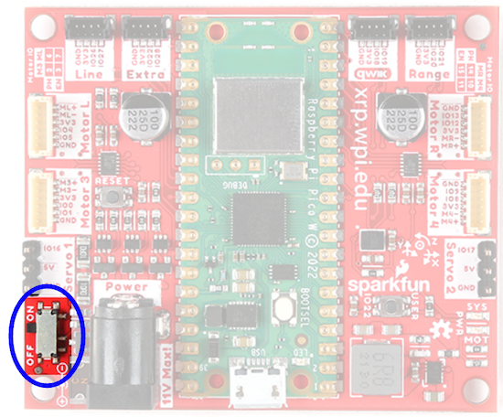

XRP Hardware, Assembly and Imaging
==================================

To get started with the XRP, you will need to have the necessary hardware.

1. XRP Kit `from SparkFun <https://www.sparkfun.com/products/22230>`__ or `from DigiKey <https://www.digikey.com/en/products/detail/sparkfun-electronics/KIT-22296/19117674>`__ - Available at a discount for educational institutions or FIRST teams. See individual vendors for details.
2. `Micro-USB cable <https://www.amazon.com/dp/B0711PVX6Z>`__ - Ensure that this is a data cable
3. `4 AA batteries <https://www.amazon.com/gp/product/B07TW9T8JW/>`__ - Rechargeable (`example <https://www.amazon.com/AmazonBasics-AA-High-Capacity-Rechargeable-4-Pack/dp/B081FF82RK>`__) is best (don't forget the charger)

Assembly
--------

.. note::

   See the assembly instructions on the `XRP User Guide <https://xrpusersguide.readthedocs.io/en/latest/course/building.html>`_.

   You should follow the instructions up to and including the point where the XRP arm is mounted to the servo.

Imaging your XRP
----------------

The XRP uses a Raspberry Pi Pico W as its main processor. A special firmware will need to be installed so that the robot operates properly.

Download
^^^^^^^^

The XRP firmware must be downloaded and written to the Pico W. Click on ``Assets`` at the bottom of the description to see the available image files:

`XRP-WPILib Firmware <https://github.com/wpilibsuite/xrp-wpilib-firmware/releases>`__

Imaging
^^^^^^^

To image the XRP, perform the following steps:

1. Extract the contents of the firmware ZIP file. You should end up with a ``.uf2`` file.

2. Plug the XRP into your computer with a Micro-USB cable. You should see a red power LED that lights up.

3. While holding the ``BOOTSEL`` button (the white button on the green Pico W, near the USB connector), quickly press the reset button (circled below), and then release the ``BOOTSEL`` button.

4. The board will temporarily disconnect from your computer, and then reconnect as a USB storage device named ``RPI-RP2``.

5. Drag the ``.uf2`` firmware file into the ``RPI-RP2`` drive, and it will automatically update the firmware.

6. Once complete, the ``RPI-RP2`` USB storage device will disconnect. At this point, you can disconnect the XRP board from your computer and run it off battery power.

First Boot
^^^^^^^^^^

Perform the following steps to get your XRP ready for use:

1. Ensure that you have 4 AA batteries installed

2. Turn the XRP on by sliding the power switch (circled below) on the XRP board to the on position. A red power LED will turn on.

3. Using your computer, connect to the XRP WiFi network using the SSID ``XRP-<IDENT>`` (where ``<IDENT>`` is based on the unique ID of the Pico W) with the WPA2 passphrase ``xrp-wpilib``.

.. note:: If powering on the XRP in an environment with multiple other XRPs, the SSID can also be found by connecting the XRP to a computer, navigating to the USB storage device (``PICODISK``) that appears and opening the ``xrp-status.txt`` file.

4. Open a web browser and connect to the web UI at ``http://192.168.42.1:5000``. If the page loads, you have established connectivity with the XRP.

.. note:: More information about the Web UI and configuration can be found in the :doc:`Web UI section</docs/xrp-robot/web-ui>`.
