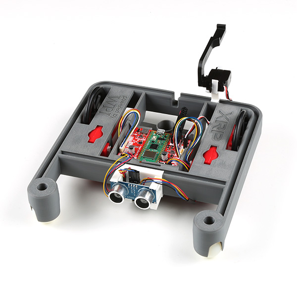

Getting Started with XRP
========================

The XRP is a small and inexpensive robot designed for learning about programming FRC robots. All the same tools used for programming full-sized FRC robots can be used to program the XRP. The XRP comes with two drive motors with integrated wheel encoders. It also includes an :term:`IMU` sensor that can be used for measuring headings and accelerations. Using it is as simple as writing a robot program, and running it on your computer. It will command the XRP to follow the steps in the program.

The XRP provides a similar use case as the :doc:`Romi </docs/romi-robot/index>` with similar functionality, albeit using a lower power processor and is overall lower in cost.

.. toctree::
   :maxdepth: 1

   hardware-and-imaging
   getting-to-know-xrp
   hardware-support
   web-ui
   programming-xrp
