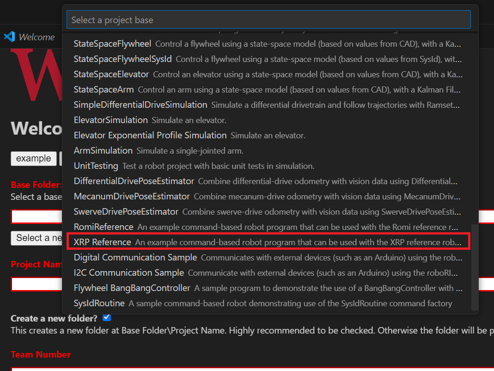

# Programming the XRP

Writing a program for the XRP is very similar to writing a program for a regular FRC robot. In fact, all the same tools (Visual Studio Code, Driver Station, SmartDashboard, etc) can be used with the XRP.

## Creating an XRP Program

Creating a new program for an XRP is like creating a normal FRC program, similar to the :doc:`Zero To Robot </docs/zero-to-robot/step-4/index>` programming steps.

[WPILib](http://wpilib.org), created by [Worcester Polytechnic Institute](http://wpi.edu), comes with two templates for XRP projects, including one based on TimedRobot, and a Command-Based project template. Additionally, an example project is provided which showcases some of the built-in functionality of the XRP, and shows how to use the vendordep exposed XRP classes. This article will walk through creating a project from this example.

.. note:: In order to program the XRP using C++, a compatible C++ desktop compiler must be installed. See :ref:`Robot Simulation - Additional C++ Dependency <cpp_sim_additional_dependency>`.

### Creating a New WPILib XRP Project

Bring up the Visual Studio Code command palette with :kbd:`Ctrl+Shift+P`, and type "New project" into the prompt. Select the "Create a new project" command:

.. image:: /docs/software/vscode-overview/images/creating-robot-program/create-new-project.png

This will bring up the "New Project Creator Window". From here, click on "Select a project type (Example or Template)", and pick "Example" from the prompt that appears:

.. image:: /docs/romi-robot/images/programming-romi/vscode-select-example.png

Select the programming language you want to use:

.. image:: /docs/romi-robot/images/programming-romi/vscode-select-language.png

Next, a list of examples will appear. Scroll through the list to find the "XRP Reference" example:

Fill out the rest of the fields in the "New Project Creator" and click "Generate Project" to create the new robot project.

### Running an XRP Program

Once the robot project is generated, it is essentially ready to run. The project has a pre-built ``Drivetrain`` class and associated default command that lets you drive the XRP around using a joystick.

One aspect where an XRP project differs from a regular FRC robot project is that the code is not deployed directly to the XRP. Instead, an XRP project runs on your development computer and leverages the WPILib simulation framework to communicate with the XRP.

To run an XRP program, first, ensure that your XRP is powered on. Next, connect to ``XRP-<IDENT>`` WiFi network broadcast by the XRP. If you changed the XRP network settings (for example, to connect it to your own network), you may change the IP address that your program uses to connect to the XRP. To do this, open the ``build.gradle`` file and update the ``wpi.sim.envVar`` line to the appropriate IP address.

.. rli:: https://raw.githubusercontent.com/wpilibsuite/vscode-wpilib/v2026.1.1/vscode-wpilib/resources/gradle/javaxrp/build.gradle
   :language: groovy
   :lines: 44-47
   :lineno-match:
   :emphasize-lines: 2

Now to start your XRP robot code, open the WPILib Command Palette (type :kbd:`Ctrl+Shift+P`) and select "Simulate Robot Code", or press :kbd:`F5`.

If all goes well, you should see the simulation GUI pop up and see the gyro and accelerometer values updating.

Your XRP code is now running!
