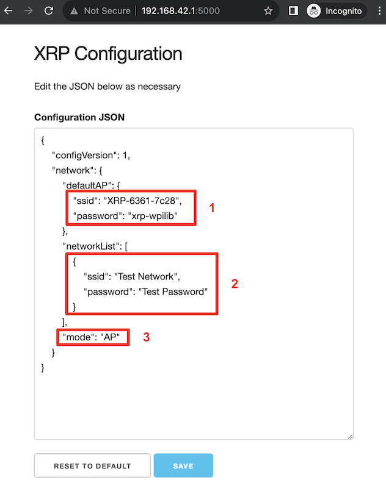

The XRP Web UI
==============

The XRP provides a simple Web UI for configuration. It is accessible at ``http://<IP Address of XRP>:5000``. By default, this is ``http://192.168.42.1:5000``.

The XRP configuration is a simple JSON object that allows a user to configure the network settings of the XRP.

Switching Network Modes
-----------------------

Box 3 in the image above shows the field that needs to be changed in order to switch the XRP from Access Point mode to/from Station mode. In Access Point (``AP``) mode, the XRP will broadcast a WiFi network. In Station (``STA``) mode, the XRP will connect to an existing WiFi network. Update the ``mode`` field with the appropriate value (``AP``/``STA``).

Setting up a default Access Point (AP)
--------------------------------------

By default, the XRP will operate in Access Point mode, where it broadcasts a WiFi network. Box 1 in the image above shows which fields control the settings for the AP SSID and passphrase.

If the operating mode is set to ``AP``, the access point information will be used to create the WiFi Access Point. If the mode is set to ``STA`` (station) and the XRP is unable to connect to any of the listed WiFi networks, then it will fall back to AP mode, again, using the information specified in box 1.

Connecting to an existing WiFi network
--------------------------------------

Box 2 in the image above shows an example of listing a WiFi network that you want the XRP to connect to. the ``networkList`` array can be populated with as many preferred networks as you would like (following the same format as Box 2). When set to ``STA`` mode, the XRP will attempt to connect to each listed network in order. If none of the networks are available, the XRP will fallback into AP mode.

.. note:: If you are unsure about what mode the XRP is operating in, or which WiFi network it is connected to, you can connect the XRP to a computer via a USB cable. A USB storage device named ``PICODISK`` will appear, and the ``xrp-status.txt`` file within it will list the appropriate network information.
