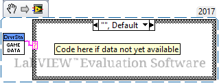
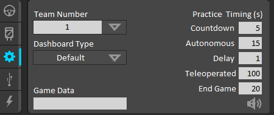

.. include:: <isonum.txt>

# 2026 Game Data Details

In the 2026 *FIRST*\ |reg| Robotics Competition game, the first goal to go inactive is determined by the alliance that scores more Fuel in Auto. The field will transmit the alliance to all 6 teams using Game Data. This page details the timing and structure of the sent data and provides examples of how to access it in the three supported programming languages.

## The Data

### Timing

Data is sent to both alliances simultaneously after Fuel scored in Auto is finished being assessed, approximately 3 seconds after the end of Auto. Between the beginning of the match and this point, the Game Data will be an empty string.

### Data format

The alliance will be provided as a single character representing the color of the alliance whose goal will go inactive first (i.e. 'R' = red, 'B' = blue). This alliance's goal will be active in Shifts 2 and 4.

## Accessing the Data

The data is accessed using the Game Data methods or VIs in each language. Below are descriptions and examples of how to access the data from each of the three languages. As the data is provided to the Robot during the Teleop period, teams will likely want to query the data in Teleop periodic code.

### C++/Java/Python

In C++, Java, and Python the Game Data is accessed by using the GetGameSpecificMessage method of the DriverStation class. Teams likely want to query the data in a Teleop method such as Teleop Periodic in order to receive the data after it is sent during the match. Make sure to handle the case where the data is an empty string as this is what the data will be until the selected alliance is sent.

.. tab-set-code::

  ```java
  import edu.wpi.first.wpilibj.DriverStation;
  String gameData;
  gameData = DriverStation.getGameSpecificMessage();
  if(gameData.length() > 0)
  {
    switch (gameData.charAt(0))
    {
      case 'B' :
        //Blue case code
        break;
      case 'R' :
        //Red case code
        break;
      default :
        //This is corrupt data
        break;
    }
  } else {
    //Code for no data received yet
  }
  ```

  ```c++
  #include <frc/DriverStation.h>
  std::string gameData;
  gameData = frc::DriverStation::GetGameSpecificMessage();
  if(gameData.length() > 0)
  {
    switch (gameData[0])
    {
      case 'B' :
        //Blue case code
        break;
      case 'R' :
        //Red case code
        break;
      default :
        //This is corrupt data
        break;
    }
  } else {
    //Code for no data received yet
  }
  ```
  
  ```python
  data = wpilib.DriverStation.getGameSpecificMessage()
  if data:
     # Set the robot gamedata property and set a network tables value
     self.gameData = data
     self.sd.putString("gameData", self.gameData)
  ```

### LabVIEW

The Game Data in LabVIEW is accessed from the Game Specific Data VI. This VI can be found in the WPI Robotics Library -> Driver Station palette.

LabVIEW teams will likely want to query the data in the Teleop or PeriodicTasks VIs and may choose to gate the query behind a button press or other action. The code below reads the data and then uses a case structure to react differently to each of the 3 possible cases (empty, or either of the 2 letters).



## Testing Game Specific Data

You can test your Game Specific Data code without :term:`FMS` by using the Driver Station. Click on the Setup tab of the Driver Station, then enter the desired test string into the Game Data text field. The data will be transmitted to the robot in one of two conditions: Enable the robot in Teleop mode, or when the DS reaches the End Game time in a Practice Match (times are configurable on the Setup tab). It is recommended to run at least one match using the Practice functionality to verify that your code works correctly in a full match flow.

