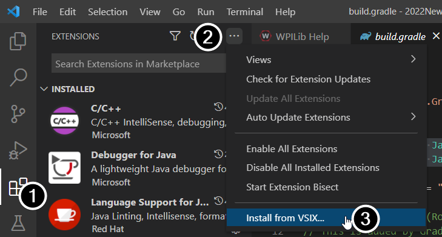
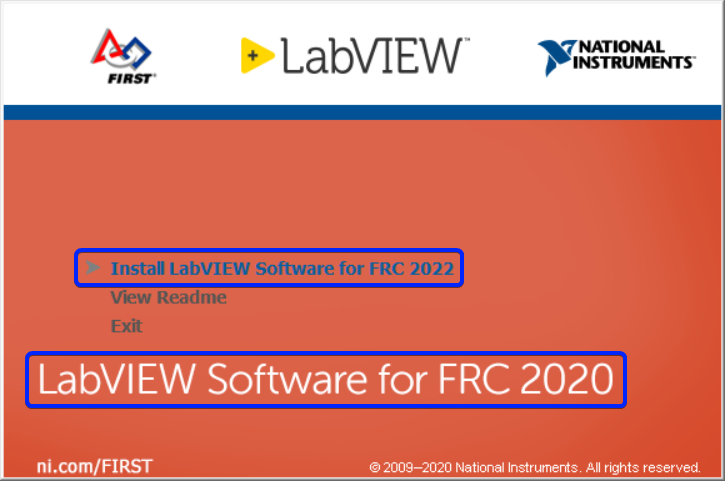

.. include:: <isonum.txt>

Known Issues
============

This article details known issues (and workarounds) for FRC\ |reg| Control System Software.

Open Issues
-----------

Visual Studio Code extensions fail to install on macOS
^^^^^^^^^^^^^^^^^^^^^^^^^^^^^^^^^^^^^^^^^^^^^^^^^^^^^^

**Issue:** With macOS Monterrey 12.3 or later, the VS Code extensions do not install automatically. This is due to the fact that macOS 12.3 removed python, but VS Code 1.62 installed by the WPILib Installer uses python when loading extensions.

**Workaround:** Manually install the VS Code extensions

1. Go to VS Code extensions (1), then three dots (2), then Install from VSIX (3).
2. Navigate to ``~/wpilib/2022/vsCodeExtensions`` and install ``CPP.vsix``
3. Repeat for the remaining 4 extensions (``JavaDebug.vsix``, ``JavaDeps.vsix``, ``JavaLang.vsix``, ``WPILib.vsix``)
4. Restart VS Code.

Code crash when initializing a PH/PCM related device
^^^^^^^^^^^^^^^^^^^^^^^^^^^^^^^^^^^^^^^^^^^^^^^^^^^^

**Issue:** The following crash may happen when a ``Solenoid``, ``DoubleSolenoid``, ``Compressor``, ``PneumaticHub`` or ``PneumaticsControlModule`` is initialized when the CAN bus is disconnected.

**Workaround:** It is recommended to wrap the constructor in a try/catch and catch any corresponding usages. Additionally, you will want to double check that all CAN connections are secure from possible disconnects.

.. tabs::

   .. code-tab:: java

      private Solenoid m_intakeSolenoid;

      @Override
      public void robotInit() {
        try {
          m_intakeSolenoid = new Solenoid(PneumaticsModuleType.REVPH, 0);
        } catch (UncleanStatusException ex) {
          DriverStation.reportError("Error creating Solenoid", ex.getStackTrace());
        }
      }

      public void toggleSolenoid() {
        try {
          m_intakeSolenoid.toggle();
        } catch (NullPointerException ex) {
          DriverStation.reportError("Solenoid object is null", ex.getStackTrace());
        }
      }

Onboard I2C Causing System Lockups
^^^^^^^^^^^^^^^^^^^^^^^^^^^^^^^^^^

**Issue:** Use of the onboard I2C port, in any language, can result in system lockups. The frequency of these lockups appears to be dependent on the specific hardware (i.e. different roboRIOs will behave differently) as well as how the bus is being used.

**Workaround:** The only surefire mitigation is to use the MXP I2C port or another device to read the I2C data. Acessing the device less frequently and/or using a different roboRIO may significantly reduce the likelihood/frequency of lockups, it will be up to each team to assess their tolerance of the risk of lockup. This lockup can not be definitively identified on the field and a field fault will not be called for a match where this behavior is believed to occur. This lockup is a CPU/kernel hang, the roboRIO will completely stop responding and will not be accessible via the DS, webpage or SSH. If you can access your roboRIO via any of these methods, you are experiencing a different issue.

Several alternatives exist for accessing the REV color sensor without using the roboRIO I2C port. A similar approach could be used for other I2C sensors.

- Use a `Raspberry Pi Pico <https://github.com/ThadHouse/picocolorsensor/>`__. Supports up to 2 REV color sensors, sends data to the roboRIO via serial. The Pi Pico is low cost (less than $10) and readily available.
- Use a `Raspberry Pi <https://github.com/PeterJohnson/rpi-colorsensor/>`__. Supports 1-4 color sensors, sends data to the roboRIO via NetworkTables. Primarily useful for teams already using a Raspberry Pi as a coprocessor.

CAN bus utilization is noisy
^^^^^^^^^^^^^^^^^^^^^^^^^^^^

**Issue:** CAN bus utilization as reported live by the DS or as shown in the DS log has significant variation or "spikes" in the data. This is due to the RoboRIO occasionally counting CAN packets in the incorrect time period, so one period will have a much lower utilization than reality and the next a much higher utilization than reality.

**Workaround:** Zoom in on the DS log plot and look for time periods when the utilization is stable (the spikes will be both above and below this average). The average utilization is the true utilization.

Updating Properties on roboRIO 2.0 may be slow or hang
^^^^^^^^^^^^^^^^^^^^^^^^^^^^^^^^^^^^^^^^^^^^^^^^^^^^^^

**Issue:** Updating the properties on a roboRIO 2.0 without reformatting using the Imaging Tool (such as setting the team number) may be slow or hang.

**Workaround:** After a few minutes of the tool waiting the roboRIO should be able to be rebooted and the new properties should be set.

Simulation crashes on Mac after updating WPILib
^^^^^^^^^^^^^^^^^^^^^^^^^^^^^^^^^^^^^^^^^^^^^^^

**Issue:** On macOS, after updating the project to use a newer version of WPILib, running simulation immediately crashes without the GUI appearing.

**Workaround:** In VS Code, run WPILib | Run a command in Gradle, ``clean``. Alternatively, run ``./gradlew clean`` in the terminal or delete the build directory.

Invalid build due to missing GradleRIO
^^^^^^^^^^^^^^^^^^^^^^^^^^^^^^^^^^^^^^

**Issue:** Rarely, a user's Gradle cache will get broken and they will get shown errors similar to the following:

.. code-block:: console

   Could not apply requested plugin [id: ‘edu.wpi.first.GradleRIO’, version: ‘2020.3.2’] as it does not provide a plugin with id ‘edu.wpi.first.GradleRIO’

**Workaround:**

Delete your Gradle cache located under ``~$USER_HOME/.gradle``. Windows machines may need to enable the ability to `view hidden files <https://support.microsoft.com/en-us/windows/view-hidden-files-and-folders-in-windows-10-97fbc472-c603-9d90-91d0-1166d1d9f4b5>`__. This issue has only shown up on Windows so far. Please `report <https://github.com/wpilibsuite/frc-docs/issues/new>`__ this issue if you get it on an alternative OS.

Unable to Build Robot Projects outside of VS Code on M1-based macOS
^^^^^^^^^^^^^^^^^^^^^^^^^^^^^^^^^^^^^^^^^^^^^^^^^^^^^^^^^^^^^^^^^^^

**Issue:** Error when building a robot project in non-WPILib installations.

.. code-block:: console

   Could not determine the dependencies of task ':extractReleaseNative'.
   > Could not resolve all files for configuration ':nativeRelease'.
     > Failed to transform hal-cpp-2022.1.1-rc-1-osxx86.zip (edu.wpi.first.hal:hal-cpp:2022.1.1-rc-1) to match attributes {artifactType=gr-directory, org.gradle.status=release}.
   ...

**Workaround:** M1-based macOS is not supported. The above error will show up when using an ARM-based JDK. User must use a x64-compatible JDK 11 or preferably use the WPILib installer.

Chinese characters in Driver Station Log
^^^^^^^^^^^^^^^^^^^^^^^^^^^^^^^^^^^^^^^^

**Issue:** Rarely, the driver station log will show Chinese characters instead of the English text. This appears to only happen when Windows is set to a language other then English.

.. image:: /docs/software/vscode-overview/images/known-issues/DS-chinese.jpg
  :alt: Chinese character appearing in the Driver Station log window.

**Workaround:**
There are two known workarounds:

  #. Copy and paste the Chinese characters into notepad, and the English text will be shown.
  #. Temporarily change the Windows language to English.

C++ Intellisense - Files Open on Launch Don't Work Properly
^^^^^^^^^^^^^^^^^^^^^^^^^^^^^^^^^^^^^^^^^^^^^^^^^^^^^^^^^^^

**Issue:** In C++, files open when VS Code launches will have issues with Intellisense showing suggestions from all options from a compilation unit and not just the appropriate ones or not finding header files. This is a bug in VS Code.

**Workaround:**

  #. Close all  files in VS Code, but leave VS Code open
  #. Delete c_cpp_properties.json file in the .vscode folder, if it exists
  #. Run the "Refresh C++ Intellisense" command in VS Code.
  #. In the bottom right you should see something that looks like a platform (linuxathena or windowsx86-64 etc). If it’s not linuxathena click it and set it to linuxathena (release)
  #. Wait ~1 min
  #. Open the main cpp file (not a header file). Intellisense should now be working

Issues with WPILib Dashboards and Simulation on Windows N Editions
^^^^^^^^^^^^^^^^^^^^^^^^^^^^^^^^^^^^^^^^^^^^^^^^^^^^^^^^^^^^^^^^^^

**Issue:** WPILib code using CSCore (dashboards and simulated robot code) will have issues on Education N editions of Windows.

- Shuffleboard will run, but not load cameras
- Smartdashbard will crash on start-up
- Robot Simulation will crash on start-up

**Solution:** Install the `Media Feature Pack <https://www.microsoft.com/en-us/software-download/mediafeaturepack>`__

NetworkTables Interoperability
^^^^^^^^^^^^^^^^^^^^^^^^^^^^^^

There is currently an issue with inter-operating C++/Java :term:`NetworkTables` clients (dashboards or co-processors) with LabVIEW servers (LV robot code). In some scenarios users will see updates from one client fail to be replicated across to other clients (e.g. data from a co-processor will not be properly replicated out to a dashboard). Data still continues to return correctly when accessed by code on the server.

**Workaround**: Write code on the server to mirror any keys you wish to see on other clients (e.g. dashboards) to a separate key. For example, if you have a key named ``targetX`` being published by a co-processor that you want to show up on a dashboard, you could write code on the robot to read the key and re-write it to a key like ``targetXDash``.

LabVIEW Autorun graphics say 2020
^^^^^^^^^^^^^^^^^^^^^^^^^^^^^^^^^^^^

**Issue:** If you launch the LabVIEW installer by using the Autorun file, the menu item correctly says 2022, but the graphic says 2020.

**Workaround:** This can be safely ignored, if the menu item says 2022, you are installing the correct software.

Fixed in WPILib 2022.4.1
------------------------

Reentrant uses of synchronized may cause deadlock in Java
^^^^^^^^^^^^^^^^^^^^^^^^^^^^^^^^^^^^^^^^^^^^^^^^^^^^^^^^^

**Issue:** If multiple threads call a `synchronized` object, there may be a deadlock. This is caused by a bug in the version of JDK bundled with the 2022.1.1 to 2022.3.1 versions of WPILib.

The old commands framework, when using PIDController and PIDCommand, is possibly susceptible to this issue. If using that combination, please update to the latest WPILib to solve the issue.

**Workaround:** There are two options for workarounds:

#. Install the 2021 JDK. This is performed automatically in WPILib 2022.4.1 and later.

   #. Download the `2021 JDK <https://frcmaven.wpi.edu/artifactory/development/edu/wpi/first/jdk/roborio-2021/11.0.9u11-1/roborio-2021-11.0.9u11-1.ipk>`__.

   #. :doc:`Copy </docs/software/roborio-info/roborio-ftp>` the downloaded ``.ipk`` file to the roboRIO.

   #. :doc:`SSH </docs/software/roborio-info/roborio-ssh>` as admin to the roborio and execute ``opkg remove frc2022-openjdk*`` and ``opkg install roborio-2021-11.0.9u11-1.ipk``

#. Replace uses of ``synchronized`` with ``reentrantLock``

.. code-block:: Java

   try {
     reentrantLock.lock()
     ...do code here...
   } finally {
     reentrantLock.unlock()
   }

ADIS16448 not reading values in Java
^^^^^^^^^^^^^^^^^^^^^^^^^^^^^^^^^^^^

**Issue:** In WPILib 2022.3.1, using the no-args constructor for the ADIS16448 IMU in Java results in an divide by zero exception in a separate thread and no IMU data updates.

**Workaround:** Instead of the no-args constructor, use ``new ADIS16448_IMU(ADIS16448_IMU.IMUAxis.kZ, SPI.Port.kMXP, ADIS16448_IMU.CalibrationTime._1s);``.

Fixed in Image 2022_v4.0 (Game Tools 2022 f1 and WPILib 2022.3.1)
-----------------------------------------------------------------

Analog Devices Gyros don't work properly
^^^^^^^^^^^^^^^^^^^^^^^^^^^^^^^^^^^^^^^^
**Issue:** Due to an issue with the "autoSPI" feature in the roboRIO image 2022_v3.0, Analog Devices gyros do not work properly.

**Workaround:** There is no known workaround. An updated image will be released when the issue has been resolved.

Fixed in WPILib 2022.2.1
------------------------

Joysticks may stop updating in Java
^^^^^^^^^^^^^^^^^^^^^^^^^^^^^^^^^^^

**Issue:** A deadlock in the Java WPILib DriverStation thread may occur. This is primarily noticeable by Joystick values "freezing" and not updating. Disable and E-Stop are not affected by this issue.

**Recommendations:** Ensure that anyone operating a robot is prepared to disable or E-Stop if this issue occurs. Limit calls to the following DriverStation methods: ``isEnabled``, ``isEStopped``, ``isAutonomous``, ``isDisabled``, ``isAutonomousEnabled``, ``isTeleopEnabled``, ``isTest``, ``isDSAttached``, ``isFMSAttached``, and ``updateControlWord``, especially from multiple threads, to limit the chance of the deadlock occurring. Follow `this WPILib issue <https://github.com/wpilibsuite/allwpilib/issues/3896>`__ for more updates and possible workarounds.

VS Code Vendor Check for Updates Broken
^^^^^^^^^^^^^^^^^^^^^^^^^^^^^^^^^^^^^^^

**Issue:** Checking for vendor library updates online results in the following error message: `Command 'WPILib: Manage Vendor Libraries' resulted in an error (Only absolute URLs are supported)`. This is caused by a bug in the VS Code extension related to the way the WPILib Command library vendordeps were created. This issue will be fixed in the next WPILib release.

**Workaround:** If you aren't using either the new or old Command vendordep, remove them from your project. Alternately, the new or old Command vendordep can be temporarily removed before checking for updates, and then re-added.

Shuffleboard aborts while launching
^^^^^^^^^^^^^^^^^^^^^^^^^^^^^^^^^^^

**Issue:** Shuffleboard may start to open, and then abort. This is caused by issues with the scripts for launching the WPILib tools.

**Workaround:** Manually launch Shuffleboard from the commandline without using the shortcut or script. On Windows run ``c:\Users\Public\wpilib\2022\jdk\bin\java -jar c:\Users\Public\wpilib\2022\tools\shuffleboard.jar``. On Linux or macOS, run ``~/wpilib/2022/jdk/bin/java -jar ~/wpilib/2022/tools/shuffleboard.jar``

.. note:: This issue may affect any WPILib Java tool, as they use the same scripts to open. If you have issues with PathWeaver, RobotBuilder, or SmartDashboard replace ``shuffleboard.jar`` above with ``PathWeaver.jar``, ``RobotBuilder.jar`` or ``SmartDashboard.jar``
