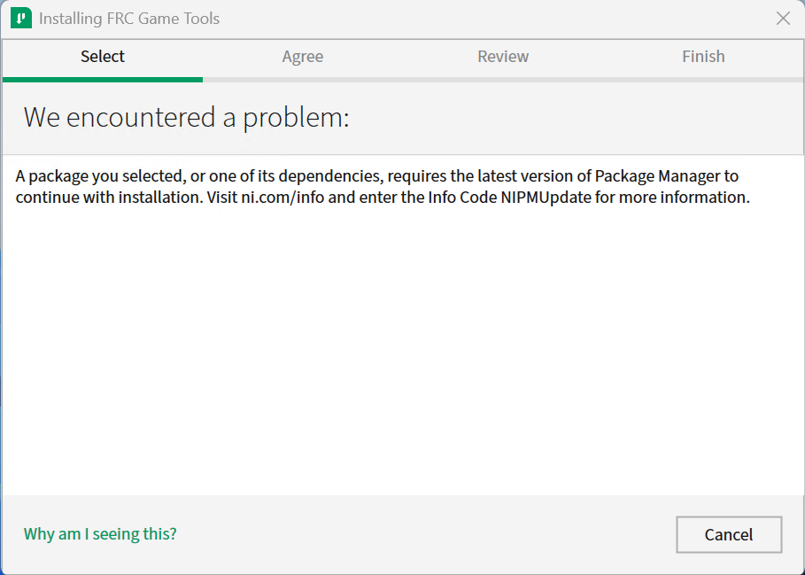

.. include:: <isonum.txt>

# Known Issues

This article details known issues (and workarounds) for FRC\ |reg| Control System Software.

## Open Issues

### I2C numbering backwards

The I2C numbering in WPILib is backwards from what the labels are on SystemCore. This will be fixed in Alpha 2 and later releases.

### DutyCycle.getOutput crashes

Attempting to call DutyCycle.getOutput() or DutyCycleEncoder.get() without calling setAssumedFrequency() will crash. This is because currently the HW does not report frequency, which doesn't allow us to compute a percentage output. This also means getFrequency() also will fail.

Use DutyCycle.getHighTime() or DutyCycleEncoder.setAssumedFrequency(), and use the value specified in the datasheet of the sensor to compute a percentage output.

### SystemCore won't get 10.TE.AM.2 address from Radio.

Due to the change in Hostname, the radio will not hand out .2 to SystemCore. Use the IP address displayed on the SystemCore screen if you need to know the IP address.

Generally, everything should work in this configuration. But if you run into issues where the DS cannot connect (And you're sure the team number is set, it's required to connect the DS and can be verified on the screen), you can manually type the IP address into the team number selector in the DS.

### Driver Station randomly disabled

**Issue:** The Driver Station contains tighter safety mechanisms introduced in 2024 to protect against control issues. Some teams have seen this cause the robot to disable.

**Workaround:** There are multiple potential causes for tripping the safety mechanisms.

.. note:: The new safety mechanisms will *not* disable the robot when connected to the :term:`FMS`.

The Driver Station software has new tools for control packet delays that could cause this. The control system team requests that teams that experience this issue post screenshots of the :doc:`Driver Station Timing window </docs/software/driverstation/driver-station-timing-viewer>` to https://github.com/wpilibsuite/allwpilib/issues/6174

Some teams have seen this happen only when the robot is operated wirelessly, but not when operated via USB or ethernet tether. Some potential mitigations:

1. Try relocating the robot radio to a better location (high in the robot and away from motors or large amounts of metal). Follow the `manufacturer's recommended mounting <https://frc-radio.vivid-hosting.net/getting-started/usage/mounting-your-radio>`__
2. :doc:`Measure your robot's bandwidth </docs/networking/networking-introduction/measuring-bandwidth-usage>` and ensure you have margin under the 7 Mbps bandwidth limit
3. See if the Wi-Fi environment is congested using a tool like [WiFi Analyzer](https://apps.microsoft.com/detail/9NBLGGH33N0N?hl=en-US&gl=US).
4. Utilize the recommended :doc:`2 radio setup </docs/zero-to-robot/step-3/radio-programming>`.
   1. Ensure the DS Radio is mounted high, away from interference and humans walking between the DS radio and the robot.
   2. Use ethernet to connect the DS computer to the DS Radio
5. Update the Wi-Fi drivers for the DS computer.

Some teams have seen this happen due to software that is running on the driver station (such as Autodesk updater or Discord). Some potential mitigations:

1. Reboot the driver station computer
2. Close software that is running in the background
3. Follow the :doc:`Driver Station Best Practices </docs/software/driverstation/driver-station-best-practices>`

While rare, this can be caused by robot code that oversaturates the roboRIO processor or network connection. If all other troubleshooting steps fail, you can try running with one of the WPILib example programs to see if the problem still occurs.

If you identify software that interferes with driver station, please post it to https://github.com/wpilibsuite/allwpilib/issues/6174

### Driver Station Reports Less Free RAM then is Available

**Issue:** The Driver Station diagnostic screen reports free RAM that is misleadingly low. This is due to Linux's use of memory caches. Linux will cache data in memory, but then relinquish when the robot programs requests more memory. The Driver Station only reports memory that isn't used by caches.

**Workaround:** The true memory available to the robot program is available in the file ``/proc/meminfo``. :doc:`Use ssh to connect to the robot </docs/software/roborio-info/roborio-ssh>`, and run ``cat /proc/meminfo``.

```text
MemTotal:         250152 kB
MemFree:           46484 kB
MemAvailable:     126956 kB
```

The proper value to look is as MemAvailable, rather then MemFree (which is what the driver station is reporting).

### Updating Properties on roboRIO 2.0 may be slow or hang

**Issue:** Updating the properties on a roboRIO 2.0 without reformatting using the Imaging Tool (such as setting the team number) may be slow or hang.

**Workaround:** After a few minutes of the tool waiting the roboRIO should be able to be rebooted and the new properties should be set.

### Simulation crashes on Mac after updating WPILib

**Issue:** On macOS, after updating the project to use a newer version of WPILib, running simulation immediately crashes without the GUI appearing.

**Workaround:** In VS Code, run WPILib | Run a command in Gradle, ``clean``. Alternatively, run ``./gradlew clean`` in the terminal or delete the build directory.

### Invalid build due to missing GradleRIO

**Issue:** Rarely, a user's Gradle cache will get broken and they will get shown errors similar to the following:

```console
Could not apply requested plugin [id: ‘edu.wpi.first.GradleRIO’, version: ‘2020.3.2’] as it does not provide a plugin with id ‘edu.wpi.first.GradleRIO’
```

**Workaround:**

Delete your Gradle cache located under ``~$USER_HOME/.gradle``. Windows machines may need to enable the ability to [view hidden files](https://support.microsoft.com/en-us/windows/view-hidden-files-and-folders-in-windows-10-97fbc472-c603-9d90-91d0-1166d1d9f4b5). This issue has only shown up on Windows so far. Please [report](https://github.com/wpilibsuite/frc-docs/issues/new) this issue if you get it on an alternative OS.

### Chinese characters in Driver Station Log

**Issue:** Rarely, the driver station log will show Chinese characters instead of the English text. This appears to only happen when Windows is set to a language other then English.

.. image:: /docs/software/vscode-overview/images/known-issues/DS-chinese.jpg
  :alt: Chinese character appearing in the Driver Station log window.

**Workaround:**
There are two known workarounds:

#. Copy and paste the Chinese characters into notepad, and the English text will be shown.
#. Temporarily change the Windows language to English.

### C++ Intellisense - Files Open on Launch Don't Work Properly

**Issue:** In C++, files open when VS Code launches will have issues with Intellisense showing suggestions from all options from a compilation unit and not just the appropriate ones or not finding header files. This is a bug in VS Code.

**Workaround:**

#. Close all  files in VS Code, but leave VS Code open
#. Delete c_cpp_properties.json file in the .vscode folder, if it exists
#. Run the "Refresh C++ Intellisense" command in VS Code.
#. In the bottom right you should see something that looks like a platform (linuxathena or windowsx86-64 etc). If it’s not linuxathena click it and set it to linuxathena (release)
#. Wait ~1 min
#. Open the main cpp file (not a header file). Intellisense should now be working

### Issues with WPILib Dashboards and Simulation on Windows N Editions

**Issue:** WPILib code using CSCore (dashboards and simulated robot code) will have issues on Education N editions of Windows.

- Shuffleboard will run, but not load cameras
- Smartdashbard will crash on start-up
- Robot Simulation will crash on start-up

**Solution:** Install the [Media Feature Pack](https://support.microsoft.com/en-us/topic/media-feature-pack-list-for-windows-n-editions-c1c6fffa-d052-8338-7a79-a4bb980a700a)

### Python - CameraServer/cscore runs out of memory on roboRIO 1

**Issue:** When using CameraServer on a roboRIO 1, the image processing program will sometimes exit with a ``SIGABRT`` or "Error code 6" or a ``MemoryError``.

**Solution:** You may be able to workaround this issue by disabling the NI webserver using the following robotpy-installer command:

```shell
python -m robotpy installer niweb disable
```

.. seealso:: [Github issue](https://github.com/robotpy/mostrobotpy/issues/61)

## Fixed by Game Tools 2025 Patch 1

### Game Tools install fails due to outdated NI Package Manager

**Issue:** An offiline installation of NI Game Tools may fail due to outdated NI Package Manager



**Workaround:** Install the latest [National Instruments Package Manager](https://www.ni.com/en/support/downloads/software-products/download.package-manager.html) (Note: Click on link for "Install Offline") and then restart Game Tools installation.

## Fixed by Elastic 2025.0.2 (WPILib Installer 2025.3.1)

### Elastic camera streams are very laggy

**Issue:** Camera streams displayed in Elastic are laggy and have low FPS.

**Workaround:** This is an issue that was fixed in Elastic 2025.0.2. Update Elastic by running the latest WPILib installer or Elastic installer.
