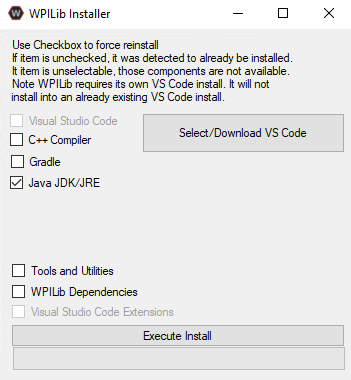

.. include:: <isonum.txt>

Known Issues
============

This article details known issues (and workarounds) for FRC\ |reg| Control System Software.

Open Issues
-----------

Visual Studio Code project importer fails to import
^^^^^^^^^^^^^^^^^^^^^^^^^^^^^^^^^^^^^^^^^^^^^^^^^^^

**Issue**

In the vscode-wpilib extension version 2021.3.1, the gradle project importer import button does not activate the import process.

**Workaround**

2020 projects can be manually imported using the :ref:`docs/software/vscode-overview/importing-gradle-project:Manual Import Process (2020 to 2021)`.

To import a project from an earlier year, create a new project using VS Code and copy your source files into the new project.

Failed to change IP Address in Radio Configuration
^^^^^^^^^^^^^^^^^^^^^^^^^^^^^^^^^^^^^^^^^^^^^^^^^^

**Issue**

The following error message may appear when configuring the radio ``Bridge configuration failed: Failed to change IP Address...``. This is due to a change in behavior in java versions 8u291 and 11.0.11.

**Workaround**

Install Java from the `WPILib 2020.3.2 installer <https://github.com/wpilibsuite/allwpilib/releases/tag/v2020.3.2>`__ . It is only necessary to install the Java JDK/JRE as shown below. The radio tool will use this version instead of any other system installed versions of java. This will take approximately 600 mb of disk space.

.. Note:: As the radio tool is unchanged from 2020, it will use the WPILib java installation from 2020, not 2021, so it is necessary to use the 2020 installer.

No such host is known in the WPILib Installer
^^^^^^^^^^^^^^^^^^^^^^^^^^^^^^^^^^^^^^^^^^^^^

The following error message will show up when downloading VS Code with WPILib Installer version ``2021.2.1`` or earlier **or** version ``2021.2.2`` that was downloaded before ``3/24/2021``.

.. code-block::

   System.Net.Http.HttpRequestException: No such host is known.

This is due to the VS Code download URL being changed. A hotfix has been published and users should redownload the ``2021.2.2`` release or later. This fix can be downloaded `here <https://github.com/wpilibsuite/allwpilib/releases>`__.

Invalid build due to missing GradleRIO
^^^^^^^^^^^^^^^^^^^^^^^^^^^^^^^^^^^^^^

**Issue:** Rarely, a user's Gradle cache will get broken and they will get shown errors similar to the following:

.. code-block:: console

   Could not apply requested plugin [id: ‘edu.wpi.first.GradleRIO’, version: ‘2020.3.2’] as it does not provide a plugin with id ‘edu.wpi.first.GradleRIO’

**Workaround:**

Delete your Gradle cache located under ``~$USER_HOME/.gradle``. Windows machines may need to enable the ability to `view hidden files <https://support.microsoft.com/en-us/windows/view-hidden-files-and-folders-in-windows-10-97fbc472-c603-9d90-91d0-1166d1d9f4b5>`__. This issue has only shown up on Windows so far. Please `report <https://github.com/wpilibsuite/frc-docs/issues/new>`__ this issue if you get it on an alternative OS.

Chinese characters in Driver Station Log
^^^^^^^^^^^^^^^^^^^^^^^^^^^^^^^^^^^^^^^^

**Issue:** Rarely, the driver station log will show Chinese characters instead of the English text. This appears to only happen when Windows is set to a language other then English.

.. image:: /docs/software/vscode-overview/images/known-issues/DS-chinese.jpg
  :alt: Chinese character appearing in the Driver Station log window.

**Workaround:**
There are two known workarounds:

  #. Copy and paste the Chinese characters into notepad, and the English text will be shown.
  #. Temporarily change the Windows language to English.

C++ Intellisense - Files Open on Launch Don't Work Properly
^^^^^^^^^^^^^^^^^^^^^^^^^^^^^^^^^^^^^^^^^^^^^^^^^^^^^^^^^^^

**Issue:** In C++, files open when VS Code launches will have issues with Intellisense showing suggestions from all options from a compilation unit and not just the appropriate ones or not finding header files. This is a bug in VS Code.

**Workaround:**

  #. Close all  files in VS Code, but leave VS Code open
  #. Delete c_cpp_properties.json file in the .vscode folder, if it exists
  #. Run the "Refresh C++ Intellisense" command in vscode.
  #. In the bottom right you should see something that looks like a platform (linuxathena or windowsx86-64 etc). If it’s not linuxathena click it and set it to linuxathena (release)
  #. Wait ~1 min
  #. Open the main cpp file (not a header file). Intellisense should now be working

SmartDashboard and Simulation fail to launch on Windows N Editions
^^^^^^^^^^^^^^^^^^^^^^^^^^^^^^^^^^^^^^^^^^^^^^^^^^^^^^^^^^^^^^^^^^

**Issue:** WPILib code using CSCore (dashboards and simulated robot code) will fail to launch on Education N editions of Windows.

**Solution:** Install the `Media Feature Pack <https://www.microsoft.com/en-us/software-download/mediafeaturepack>`__

NetworkTables Interoperability
^^^^^^^^^^^^^^^^^^^^^^^^^^^^^^

There is currently an issue with inter-operating C++/Java :term:`NetworkTables` clients (dashboards or co-processors) with LabVIEW servers (LV robot code). In some scenarios users will see updates from one client fail to be replicated across to other clients (e.g. data from a co-processor will not be properly replicated out to a dashboard). Data still continues to return correctly when accessed by code on the server.

**Workaround**: Write code on the server to mirror any keys you wish to see on other clients (e.g. dashboards) to a separate key. For example, if you have a key named ``targetX`` being published by a co-processor that you want to show up on a dashboard, you could write code on the robot to read the key and re-write it to a key like ``targetXDash``.

Fixed in WPILib 2021.2.2
------------------------

macOS Mojave Simulation Crash
^^^^^^^^^^^^^^^^^^^^^^^^^^^^^
**Issue:** The simulation GUI fails to launch on macOS Mojave (10.14.x) due to a dynamic linker error (example below):

.. code-block::

   dyld: lazy symbol binding failed: Symbol not found: _objc_opt_respondsToSelector

**Solution:** Upgrade to WPILib 2021.2.2 by using the latest installer or the "Check for WPILib Updates" feature in VS Code.

Fixed in Game Tools 2021 f1
---------------------------

2021_v3.0 Imaging Issue
^^^^^^^^^^^^^^^^^^^^^^^

**Issue:** An issue was discovered with the roboRIO image version 2021_v3.1 included in the initial release of the 2021 NI Game Tools that prevents successful imaging of roboRIOs.

**Solution:**  Teams that downloaded the 2021 Game Tools installer prior to the morning of January 11, 2021 should :doc:`re-download and re-install</docs/zero-to-robot/step-2/frc-game-tools>` the latest installer (no need to uninstall first). The new version is 2021 f1. Users with the correct version installed will not see 2021_v3.1 as an option in the roboRIO imaging tool. Once the new version is installed, the roboRIO can be imaged with 2021_v3.0.
