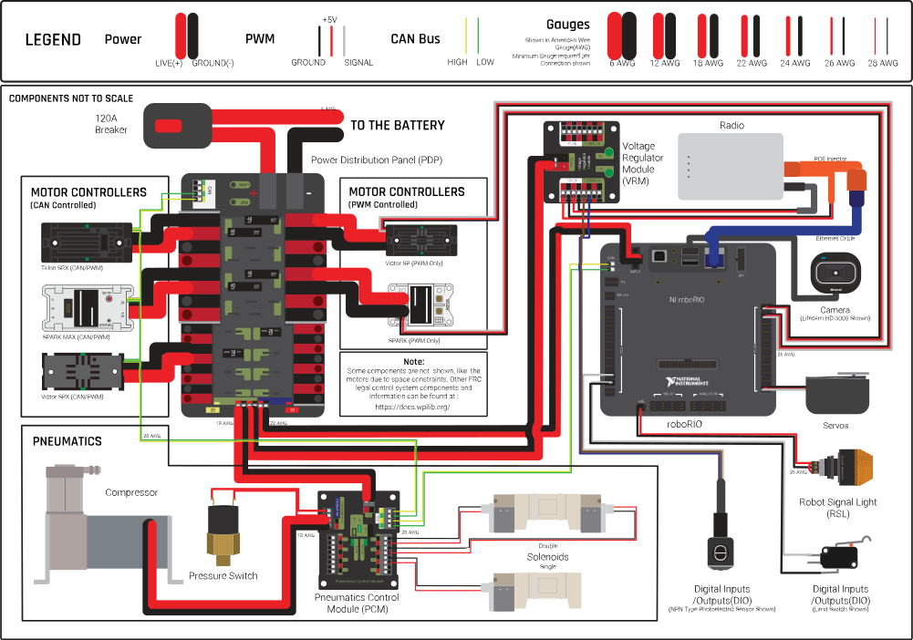
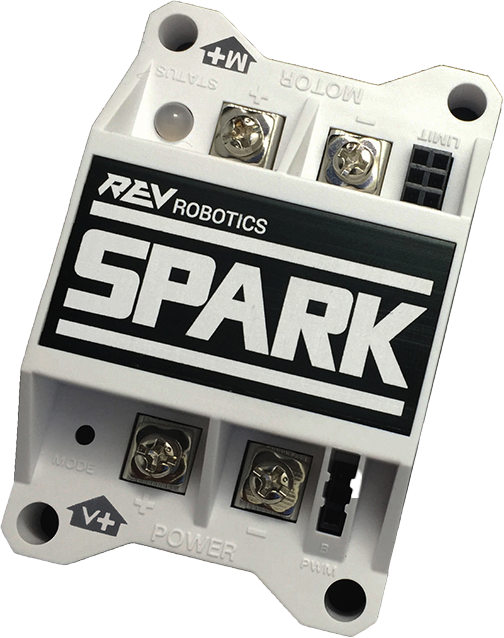
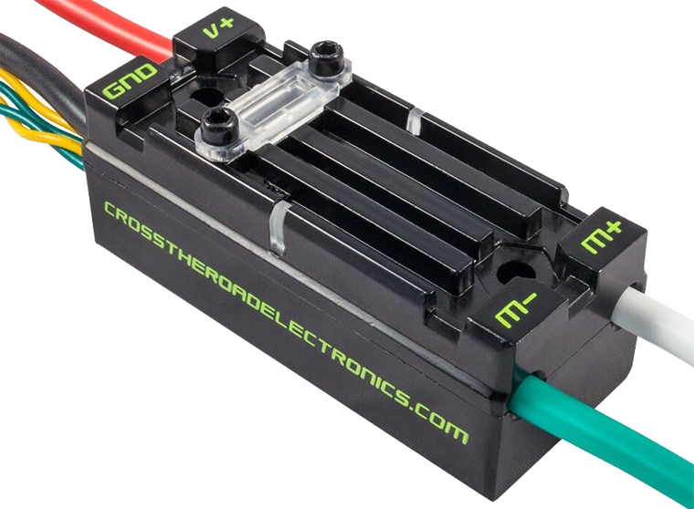
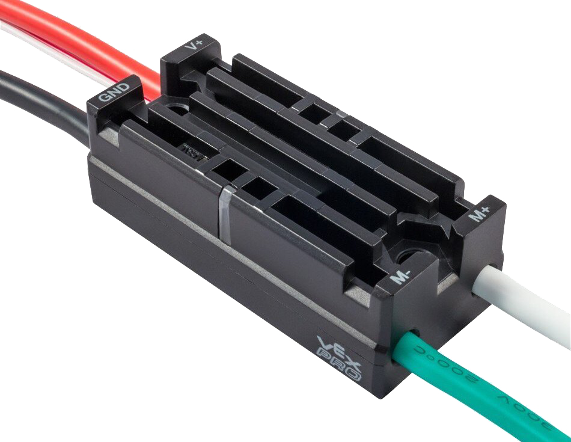
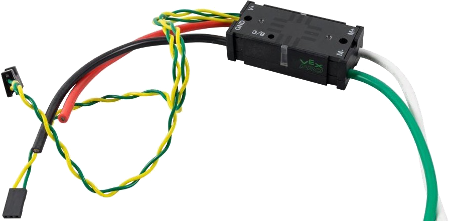
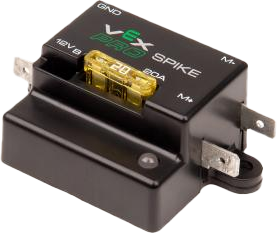
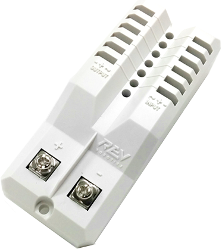
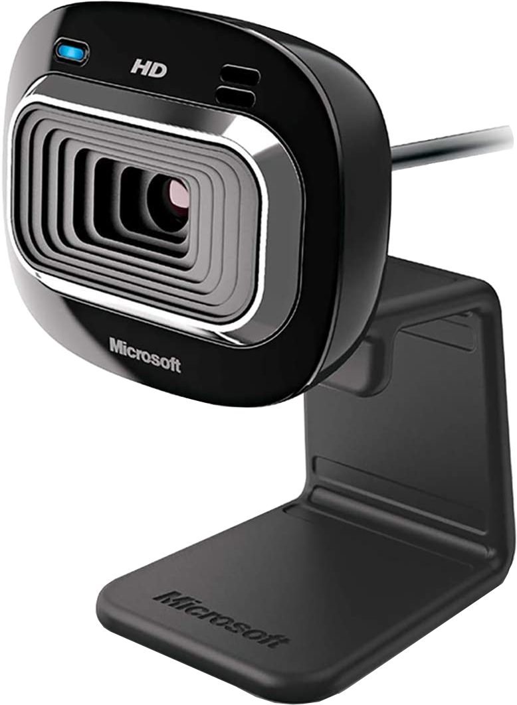
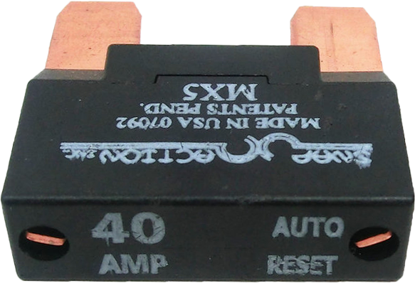

.. include:: <isonum.txt>

FRC Control System Hardware Overview
====================================

The goal of this document is to provide a brief overview of the hardware components that make up the FRC\ |reg| Control System. Each component will contain a brief description of the component function, a brief listing of critical connections, and a link to more documentation if available.

.. note:: For complete wiring instructions/diagrams, please see the :doc:`Wiring the FRC Control System <how-to-wire-a-robot>` document.

Overview of Control System
--------------------------

  Diagram courtesy of FRC Team 3161 and Stefen Acepcion.

NI roboRIO
----------

The NI-roboRIO is the main robot controller used for FRC. The roboRIO includes a dual-core ARM Cortex™-A9 processor and FPGA which runs both trusted elements for control and safety as well as team-generated code. Integrated controller I/O includes a variety of communication protocols (Ethernet, USB, CAN, SPI, I2C, and serial) as well as PWM, servo, digital I/O, and analog I/O channels used to connect to robot peripherals for sensing and control.The roboRIO should connect to the dedicated 12V port on the Power Distribution Panel for power. Wired communication is available via USB or Ethernet. Detailed information on the roboRIO can be found in the `roboRIO User Manual <https://www.ni.com/pdf/manuals/374474a.pdf>`__ and in the `roboRIO technical specifications <https://www.ni.com/pdf/manuals/374661a.pdf>`__.

Power Distribution Panel
------------------------

The Power Distribution Panel (PDP) is designed to distribute power from a 12VDC battery to various robot components through auto-resetting circuit breakers and a small number of special function fused connections. The PDP provides 8 output pairs rated for 40A continuous current and 8 pairs rated for 30A continuous current. The PDP provides dedicated 12V connectors for the roboRIO, as well as connectors for the Voltage Regulator Module and Pneumatics Control Module. It also includes a CAN interface for logging current, temperature, and battery voltage. For more detailed information, see the `PDP User Manual <https://www.ctr-electronics.com/downloads/pdf/PDP%20User's%20Guide.pdf>`__.

Pneumatics Control Module
-------------------------

.. image:: images/control-system-hardware/pneumatics-control-module.png
  :width: 500

The PCM is a device that contains all of the inputs and outputs required to operate 12V or 24V pneumatic solenoids and the on board compressor. The PCM is enabled/disabled by the roboRIO over the CAN interface. The PCM contains an input for the pressure sensor and will control the compressor automatically when the robot is enabled and a solenoid has been created in the code. The device also collects diagnostic information such as solenoid states, pressure switch state, and compressor state. The module includes diagnostic LED’s for both CAN and the individual solenoid channels. For more information see the `PCM User Manual <https://www.ctr-electronics.com/downloads/pdf/PCM%20User's%20Guide.pdf>`__.

Voltage Regulator Module
------------------------

The VRM is an independent module that is powered by 12 volts. The device is wired to a dedicated connector on the PDP. The module has multiple regulated 12V and 5V outputs. The purpose of the VRM is to provide regulated power for the robot radio, custom circuits, and IP vision cameras. The two connector pairs associated with each label have a combined rating of what the label indicates (e.g. 5V/500mA total for both pairs not for each pair). The 12V/2A limit is a peak rating, the supply should not be loaded with more than 1.5A continuous current draw. For more information, see the `VRM User Manual <https://www.ctr-electronics.com/VRM%20User's%20Guide.pdf>`__.

Motor Controllers
-----------------

There are a variety of different motor controllers which work with the FRC Control System and are approved for use. These devices are used to provide variable voltage control of the brushed DC motors used in FRC. They are listed here in alphabetical order.

DMC-60 and DMC-60C Motor Controller
^^^^^^^^^^^^^^^^^^^^^^^^^^^^^^^^^^^

The DMC-60 is a PWM motor controller from Digilent. The DMC-60 features integrated thermal sensing and protection including current-foldback to prevent overheating and damage, and four multi-color LEDs to indicate speed, direction, and status for easier debugging. For more information, see the `DMC-60 reference manual <https://reference.digilentinc.com/_media/dmc-60/dmc60_rm.pdf>`__

The DMC-60C adds CAN smart controller capabilities to the DMC-60 controller. This enables closed loop control features and other intelligent control options. For more information see the `DMC-60C Product Page <https://store.digilentinc.com/dmc60c-digital-motor-controller-approved-for-first-robotics/>`__

Jaguar Motor Controller
^^^^^^^^^^^^^^^^^^^^^^^

The Jaguar Motor Controller from VEX Robotics (formerly made by Luminary Micro and Texas Instruments) is a variable speed motor controller for use in FRC. For FRC, the Jaguar may only be controlled using the PWM interface.

SD540B and SD540C Motor Controllers
^^^^^^^^^^^^^^^^^^^^^^^^^^^^^^^^^^^

The SD540 Motor Controller from Mindsensors is a variable speed motor controller for use in FRC. The SD540B is controlled using the PWM interface. The SD540C is controllable over CAN. Limit switches may be wired directly to the SD540 to limit motor travel in one or both directions. Switches on the device are used to flip the direction of motor travel, configure the wiring polarity of limit switches, set Brake or Coast mode, and put the device in calibration mode. For more information see the `Mindsensors FRC page <http://www.mindsensors.com/68-frc>`__

SPARK Motor Controller
^^^^^^^^^^^^^^^^^^^^^^

The SPARK Motor Controller from REV Robotics is a variable speed motor controller for use in FRC. The SPARK is controlled using the PWM interface. Limit switches may be wired directly to the SPARK to limit motor travel in one or both directions. The RGB status LED displays the current state of the device including whether the device is currently in Brake mode or Coast mode. For more information, see the `REV Robotics SPARK product page <https://www.revrobotics.com/rev-11-1200/>`__

SPARK MAX Motor Controller
^^^^^^^^^^^^^^^^^^^^^^^^^^

The SPARK MAX Motor Controller from REV Robotics is a variable speed motor controller for use in FRC. The SPARK MAX is capable of controlling either the traditional brushed DC motors commonly used in FRC or the REV Robotics NEO Brushless Motor. The SPARK MAX can be controlled over PWM, CAN or USB (for configuration/testing only). The controller has a data port for sensor input and is capable of closed loop control modes when controlled over CAN or USB. For more information see the `REV Robotics SPARK MAX product page <https://www.revrobotics.com/rev-11-2158/>`__.

Talon Motor Controller
^^^^^^^^^^^^^^^^^^^^^^

The Talon Motor Controller from Cross the Road Electronics is a variable speed motor controller for use in FRC. The Talon is controlled over the PWM interface. The Talon should be connected to a PWM output of the roboRIO and powered from the Power Distribution Panel. For more information see the `Talon User Manual <https://ctr-electronics.com/Talon_User_Manual_1_1.pdf>`__.

Talon SRX
^^^^^^^^^

The Talon SRX motor controller is a CAN-enabled “smart motor controller” from Cross The Road Electronics/VEX Robotics. The Talon SRX has an electrically isolated metal housing for heat dissipation, making the use of a fan optional. The Talon SRX can be controlled over the CAN bus or PWM interface. When using the CAN bus control, this device can take inputs from limit switches and potentiometers, encoders, or similar sensors in order to perform advanced control such as limiting or PID(F) closed loop control on the device. For more information see the `Talon SRX User Manual <https://www.ctr-electronics.com/talon-srx.html>`__.

.. note:: CAN Talon SRX has been removed from WPILib. See this `blog <https://www.firstinspires.org/robotics/frc/blog/2017-control-system-update>`__ for more info and find the CTRE Toolsuite installer `here <https://www.ctr-electronics.com/Talon%20SRX%20User's%20Guide.pdf>`__.

Victor 888 Motor Controller / Victor 884 Motor Controller
^^^^^^^^^^^^^^^^^^^^^^^^^^^^^^^^^^^^^^^^^^^^^^^^^^^^^^^^^

The Victor 888 Motor Controller from VEX Robotics is a variable speed motor controller for use in FRC. The Victor 888 replaces the Victor 884, which is also usable in FRC. The Victor is controlled over the PWM interface. The Victor should be connected to a PWM output of the roboRIO and powered from the Power Distribution Panel. For more information, see the `Victor 884 User Manual <https://content.vexrobotics.com/docs/ifi-v884-users-manual-9-25-06.pdf>`__ and `Victor 888 User Manual <https://content.vexrobotics.com/docs/217-2769-Victor888UserManual.pdf>`__.

Victor SP
^^^^^^^^^

The Victor SP motor controller is a PWM motor controller from Cross The Road Electronics/VEX Robotics. The Victor SP has an electrically isolated metal housing for heat dissipation, making the use of the fan optional. The case is sealed to prevent debris from entering the controller. The controller is approximately half the size of previous models.

Victor SPX
^^^^^^^^^^

The Victor SPX motor controller is a CAN or PWM controlled motor controller from Cross The Road Electronics/VEX Robotics. The device is connectorized to allow easy connection to the roboRIO PWM connectors or a CAN bus chain. When controlled over the CAN bus, the device has a number of the closed loop features also present in the Talon SRX. The case is sealed to prevent debris from entering the controller. For more information, see the `Victor SPX Webpage <https://www.vexrobotics.com/217-9191.html>`__.

.. note:: Victor SPX CAN control is not supported from WPILib. See `this blog <https://www.firstinspires.org/robotics/frc/blog/2017-control-system-update>`__ for more info and find the CTRE Toolsuite installer `here <https://www.ctr-electronics.com/control-system/hro.html#product_tabs_technical_resources>`__.

Spike H-Bridge Relay
--------------------

The Spike H-Bridge Relay from VEX Robotics is a device used for controlling power to motors or other custom robot electronics. When connected to a motor, the Spike provides On/Off control in both the forward and reverse directions. The Spike outputs are independently controlled so it can also be used to provide power to up to 2 custom electronic circuits. The Spike H-Bridge Relay should be connected to a relay output of the roboRIO and powered from the Power Distribution Panel. For more information, see the `Spike User’s Guide <https://content.vexrobotics.com/docs/spike-blue-guide-sep05.pdf>`__.

Servo Power Module
------------------

The Servo Power Module from Rev Robotics is capable of expanding the power available to servos beyond what the roboRIO integrated power supply is capable of. The Servo Power Module provides up to 90W of 6V power across 6 channels. All control signals are passed through directly from the roboRIO. For more information, see the `Servo Power Module webpage <https://www.revrobotics.com/rev-11-1144/>`__.

Axis M1013/M1011/206 Ethernet Camera
------------------------------------

The Axis M1013, M1011 and Axis 206 Ethernet cameras are used for capturing images for vision processing and/or sending video back to the Driver Station laptop. The camera should be wired to a 5V power output on the Voltage Regulator Module and an open ethernet port on the robot radio. For more information, see :ref:`Configuring an Axis Camera <docs/software/vision-processing/axis-camera/configuring-an-axis-camera:Configuring an Axis Camera>` and the `Axis 206 <https://www.axis.com/en-us/products/axis-206>`__, `Axis M1011 <https://www.axis.com/en-us/products/axis-m1011>`__, `Axis M1013 pages <https://www.axis.com/en-us/products/axis-m1013>`__.

Microsoft Lifecam HD3000
------------------------

The Microsoft Lifecam HD3000 is a USB webcam that can be plugged directly into the roboRIO. The camera is capable of capturing up to 1280x720 video at 30 FPS. For more information about the camera, see the `Microsoft product page <https://www.microsoft.com/accessories/en-us/products/webcams/lifecam-hd-3000/t3h-00011#support>`__. For more information about using the camera with the roboRIO, see the :ref:`Vision Processing <docs/software/vision-processing/index:Vision Processing>` section of this documentation.

OpenMesh OM5P-AN or OM5P-AC Radio
---------------------------------

Either the OpenMesh OM5P-AN or OpenMesh OM5P-AC wireless radio is used as the robot radio to provide wireless communication functionality to the robot. The device can be configured as an Access Point for direct connection of a laptop for use at home. It can also be configured as a bridge for use on the field. The robot radio should be powered by one of the 12V/2A outputs on the VRM and connected to the roboRIO controller over Ethernet. For more information, see :ref:`Programming your Radio <docs/zero-to-robot/step-3/radio-programming:Programming your Radio>`.

The OM5P-AN `is no longer available for purchase <https://www.firstinspires.org/robotics/frc/blog/radio-silence>`__. The OM5P-AC is slightly heavier, has more cooling grates, and has a rough surface texture compared to the OM5P-AN.

120A Circuit Breaker
--------------------

The 120A Main Circuit Breaker serves two roles on the robot: the main robot power switch and a protection device for downstream robot wiring and components. The 120A circuit breaker is wired to the positive terminals of the robot battery and Power Distribution boards. For more information, please see the `Cooper Bussmann 18X Series Datasheet (PN: 185120F) <http://www.cooperindustries.com/content/dam/public/bussmann/Transportation/Circuit%20Protection/resources/datasheets/BUS_Tns_DS_18X_CIRCUITBREAKER.pdf>`__

Snap Action Circuit Breakers
----------------------------

The Snap Action circuit breakers, MX5-A40 and VB3 series, are used with the Power Distribution Panel to limit current to branch circuits. The MX5-A40 40A MAXI style circuit breaker is used with the larger channels on the Power Distribution Panel to power loads which draw current up to 40A continuous. The VB3 series are used with the smaller channels on the PDP to power circuits drawing current of 30A or less continuous. For more information, see the Datasheets for the `MX5 series <http://www.snapaction.net/pdf/MX5%20Spec%20Sheet.pdf>`__ and `VB3 Series <http://www.snapaction.net/pdf/vb3.pdf>`__.

Robot Battery
-------------

The power supply for an FRC robot is a single 12V 18Ah battery. The batteries used for FRC are sealed lead acid batteries capable of meeting the high current demands of an FRC robot. For more information, see the datasheet for the `MK ES17-12 <https://www.mkbattery.com/application/files/2515/3308/8109/ES17-12.pdf>`__.

.. note:: Other battery part numbers may be legal, consult the `FRC Manual <https://www.firstinspires.org/resource-library/frc/competition-manual-qa-system>`__ for a complete list.

Image Credits
-------------

Image of roboRIO courtesy of National Instruments. Image of DMC-60 courtesy of Digilent. Image of SD540 courtesy of Mindsensors. Images of Jaguar Motor Controller, Talon SRX, Victor 888, Victor SP, Victor SPX, and Spike H-Bridge Relay courtesy of VEX Robotics, Inc. Image of SPARK MAX courtesy of REV Robotics. Lifecam, PDP, PCM, SPARK, and VRM photos courtesy of *FIRST*\ |reg|. All other photos courtesy of AndyMark Inc.
