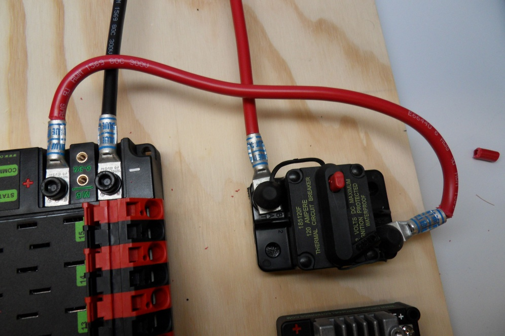
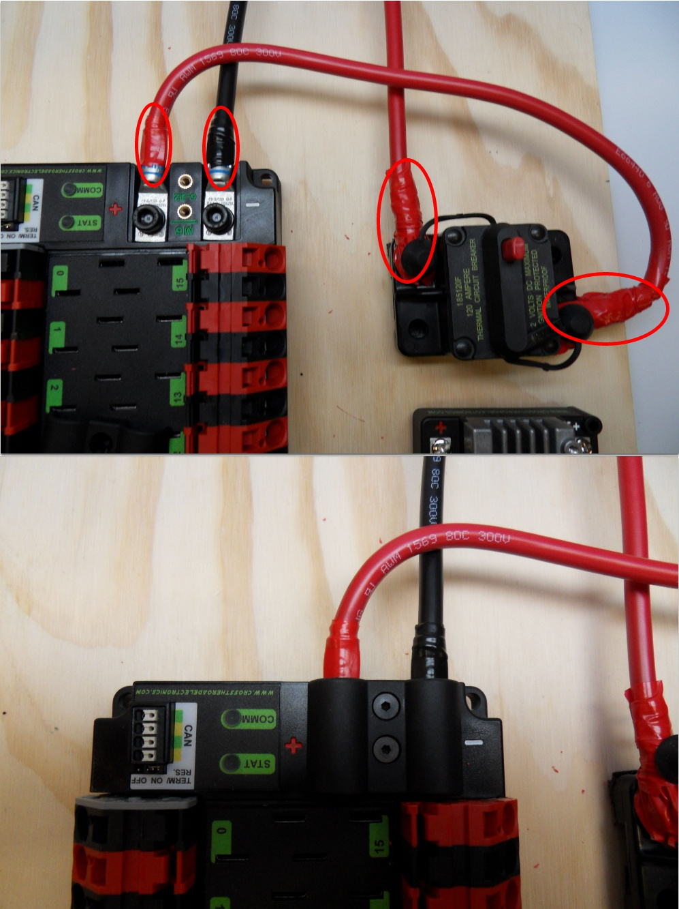

.. include:: <isonum.txt>

How to Wire an FRC Robot
========================

.. note::

   This document details the wiring of a basic electronics board for bench-top testing.

   Some images shown in this section reflect the setup for a Robot Control System using Victor SPX Motor Controllers. Wiring diagram and layout should be similar for other motor controllers. Where appropriate, two sets of images are provided to show connections using controllers with and without integrated wires.

Overview
--------

.. figure:: /docs/controls-overviews/images/frc-control-system-layout.svg
  :alt: Detailed diagram of all of the components and how they are connected.
  :width: 600

  Diagram courtesy of FRC\ |reg| Team 3161 and Stefen Acepcion.

Gather Materials
----------------

Locate the following control system components and tools

- Kit Materials:

      - Power Distribution Panel (PDP)
      - roboRIO
      - Pneumatics Control Module (PCM)
      - Voltage Regulator Module (VRM)
      - OpenMesh radio (with power cable and Ethernet cable)
      - Robot Signal Light (RSL)
      - 4x SPARK MAX or other motor controllers
      - 2x PWM y-cables
      - 120A Circuit breaker
      - 4x 40A Circuit breaker
      - 6 AWG (16 :math:`mm^2`) Red wire
      - 10 AWG (6 :math:`mm^2`) Red/Black wire
      - 18 AWG (1 :math:`mm^2`) Red/Black wire
      - 22 AWG (0.5 :math:`mm^2`) Yellow/Green twisted CAN cable
      - 16x 10-12 AWG (4 - 6 :math:`mm^2`) (Yellow) ring terminals
        (8x quick disconnect pairs if using integrated wire controllers)
      - 2x Anderson SB50 battery connectors
      - 6 AWG (16 :math:`mm^2`) Terminal lugs
      - 12V Battery
      - Red/Black Electrical tape
      - Dual Lock material or fasteners
      - Zip ties
      - 1/4" or 1/2" (6-12 mm) plywood

- Tools Required:

      - Wago Tool or small flat-head screwdriver
      - Very small flat head screwdriver (eyeglass repair size)
      - Philips head screw driver
      - 5 mm Hex key (3/16" may work if metric is unavailable)
      - 1/16" Hex key
      - Wire cutters, strippers, and crimpers
      - 7/16" (11 mm may work if imperial is unavailable) box end wrench or nut driver

Create the Base for the Control System
--------------------------------------

For a benchtop test board, cut piece of 1/4" or 1/2" (6-12 mm) material (wood or plastic) approximately 24" x 16" (60 x 40 cm). For a Robot Quick Build control board see the supporting documentation for the proper size board for the chosen chassis configuration.

Layout the Core Control System Components
-----------------------------------------

.. image:: images/how-to-wire-a-robot/layout.jpg
  :alt: A basic wiring layout.

Lay out the components on the board. An example layout is shown in the image above.

.. image:: images/how-to-wire-a-robot/ziptie.png
  :alt: Using zipties to secure components down.

Fasten Components
-----------------

Using the Dual Lock or hardware, fasten all components to the board. Note that in many FRC games robot-to-robot contact may be substantial and Dual Lock alone is unlikely to stand up as a fastener for many electronic components. Teams may wish to use nut and bolt fasteners or (as shown in the image above) cable ties, with or without Dual Lock to secure devices to the board.

Attach Battery Connector to PDP
-------------------------------

.. image:: images/how-to-wire-a-robot/terminal-lug.jpg
  :alt: Highlights the location of the terminal lugs on the PDP and circuit breaker.

Requires: Battery Connector, 6 AWG (16 :math:`mm^2`) terminal lugs, 1/16" Allen, 5 mm Allen,
7/16" (11 mm) Box end

Attach terminal lugs to battery connector:

1. Using a 1/16" Allen wrench, remove the two screws securing the PDP terminal cover.
2. Using a 5 mm Allen wrench (3/16"), remove the negative (-) bolt and washer from the PDP and fasten the negative terminal of the battery connector.
3. Using a 7/16" (11 mm) box end wrench, remove the nut on the "Batt" side of the main breaker and secure the positive terminal of the battery connector

Wire Breaker to PDP
-------------------

Requires: 6 AWG (16 :math:`mm^2`) red wire, 2x 6 AWG (16 :math:`mm^2`) terminal lugs, 5 mm Allen, 7/16" (11 mm) box end

Secure one terminal lug to the end of the 6 AWG (16 :math:`mm^2`) red wire. Using the 7/16" (11 mm) box end, remove the nut from the "AUX" side of the 120A main breaker and place the terminal over the stud. Loosely secure the nut (you may wish to remove it shortly to cut, strip, and crimp the other end of the wire). Measure out the length of wire required to reach the positive terminal of the PDP.

1. Cut, strip, and crimp the terminal to the 2nd end of the red 6 AWG (16 :math:`mm^2`) wire.
2. Using the 7/16" (11 mm) box end, secure the wire to the "AUX" side of the 120A main breaker.
3. Using the 5 mm Allen wrench, secure the other end to the PDP positive terminal.

Insulate PDP connections
------------------------

Requires: 1/16" Allen, Electrical tape

1. Using electrical tape, insulate the two connections to the 120A breaker. Also insulate any part of the PDP terminals which will be exposed when the cover is replaced. One method for insulating the main breaker connections is to wrap the stud and nut first, then use the tape wrapped around the terminal and wire to secure the tape.
2. Using the 1/16" Allen wrench, replace the PDP terminal cover

Wago connectors
---------------

.. raw:: html

    

        <iframe src="https://www.youtube-nocookie.com/embed/t-zb7j4ikHM" frameborder="0" allowfullscreen style="position: absolute; top: 0; left: 0; width: 100%; height: 100%;"></iframe>
    

The next step will involve using the Wago connectors on the PDP. To use the Wago connectors, insert a small flat blade screwdriver into the rectangular hole at a shallow angle then angle the screwdriver upwards as you continue to press in to actuate the lever, opening the terminal. Two sizes of Wago connector are found on the PDP:

- Small Wago connector: Accepts 10 - 24 AWG (0.25 - 6 :math:`mm^2`), strip 11-12 mm (~7/16")
- Large Wago connector: Accepts 6 - 12 AWG (4 - 16 :math:`mm^2`), strip 12-13 mm (~1/2")

To maximize pullout force and minimize connection resistance wires should not be tinned (and ideally not twisted) before inserting into the Wago connector.

Motor Controller Power
----------------------

.. image:: images/how-to-wire-a-robot/pdp-power.jpg
  :alt: Wiring power from the PDP to motor controllers.

.. image:: images/how-to-wire-a-robot/spark-power.jpg
  :alt: Wiring power to a Spark Motor Controller with ring terminals.

Requires: Wire Stripper, Small Flat Screwdriver, 10 or 12 AWG (4 - 6 :math:`mm^2`) wire, 10 or 12 AWG (4 - 6 :math:`mm^2`) fork/ring terminals (terminal controllers only), wire crimper

For SPARK MAX or other wire integrated motor controllers (top image):

- Cut and strip the red and black power input wires, then insert into one of the 40A (larger) Wago terminal pairs.

For terminal motor controllers (bottom image):

1. Cut red and black wire to appropriate length to reach from one of the 40A (larger) Wago terminal pairs to the input side of the motor controller (with a little extra for the length that will be inserted into the terminals on each end)
2. Strip one end of each of the wires, then insert into the Wago terminals.
3. Strip the other end of each wire, and crimp on a ring or fork terminal
4. Attach the terminal to the motor controller input terminals (red to +, black to -)

Weidmuller Connectors
---------------------

.. raw:: html

    

        <iframe src="https://www.youtube-nocookie.com/embed/Zsnro-9_ZfQ" frameborder="0" allowfullscreen style="position: absolute; top: 0; left: 0; width: 100%; height: 100%;"></iframe>
    

A number of the CAN and power connectors in the system use a Weidmuller LSF series wire-to-board connector. There are a few things to keep in mind when using this connector for best results:

- Wire should be 16 AWG (1.5 :math:`mm^2`) to 24 AWG (0.25 :math:`mm^2`) (consult rules to verify required gauge for power wiring)
- Wire ends should be stripped approximately 5/16 (~8 mm)"
- To insert or remove the wire, press down on the corresponding "button" to open the terminal

After making the connection check to be sure that it is clean and secure:

- Verify that there are no "whiskers" outside the connector that may cause a short circuit
- Tug on the wire to verify that it is seated fully. If the wire comes out and is the correct gauge it needs to be inserted further and/or stripped back further.

roboRIO Power
-------------

.. image:: images/how-to-wire-a-robot/roborio-power.jpg
  :alt: Power coming from the PDP to the roboRIO.

Requires: 10A/20A mini fuses, Wire stripper, very small flat screwdriver, 18 AWG (1 :math:`mm^2`) Red and Black

1. Insert the 10A and 20A mini fuses in the PDP in the locations shown on the silk screen (and in the image above)
2. Strip ~5/16" (~8 mm) on both the red and black 18 AWG (1 :math:`mm^2`) wire and connect to the "Vbat Controller PWR" terminals on the PDB
3. Measure the required length to reach the power input on the roboRIO. Take care to leave enough length to route the wires around any other components such as the battery and to allow for any strain relief or cable management.
4. Cut and strip the wire.
5. Using a very small flat screwdriver connect the wires to the power input connector of the roboRIO (red to V, black to C). Also make sure that the power connector is screwed down securely to the roboRIO.

Voltage Regulator Module Power
------------------------------

.. image:: images/how-to-wire-a-robot/vrm-power.jpg
  :alt: Power going from the PDP to the VRM.

Requires: Wire stripper, small flat screwdriver (optional), 18 AWG (1 :math:`mm^2`) red and black wire:

1. Strip ~5/16" (~8 mm) on the end of the red and black 18 AWG (1 :math:`mm^2`) wire.
2. Connect the wire to one of the two terminal pairs labeled "Vbat VRM PCM PWR" on the PDP.
3. Measure the length required to reach the "12Vin" terminals on the VRM. Take care to leave enough length to route the wires around any other components such as the battery and to allow for any strain relief or cable management.
4. Cut and strip ~5/16" (~8 mm) from the end of the wire.
5. Connect the wire to the VRM 12Vin terminals.

Pneumatics Control Module Power (Optional)
------------------------------------------

.. image:: images/how-to-wire-a-robot/pcm-power.jpg
  :alt: Power going from the PDP to the PCM.

Requires: Wire stripper, small flat screwdriver (optional), 18 AWG (1 :math:`mm^2`) red and black wire

.. note: The PCM is an optional component used for controlling pneumatics on the robot.

1. Strip ~5/16" (~8 mm) on the end of the red and black 18 AWG (1 :math:`mm^2`) wire.
2. Connect the wire to one of the two terminal pairs labeled "Vbat VRM PCM PWR" on the PDP.
3. Measure the length required to reach the "Vin" terminals on the PCM. Take care to leave enough length to route the wires around any other components such as the battery and to allow for any strain relief or cable management.
4. Cut and strip ~5/16" (~8 mm) from the end of the wire.
5. Connect the wire to the PCM 12Vin terminals.

Radio Power and Ethernet
------------------------

.. warning:: DO NOT connect the Rev passive POE injector cable directly to the roboRIO. The roboRIO MUST connect to the female end of the cable using an additional Ethernet cable as shown in the next step.

.. image:: images/how-to-wire-a-robot/radio-power.jpg
  :alt: Connection power to the robot radio via a PoE cable.

Requires: Small flat screwdriver (optional), Rev radio PoE cable

1. Insert the ferrules of the passive PoE injector cable into the corresponding colored terminals on the 12V/2A section of the VRM.
2. Connect the male RJ45 (Ethernet) end of the cable into the Ethernet port on the radio closest to the barrel connector (labeled 18-24v POE)

roboRIO to Radio Ethernet
-------------------------

.. image:: images/how-to-wire-a-robot/radio-ethernet.jpg
  :alt: Connecting Ethernet from the roboRIO to the PoE cable.

Requires: Ethernet cable

Connect an Ethernet cable from the female RJ45 (Ethernet) port of the Rev Passive POE cable to the RJ45 (Ethernet) port on the roboRIO.

CAN Devices
-----------

roboRIO to PCM CAN
^^^^^^^^^^^^^^^^^^

.. image:: images/how-to-wire-a-robot/pcm-can.jpg
  :alt: Connecting CAN wire from the roboRIO to the PCM.

Requires: Wire stripper, small flat screwdriver (optional), yellow/green twisted CAN cable

.. note: The PCM is an optional component used for controlling pneumatics on the robot. If you are not using the PCM, wire the CAN connection directly from the roboRIO (shown in this step) to the PDP (shown in the next step).

1. Strip ~5/16" (~8 mm) off of each of the CAN wires.
2. Insert the wires into the appropriate CAN terminals on the roboRIO (Yellow->YEL, Green->GRN).
3. Measure the length required to reach the CAN terminals of the PCM (either of the two available pairs). Cut and strip ~5/16" (~8 mm) off this end of the wires.
4. Insert the wires into the appropriate color coded CAN terminals on the PCM. You may use either of the Yellow/Green terminal pairs on the PCM, there is no defined in or out.

PCM to PDP CAN
^^^^^^^^^^^^^^

.. image:: images/how-to-wire-a-robot/pdp-can.jpg
  :alt: Connecting the PCM CAN to the PDP.

Requires: Wire stripper, small flat screwdriver (optional), yellow/green twisted CAN cable

.. note: The PCM is an optional component used for controlling pneumatics on the robot. If you are not using the PCM, wire the CAN connection directly from the roboRIO (shown in the above step) to the PDP (shown in this step).

1. Strip ~5/16" (~8 mm) off of each of the CAN wires.
2. Insert the wires into the appropriate CAN terminals on the PCM.
3. Measure the length required to reach the CAN terminals of the PDP (either of the two available pairs). Cut and strip ~5/16" (~8 mm) off this end of the wires.
4. Insert the wires into the appropriate color coded CAN terminals on the PDP. You may use either of the Yellow/Green terminal pairs on the PDP, there is no defined in or out.

.. note: See the :ref:`CAN Wiring Basics<docs/hardware/hardware-basics/can-wiring-basics:Termination>` if you need to terminate the CAN bus somewhere other than the PDP.

PWM Cables
----------

.. image:: images/how-to-wire-a-robot/pwm.jpg
  :alt: PWM Cables going from the roboRIO to the Spark Motor Controller.

This section details how to wire the SPARK MAX controllers using PWM signaling. This is a recommended starting point as it is less complex and easier to troubleshoot than CAN operation. The SPARK MAXs (and many other FRC motor controllers) can also be wired using :ref:`CAN<docs/hardware/hardware-basics/can-wiring-basics:CAN Wiring Basics>` which unlocks easier configuration, advanced functionality, better diagnostic data and reduces the amount of wire needed.

Requires: 4x SPARK MAX PWM adapters (if using SPARK MAX), 4x PWM cables (if controllers without integrated wires or adapters, otherwise optional), 2x PWM Y-cable (Optional)

Option 1 (Direct connect):

1. If using SPARK MAX, attach the PWM adapter to the SPARK MAX (small adapter with a 3 pin connector with black/white wires).
2. If needed, attach PWM extension cables to the controller or adapter. On the controller side, match the colors or markings (some controllers may have green/yellow wiring, green should connect to black).
3. Attach the other end of the cable to the roboRIO with the black wire towards the outside of the roboRIO. It is recommended to connect the left side to PWM 0 and 1 and the right side to PWM 2 and 3 for the most straightforward programming experience, but any channel will work as long as you note which side goes to which channel and adjust the code accordingly.

Option 2 (Y-cable):

1. If using SPARK MAX, attach the PWM adapter to the SPARK MAX (small adapter with a 3 pin connector with black/white wires).
2. If needed, attach PWM extension cables between the controller or adapter and the PWM Y-cable. On the controller side, match the colors or markings (some controllers may have green/yellow wiring, green should connect to black).
3. Connect 1 PWM Y-cable to the 2 PWM cables for the controllers controlling each side of the robot. The brown wire on the Y-cable should match the black wire on the PWM cable.
4. Connect the PWM Y-cables to the PWM ports on the roboRIO. The brown wire should be towards the outside of the roboRIO. It is recommended to connect the left side to PWM 0 and the right side to PWM 1 for the most straightforward programming experience, but any channel will work as long as you note which side goes to which channel and adjust the code accordingly.

Robot Signal Light
------------------

.. image:: images/how-to-wire-a-robot/rsl.jpg
  :alt: Robot Signal Light (rsl) wiring from roboRIO to RSL

Requires: Wire stripper, 2 pin cable, Robot Signal Light, 18 AWG (1 :math:`mm^2`) red wire, very small flat screwdriver

1. Cut one end off of the 2 pin cable and strip both wires
2. Insert the black wire into the center, "N" terminal and tighten the terminal.
3. Strip the 18 AWG (1 :math:`mm^2`) red wire and insert into the "La" terminal and tighten the terminal.
4. Cut and strip the other end of the 18 AWG (1 :math:`mm^2`) wire to insert into the "Lb" terminal
5. Insert the red wire from the two pin cable into the "Lb" terminal with the 18 AWG (1 :math:`mm^2`) red wire and tighten the terminal.
6. Connect the two-pin connector to the RSL port on the roboRIO. The black wire should be closest to the outside of the roboRIO.

.. tip:: You may wish to temporarily secure the RSL to the control board using cable ties or Dual Lock (it is recommended to move the RSL to a more visible location as the robot is being constructed)

Circuit Breakers
----------------

.. image:: images/how-to-wire-a-robot/40A-breaker.jpg
  :alt: Installing 40A breakers in the PDP.

Requires: 4x 40A circuit breakers

Insert 40-amp Circuit Breakers into the positions on the PDP corresponding with the Wago connectors the Talons are connected to. Note that, for all breakers, the breaker corresponds with the nearest positive (red) terminal (see graphic above). All negative terminals on the board are directly connected internally.

If working on a Robot Quick Build, stop here and insert the board into the robot chassis before continuing.

Motor Power
-----------

.. image:: images/how-to-wire-a-robot/motor-power.jpg
  :alt: Connecting power from the motor to the motor controller.

Requires: Wire stripper, wire crimper, phillips head screwdriver, wire connecting hardware

For each CIM motor:

- Strip the ends of the red and black wires from the CIM

For integrated wire controllers including SPARK MAX (top image):

1. Strip the red and black wires (or white and green wires) from the controller (the SPARK MAX white wire is unused for brushed motors such as the CIM, it should be secured and the end should be insulated such with electrical tape or other insulation method).
2. Connect the motor wires to the matching controller output wires (for controllers with white/green, connect red to white and green to black). The images above show an example using quick disconnect terminals which are provided in the Rookie KOP.

For the SPARK or other non-integrated-wire controllers (bottom image):

1. Crimp a ring/fork terminal on each of the motor wires.
2. Attach the wires to the output side of the motor controller (red to +, black to -)

STOP
----

.. danger:: Before plugging in the battery, make sure all connections have been made with the proper polarity. Ideally have someone that did not wire the robot check to make sure all connections are correct.

Before plugging in the battery, make sure all connections have been made with the proper polarity. Ideally have someone that did not wire the robot check to make sure all connections are correct.

- Start with the battery and verify that the red wire is connected to the positive terminal
- Check that the red wire passes through the main breaker and to the + terminal of the PDP and that the black wire travels directly to the - terminal.
- For each motor controller, verify that the red wire goes from the red PDP terminal to the Red wire on the Victor SPX (not the white M+!!!!)
- For each device on the end of the PDP, verify that the red wire connects to the red terminal on the PDP and the red terminal on the component.
- Make sure that the orange Passive PoE cable is plugged directly into the radio NOT THE roboRIO! It must be connected to the roboRIO using an additional Ethernet cable.

.. tip:: It is also recommended to put the robot on blocks so the wheels are off the ground before proceeding. This will prevent any unexpected movement from becoming dangerous.

Manage Wires
------------

.. image:: images/how-to-wire-a-robot/wires.jpg
  :alt: Using zipties to make the wiring look more organized.

Requires: Zip ties

.. tip:: Now may be a good time to add a few zip ties to manage some of the wires before proceeding. This will help keep the robot wiring neat.

Connect Battery
---------------

Connect the battery to the robot side of the Anderson connector. Power on the robot by moving the lever on the top of the 120A main breaker into the ridge on the top of the housing.

If stuff blinks, you probably did it right.

Before moving on, if using SPARK MAX controllers, there is one more configuration step to complete. The SPARK MAX motor controllers are configured to control a brushless motor by default. You can verify this by checking that the light on the controller is blinking either cyan or magenta (indicating brushless brake or brushless coast respectively). To change to brushed mode, press and hold the mode button for 3-4 seconds until the status LED changes color. The LED should change to either blue or yellow, indicating that the controller is in brushed mode (brake or coast respectively). To change the brake or coast mode, which controls how quickly the motor slows down when a neutral signal is applied, press the mode button briefly.

.. tip:: For more information on the SPARK MAX motor controllers, including how to test your motors/controllers without writing any code by using the REV Hardware Client, see the `SPARK MAX Quickstart guide <https://docs.revrobotics.com/sparkmax/gs-sm>`__.

From here, you should connect to the roboRIO and try uploading your code!
