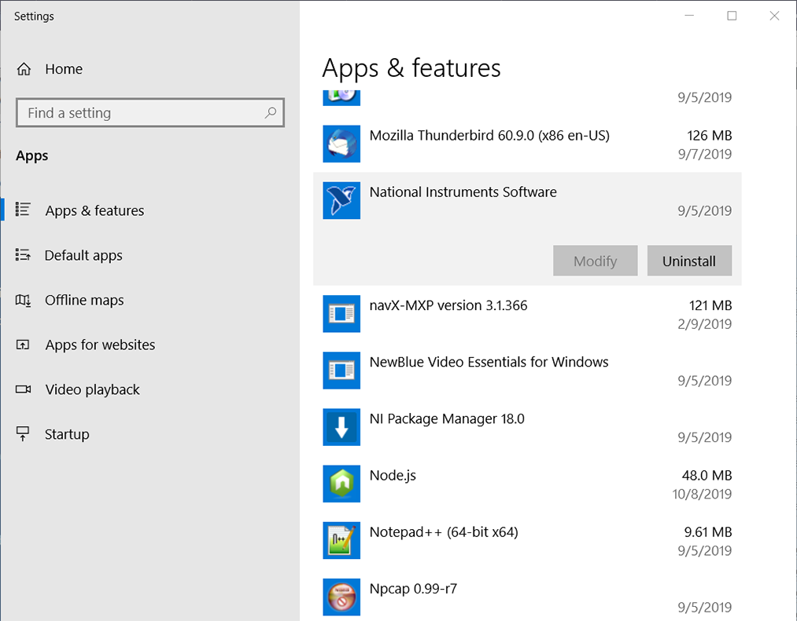
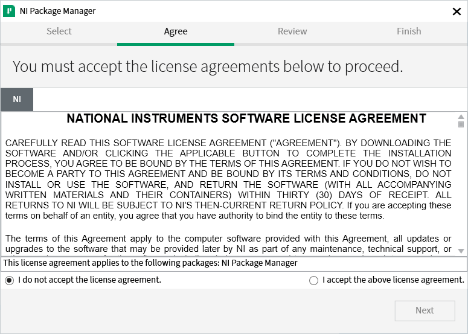
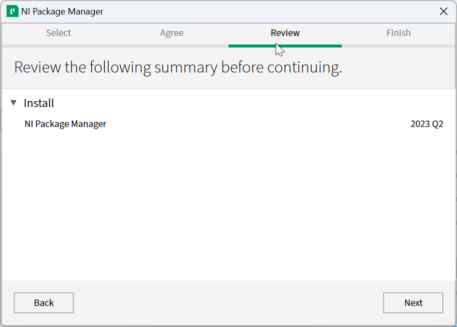
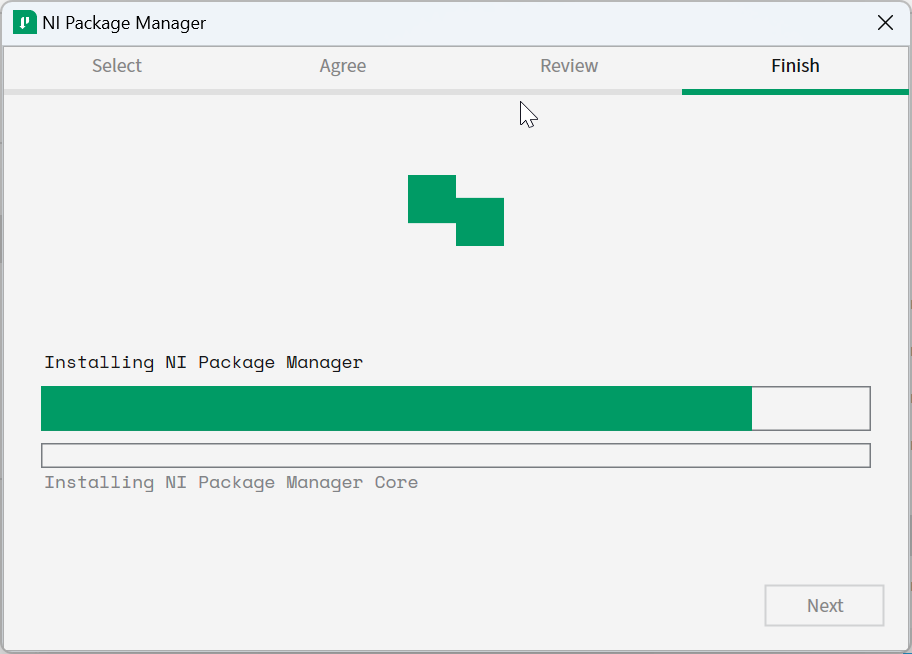
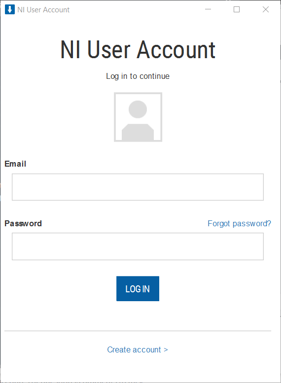
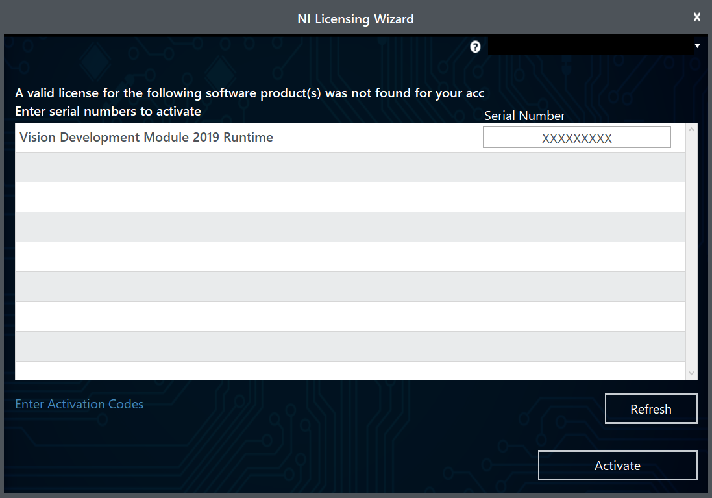
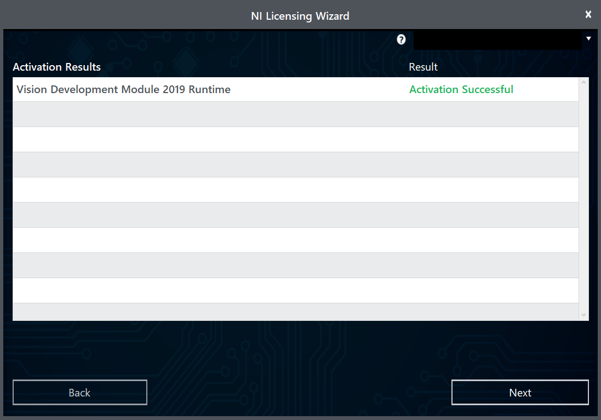
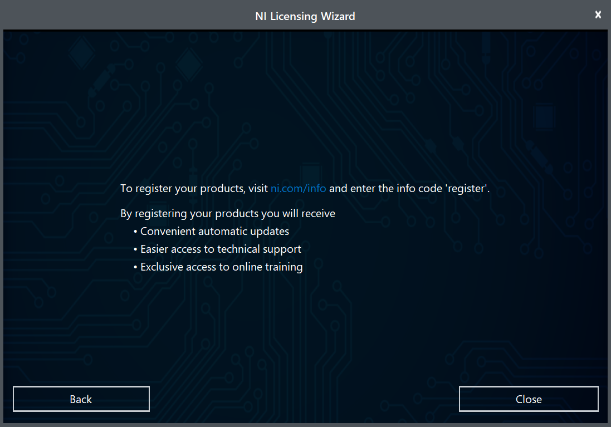

.. include:: <isonum.txt>

Installing the FRC\ |reg| Game Tools
=============================

The FRC Game Tools contains the following software components:

- LabVIEW Update
- FRC Driver Station
- FRC Utilities

The LabVIEW runtime components required for the Driver Station and Utilities are included in this package.

.. note:: No components from the LabVIEW Software for FRC package are required for running either the Driver Station or Utilities.

Requirements
------------

- Windows 7 or higher (Windows 7, 8, 8.1, 10). Windows 10 is the recommended OS.
- Download the FRC Game Tools from `NI <https://www.ni.com/en-us/support/downloads/drivers/download.frc-game-tools.html>`__.

.. image:: images/labview/offline-installer.png

If you wish to install on other machines offline, click :guilabel:`Individual Offline Installers` before clicking :guilabel:`Download` to download the full installer.

Uninstall Old Versions (Recommended)
------------------------------------

.. important:: LabVIEW teams have already completed this step, do not repeat it. LabVIEW teams should skip to the :ref:`docs/zero-to-robot/step-2/frc-game-tools:installation` section.

Before installing the new version of the FRC Game Tools it is recommended to remove any old versions. The new version will likely co-exist with the old version (note that the DS will overwrite old versions), but all testing has been done with FRC 2021 only.  Then click Start >> Add or Remove Programs. Locate the entry labeled "National Instruments Software", and select :guilabel:`Uninstall`.

.. note:: It is only necessary to uninstall previous versions when installing a new year's tools. For example, uninstall the 2020 tools before installing the 2021 tools. It is not necessary to uninstall before upgrading to a new update of the 2021 game tools.

Select Components to Uninstall
^^^^^^^^^^^^^^^^^^^^^^^^^^^^^^

In the dialog box that appears, select all entries. The easiest way to do this is to de-select the :guilabel:`Products Only` check-box and select the check-box to the left of "Name". Click :guilabel:`Remove`. Wait for the uninstaller to complete and reboot if prompted.

.. image:: images/labview/uninstall_select_components.png

Installation
------------

.. important:: The Game Tools installer may prompt that .NET Framework 4.6.2 needs to be updated or installed. Follow prompts on-screen to complete the installation, including rebooting if requested. Then resume the installation of the FRC Game Tools, restarting the installer if necessary.

Extraction
^^^^^^^^^^

.. tabs::
   .. tab:: Online

      Run the downloaded executable file to start the install process. Click :guilabel:`Yes` if a Windows Security prompt appears.

   .. tab:: Offline (Windows 10)

      Right click on the downloaded iso file and select :guilabel:`mount`. Run ``install.exe`` from the mounted iso. Click :guilabel:`Yes` if a Windows Security prompt appears.

      .. image:: images/labview/mount-iso.png

      .. note:: Other installed programs may associate with iso files and the :guilabel:`mount` option may not appear. If that software does not give the option to mount or extract the iso file, then follow the directions in the "Offline Installer (Windows 7, 8, & 8.1)" tab.

   .. tab:: Offline (Windows 7, 8, 8.1)

      Install 7-Zip (download `here <https://www.7-zip.org>`__). As of the writing of this document, the current released version is 19.00 (2019-02-21). Right click on the downloaded iso file and select :guilabel:`Extract to`.

      .. image:: images/labview/extract-iso.png

      Run ``install.exe`` from the extracted folder. Click :guilabel:`Yes` if a Windows Security prompt appears.

NI Package Manager License
^^^^^^^^^^^^^^^^^^^^^^^^^^

If you see this screen, click :guilabel:`Next`. This screen confirms that you agree to NI Package Manager License agreement.

Disable Windows Fast Startup
^^^^^^^^^^^^^^^^^^^^^^^^^^^^

.. image:: images/update-suite/labview_fast_startup.png

It is recommended to leave this screen as-is, as Windows Fast Startup can cause issues with the NI drivers required to image the roboRIO. Go ahead and click :guilabel:`Next`.

NI Package Manager Review
^^^^^^^^^^^^^^^^^^^^^^^^^

If you see this screen, click :guilabel:`Next`.

NI Package Manager Installation
^^^^^^^^^^^^^^^^^^^^^^^^^^^^^^^

Installation progress of the NI Package Manager will be tracked in this window.

Additional Software
^^^^^^^^^^^^^^^^^^^

.. image:: images/update-suite/additional-software.png

If you see this screen, click :guilabel:`Next`.

License Agreements
^^^^^^^^^^^^^^^^^^

.. image:: images/update-suite/license-agreements.png

Select :guilabel:`I accept…` then click :guilabel:`Next`

.. image:: images/labview/labview_license_2.png

Go ahead and press :guilabel:`I accept…` then click :guilabel:`Next`, confirming that you agree to the NI License agreement.

Review Summary
^^^^^^^^^^^^^^

.. image:: images/update-suite/review-summary.png
   :alt: Review Summary

Click :guilabel:`Next`.

Detail Progress
^^^^^^^^^^^^^^^

.. image:: images/update-suite/detail-progress.png
   :alt: Detail Progress

This screen showcases the installation process, go ahead and press :guilabel:`Next` when it's finished.

NI Activation Wizard
^^^^^^^^^^^^^^^^^^^^

Log into your `ni.com <https://ni.com>`__ account. If you don’t have an account, select :guilabel:`Create account` to create a free account.

Enter the serial number. Click :guilabel:`Activate`.

.. note:: If this is the first time activating this year's software on this account, you will see the message shown above about a valid license not being found. You can ignore this.

If your products activate successfully, an :guilabel:`Activation Successful` message will appear. If the serial number was incorrect, it will give you a text box and you can re-enter the number and select :guilabel:`Try Again`. If everything activated successfully, click :guilabel:`Next`.

Click :guilabel:`Close`.

NI Update Service
^^^^^^^^^^^^^^^^^

.. image:: images/labview/ni_update_enable.png

You will be prompted whether to enable the NI update service. You can choose to not enable the update service.

.. warning:: It is not recommended to install these updates unless directed by FRC through our usual communication channels (FRC Blog, Team Updates or E-mail Blasts).

Reboot to Complete Installation
-------------------------------

.. image:: images/update-suite/install-complete-reboot.png

If prompted, select :guilabel:`Reboot Now` after closing any open programs.
