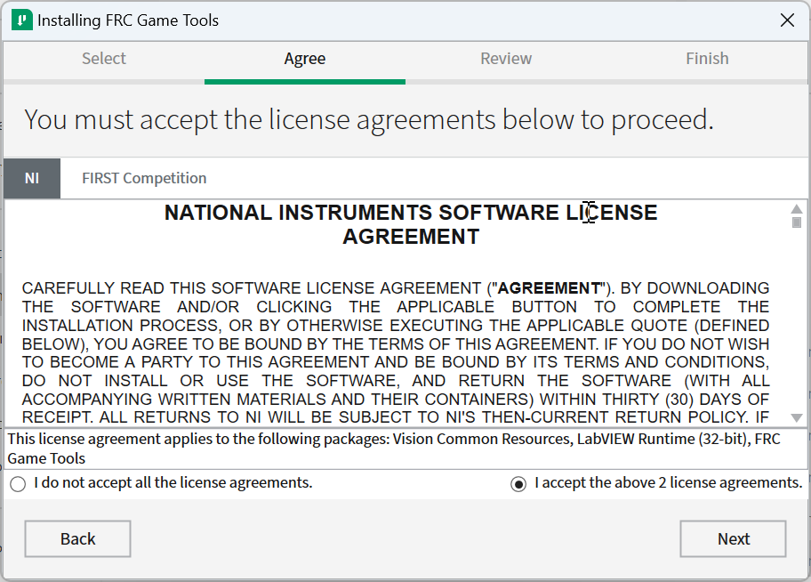

.. include:: <isonum.txt>

# Installing the FRC Game Tools

The FRC\ |reg| Game Tools contains the following software components:

- LabVIEW Update
- FRC Driver Station
- FRC roboRIO Imaging Tool and Images

The LabVIEW runtime components required for the Driver Station and Imaging Tool are included in this package.

.. note:: No components from the LabVIEW Software for FRC package are required for running either the Driver Station or Imaging Tool.

## Requirements

- Windows 10 or higher (Windows 10, 11).

## Download Game Tools

Navigate to the [FRC Game Tools](https://www.ni.com/en/support/downloads/drivers/download.frc-game-tools.html) page from NI.

Log-in or create an National Instruments account.

.. image:: images/labview/offline-installer.png
   :alt: The Download button for the NI installer with the offline installer link below it.

If you wish to install on other machines offline, click :guilabel:`Install Offline` or else choose :guilabel:`Download` to download the online installer which will download while installing.

## Uninstall Old Versions (Recommended)

.. important:: LabVIEW teams have already completed this step, do not repeat it. LabVIEW teams should skip to the :ref:`docs/zero-to-robot/step-2/frc-game-tools:installation` section.

Before installing the new version of the FRC Game Tools it is recommended to remove any old versions. The new version will likely co-exist with the old version (note that the DS will overwrite old versions), but all testing has been done with FRC 2026 only.  Then click Start >> Add or Remove Programs. Locate the entry labeled "NI Software", and select :guilabel:`Uninstall`.

.. note:: It is only necessary to uninstall previous versions when installing a new year's tools (or when a beta is installed). For example, uninstall the 2021 tools before installing the 2022 tools. It is not necessary to uninstall before upgrading to a new update of the 2022 game tools.

.. image:: images/labview/uninstall_control_panel.png
   :alt: Add or Remove -> NI Software

### Select Components to Uninstall

In the dialog box that appears, select all entries. The easiest way to do this is to de-select the :guilabel:`Products Only` check-box and select the check-box to the left of "Name". Click :guilabel:`Remove`. Wait for the uninstaller to complete and reboot if prompted.

.. image:: images/labview/uninstall_select_components.png
   :alt: Using the checkbox in the upper left to select all.

## Installation

.. important:: The Game Tools installer may prompt that .NET Framework 4.6.2 needs to be updated or installed. Follow prompts on-screen to complete the installation, including rebooting if requested. Then resume the installation of the FRC Game Tools, restarting the installer if necessary.

### Extraction

.. tab-set::
   .. tab-item:: Online

      Run the downloaded executable file to start the install process. Click :guilabel:`Yes` if a Windows Security prompt appears.

   .. tab-item:: Offline (Windows 10+)

      Right click on the downloaded iso file and select :guilabel:`mount`. Run ``install.exe`` from the mounted iso. Click :guilabel:`Yes` if a Windows Security prompt appears.

      .. image:: images/labview/mount-iso.png
         :alt: The menu after right clicking on an .iso file to choose "Mount".

      .. note:: Other installed programs may associate with iso files and the :guilabel:`mount` option may not appear. If that software does not give the option to mount or extract the iso file, then install 7-Zip and use that to extract the iso.

### Additional Software

.. image:: images/update-suite/additional-software.png
   :alt: Leave all of the additional packages selected.

If you see this screen, click :guilabel:`Next`.

### License Agreements

Select :guilabel:`I accept…` then click :guilabel:`Next`

### Disable Windows Fast Startup

.. image:: images/update-suite/labview_fast_startup.png
   :alt: Screen for disabling Windows fast startup.

It is recommended to leave this screen as-is, as Windows Fast Startup can cause issues with the NI drivers required to image the roboRIO. Go ahead and click :guilabel:`Next`.

### Review Summary

.. image:: images/update-suite/review-summary.png
   :alt: Review Summary

Click :guilabel:`Next`.

### Detail Progress

.. image:: images/update-suite/detail-progress.png
   :alt: Detail Progress

This screen showcases the installation process, go ahead and press :guilabel:`Next` when it's finished.

## Reboot to Complete Installation

.. image:: images/update-suite/install-complete-reboot.png
   :alt: Choose reboot to complete the installation.

If prompted, select :guilabel:`Reboot Now` after closing any open programs.
