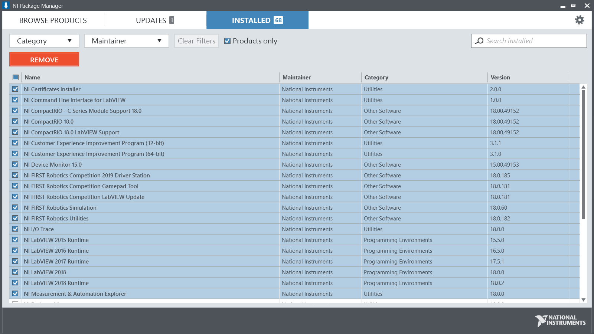
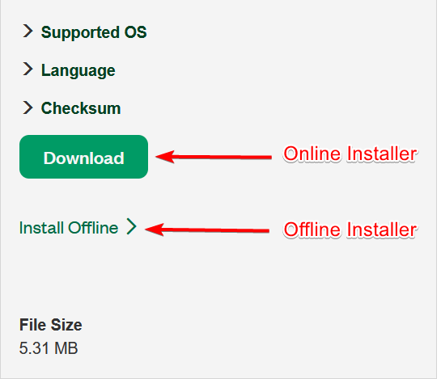
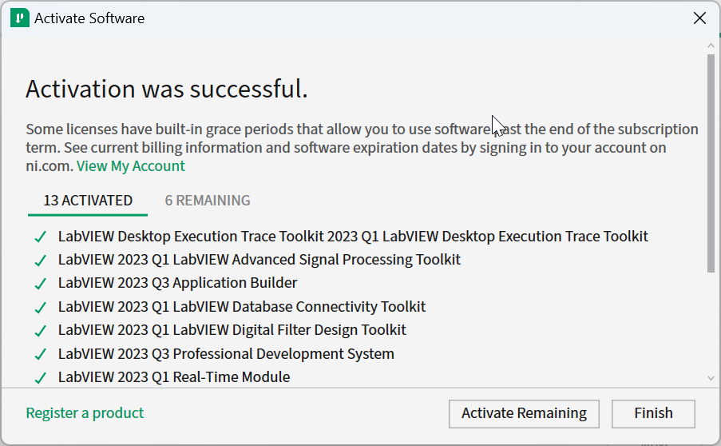

.. include:: <isonum.txt>

Installing LabVIEW for FRC (LabVIEW only)
=========================================

.. note:: This installation is for teams programming in LabVIEW or using NI Vision Assistant only. C++ and Java teams not using these features do not need to install LabVIEW and should proceed to :doc:`Installing the FRC Game Tools </docs/zero-to-robot/step-2/frc-game-tools>`.

Download and installation times will vary widely with computer and internet connection specifications, however note that this process involves a large file download and installation and will likely take at least an hour to complete.

Requirements
------------

- Windows 10 or higher (Windows 10, 11). Windows 11 is not officially supported by NI, but has been tested to work.

Uninstall Old Versions (Recommended)
------------------------------------

.. note:: If you wish to keep programming cRIOs you will need to maintain an install of LabVIEW for FRC\ |reg| 2014. The LabVIEW for FRC 2014 license has been extended. While these versions should be able to co-exist on a single computer, this is not a configuration that has been extensively tested.

Before installing the new version of LabVIEW it is recommended to remove any old versions. The new version will likely co-exist with the old version, but all testing has been done with FRC 2020 only. Make sure to back up any team code located in the "User\\LabVIEW Data" directory before un-installing. Then click Start >> Add or Remove Programs. Locate the entry labeled "NI Software", and select Uninstall.

.. image:: images/labview/uninstall_control_panel.png
   :alt: Add or Remove -> NI Software

Select Components to Uninstall
^^^^^^^^^^^^^^^^^^^^^^^^^^^^^^

In the dialog box that appears, select all entries. The easiest way to do this is to de-select the "Products Only" check-box and select the check-box to the left of "Name". Click Remove. Wait for the uninstaller to complete and reboot if prompted.

.. warning:: These instructions assume that no other NI software is installed. If you have other NI software installed, it is necessary to uncheck the software that should not be uninstalled.

Getting LabVIEW installer
-------------------------

Either locate and insert the LabVIEW USB Drive or download the `LabVIEW for FRC 2020 installer <https://www.ni.com/en-us/support/downloads/software-products/download.labview-software-for-frc.html>`__ from NI. Be sure to select the correct version from the drop-down.

If you wish to install on other machines offline, do not click the Download button, click **Individual Offline Installers** and then click Download, to download the full installer.

.. note:: This is a large download (~8GB). It is recommended to use a fast internet connection and to use the NI Downloader to allow the download to resume if interrupted.

Installing LabVIEW
------------------

NI LabVIEW requires a license. Each season’s license is active until January 31st of the following year (e.g. the license for the 2020 season expires on January 31, 2021)

Teams are permitted to install the software on as many team computers as needed, subject to the restrictions and license terms that accompany the applicable software, and provided that only team members or mentors use the software, and solely for FRC. Rights to use LabVIEW are governed solely by the terms of the license agreements that are shown during the installation of the applicable software.

Starting Install
^^^^^^^^^^^^^^^^

.. tabs::
  .. tab:: Online Installer

     Run the downloaded exe file to start the install process. Click :guilabel:`Yes` if a Windows Security prompt

  .. tab:: Offline Installer (Windows 10+)

     Right click on the downloaded iso file and select mount. Run install.exe from the mounted iso. Click "Yes" if a Windows Security prompt

     .. note:: other installed programs may associate with iso files and the mount option may not appear. If that software does not give the option to mount or extract the iso file, then install 7-Zip and use that to extract the iso.

     .. image:: images/labview/mount-iso.png
      :alt: The menu after right clicking on an .iso file to choose "Mount".

NI Package Manager License
^^^^^^^^^^^^^^^^^^^^^^^^^^

If you see this screen, click :guilabel:`Next`

Disable Windows Fast Startup
^^^^^^^^^^^^^^^^^^^^^^^^^^^^

If you see this screen, click :guilabel:`Next`

NI Package Manager Review
^^^^^^^^^^^^^^^^^^^^^^^^^

If you see this screen, click :guilabel:`Next`

NI Package Manager Installation
^^^^^^^^^^^^^^^^^^^^^^^^^^^^^^^

.. image:: images/labview/ni-package-install.png
   :alt: Screen with progress bars indicating the amount of completion.

Installation progress of the NI Package Manager will be tracked in this window

Product List
^^^^^^^^^^^^

Click :guilabel:`Next`

Additional Packages
^^^^^^^^^^^^^^^^^^^

Click :guilabel:`Next`

License agreements
^^^^^^^^^^^^^^^^^^

Check "I accept..." then Click :guilabel:`Next`

.. image:: images/labview/labview_license_2.png
   :alt: Accept the Silverlight license agreements.

Check "I accept..." then Click :guilabel:`Next`

Product Information
^^^^^^^^^^^^^^^^^^^

Click :guilabel:`Next`

Start Installation
^^^^^^^^^^^^^^^^^^

Click :guilabel:`Next`

Overall Progress
^^^^^^^^^^^^^^^^

Overall installation progress will be tracked in this window

NI Update Service
-----------------

You will be prompted whether to enable the NI update service. You can choose to not enable the update service.

.. warning:: It is not recommended to install these updates unless directed by FRC through our usual communication channels (FRC Blog, Team Updates or E-mail Blasts).

NI Activation Wizard
^^^^^^^^^^^^^^^^^^^^

Click the :guilabel:`Log in to Activate` button.

.. image:: images/labview/ni_activation_login.png
   :alt: The NI user login screen.

Log into your ni.com account. If you don't have an account, select :guilabel:`Create account` to create a free account.

.. image:: images/labview/ni_activation_sn_selection.png
   :alt: Screen so select how to activate LabVIEW.

From the drop-down, select enter a serial number

Enter the serial number in all the boxes. Click :guilabel:`Activate`.

If your products activate successfully, an "Activation Successful" message will appear. If the serial number was incorrect, it will give you a text box and you can re-enter the number and select :guilabel:`Try Again`. The items shown above are not expected to activate. If everything activated successfully, click :guilabel:`Finish`.

Restart
^^^^^^^

Select :guilabel:`Reboot Now` after closing any open programs.
