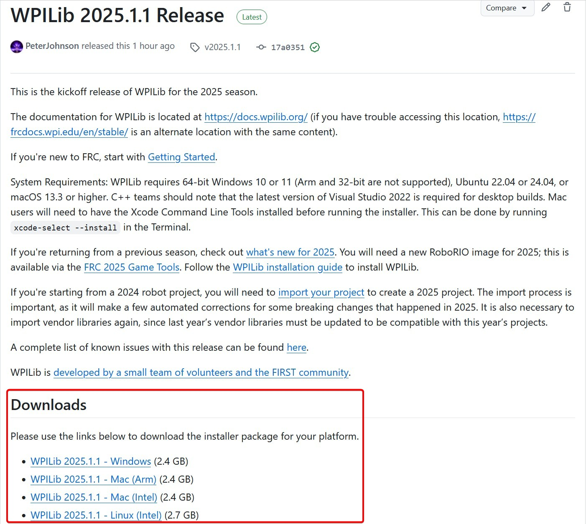

.. include:: <isonum.txt>

# Offline Installation Preparation

This article contains instructions/links to components you will want to gather if you need to do offline installation of the FRC\ |reg| Control System software.

.. tip:: This document compiles all the download links from the following documents to make it easier to install on offline computers or on multiple computers. If you are you installing on a single computer that is connected to the internet, you can skip this page.

.. note:: The order in which these tools are installed does not matter for Java and C++ teams.  LabVIEW should be installed before the FRC Game Tools or 3rd Party Libraries.

## Documentation

This documentation can be downloaded for offline viewing. The link to download the PDF can be found [here](https://buildmedia.readthedocs.org/media/pdf/frc-docs/stable/frc-docs.pdf).

## Installers

### All Teams

-  [2026 FRC Game Tools](https://www.ni.com/en/support/downloads/drivers/download.frc-game-tools.html)

### LabVIEW Teams

-  LabVIEW Base Installer - Coming Soon

### Java/C++ Teams

-  Java/C++ WPILib Installer - Coming Soon

Once on the GitHub releases page, scroll to the download section in the middle of the page.

Then click on the correct binary for your OS and architecture to begin the download.

.. note:: After downloading the Java/C++ WPILib installer, run it once while connected to the internet and select :guilabel:`Install for this User` then :guilabel:`Create VS Code zip to share with other computers/OSes for offline install` and save the downloaded VS Code archives for future offline installations.

## 3rd Party Libraries/Software

A directory of available 3rd party software that plugs in to WPILib can be found on :ref:`docs/software/vscode-overview/3rd-party-libraries:3rd Party Libraries`.
