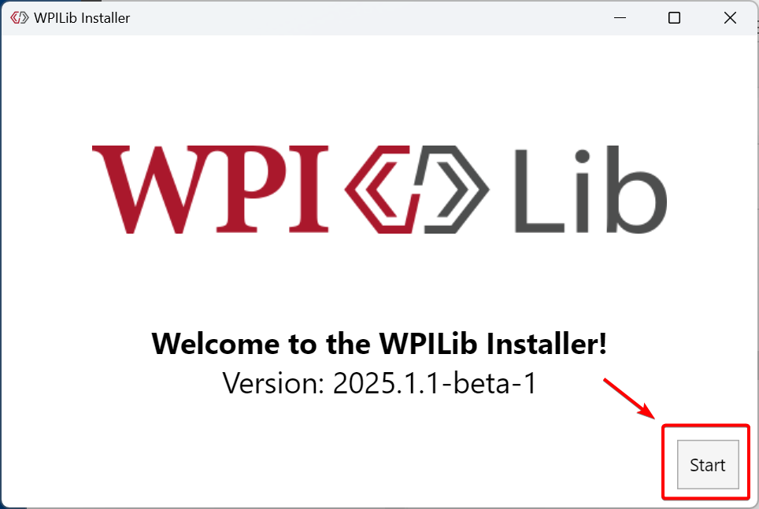
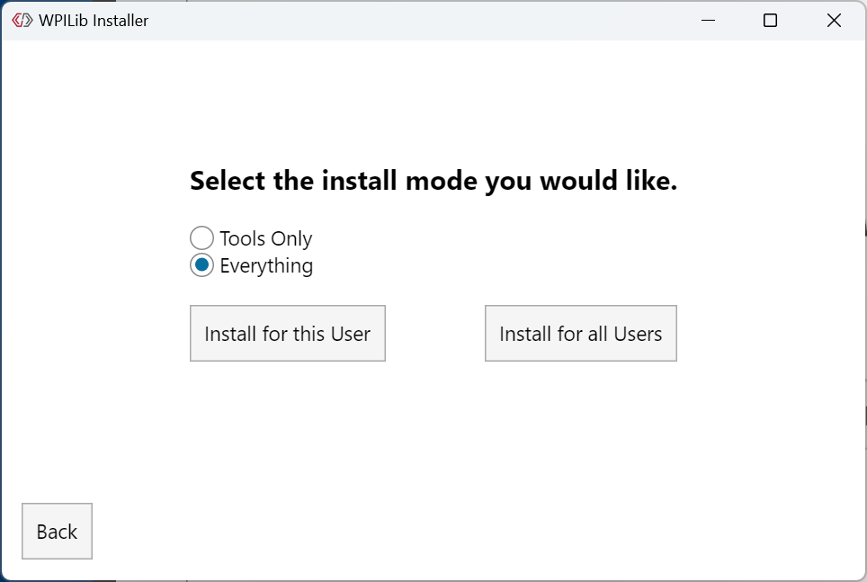
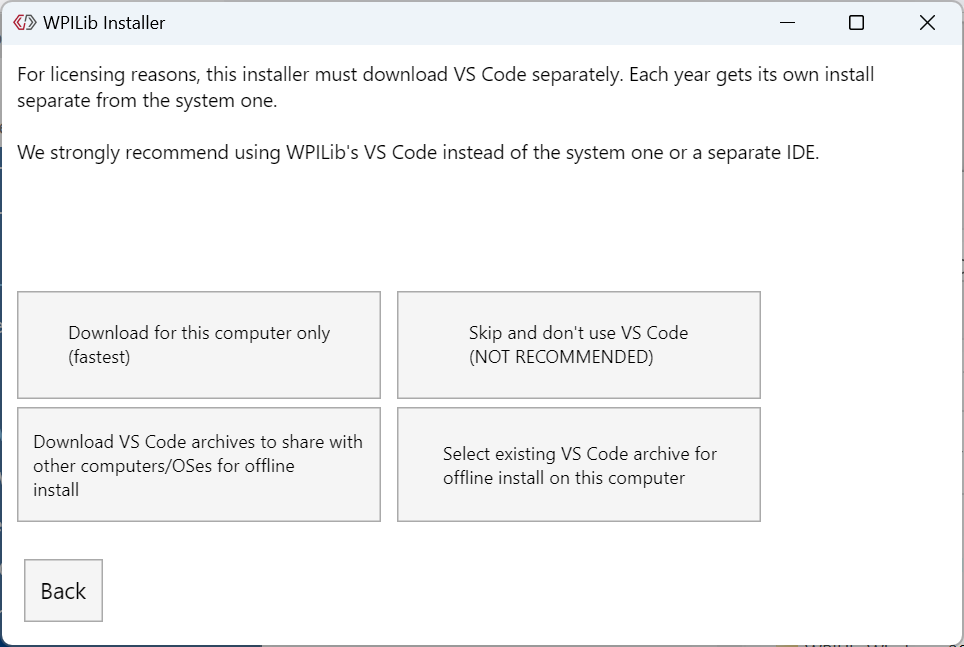
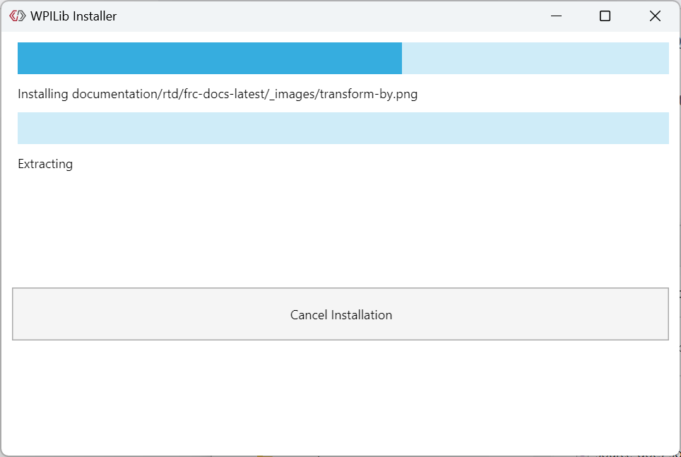
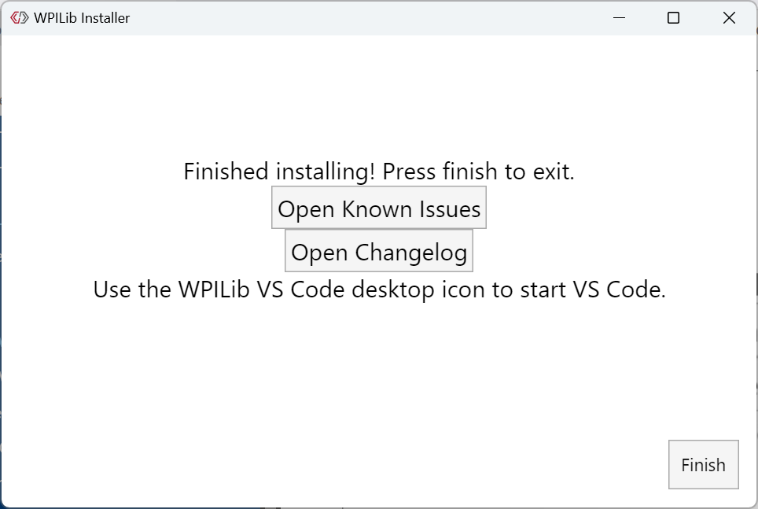

WPILib Installation Guide
=========================

This guide is intended for Java and C++ teams. LabVIEW teams can skip to :doc:`labview-setup`. Additionally, the below tutorial shows Windows 10, but the steps are identical for all operating systems. Notes differentiating operating systems will be shown.

Prerequisites
-------------

`You can download the latest release of the installer from GitHub <https://github.com/wpilibsuite/allwpilib/releases/latest/>`__. Ensure that you download the correct binary for your OS and architecture.

Supported Operating Systems and Architectures:
 * Windows 10 & 11, 64 bit. Arm is not supported
 * Ubuntu 20.04 and 22.04, 64 bit. Other Linux distributions may work, but are unsupported
 * macOS 11 & 12, Intel and Arm.

.. warning:: The following OSes are no longer supported: macOS 10.15, Ubuntu 18.04, Windows 7, Windows 8.1, and any 32-bit Windows.

WPILib is designed to install to different folders for different years, so that it is not necessary to uninstall a previous version before installing this year's WPILib.

Extracting the Installer
------------------------

When you download the WPILib installer, it is distributed as a disk image file ``.iso`` for Windows, ``.tar.gz`` for Linux, and distributed as a ``DMG`` for MacOS.

.. tabs::

   .. group-tab:: Windows 10+

      Windows 10+ users can right click on the downloaded disk image and select :guilabel:`Mount` to open it. Then launch ``WPILibInstaller.exe``.

      .. image:: images/wpilib-setup/extract-windows-10.png
         :alt: The menu after right clicking on an .iso file to choose "Mount".

      .. note:: Other installed programs may associate with iso files and the :guilabel:`mount` option may not appear. If that software does not give the option to mount or extract the iso file, then follow the directions below.

      You can use `7-zip <https://www.7-zip.org/>`__ to extract the disk image by right-clicking, selecting :guilabel:`7-Zip` and selecting :guilabel:`Extract to...`. Then launch ``WPILibInstaller.exe``. Windows 11 users may need to select :guilabel:`Show more options` at the bottom of the context menu.

      .. image:: images/wpilib-setup/extract-windows-7.png
         :alt: After right clicking on the .iso file go to "7-Zip" then "Extract to....".

   .. group-tab:: macOS

      macOS users can double click on the downloaded ``DMG`` and then select ``WPILibInstaller`` to launch the application.

      .. image:: images/wpilib-setup/macos-launch.png
         :alt: Show the macOS screen after double clicking the DMG file.

   .. group-tab:: Linux

      Linux users should extract the downloaded ``.tar.gz`` and then launch ``WPILibInstaller``. Ubuntu treats executables in the file explorer as shared libraries, so double-clicking won't run them. Run the following commands in a terminal instead with ``<version>`` replaced with the version you're installing.

      .. code-block:: console

          $ tar -xf WPILib_Linux-<version>.tar.gz
          $ cd WPILib_Linux-<version>/
          $ ./WPILibInstaller

Running the Installer
---------------------

Upon opening the installer, you'll be presented with the below screen. Go ahead and press :guilabel:`Start`.

This showcases a list of options included with the WPILib installation.

- :guilabel:`Tools Only` installs just the WPILib tools (Pathweaver, Shuffleboard, RobotBuilder, SysID, Glass, and OutlineViewer) and JDK.
- :guilabel:`Everything` installs the full development environment (VS Code, extensions, all dependencies), WPILib tools, and JDK.

You will notice two buttons, :guilabel:`Install for this User` and :guilabel:`Install for all Users`. :guilabel:`Install for this User` only installs it on the current user account, and does not require administrator privileges. However, :guilabel:`Install for all Users` installs the tools for all system accounts and *will* require administrator access. :guilabel:`Install for all Users` is not an option for macOS and Linux.

.. note:: If you select Install for all Users, Windows will prompt for administrator access through UAC during installation.

Select the option that is appropriate for you, and you'll presented with the following installation screen.

This next screen involves downloading VS Code. Unfortunately, due to licensing reasons, VS Code can not be bundled with the installer.

- Download for this computer only

  - This downloads VS Code only for the current platform, which is also the smallest download.

- Skip and don't use VS Code

  - Skips installing VS Code. Useful for advanced installations or configurations. Generally not recommended.

- Select existing VS Code zip for offline install on this computer

  - Selecting this option will bring up a prompt allowing you to select a pre-existing zip file of VS Code that has been downloaded by the installer previously. This option does **not** let you select an already installed copy of VS Code on your machine.

- Create VS Code zip to share with other computers/OSes for offline install

  - This option downloads and saves a copy of VS Code for all platforms, which is useful for sharing the copy of the installer.

Go ahead and select :guilabel:`Download VS Code for Single Install`. This will begin the download process and can take a bit depending on internet connectivity (it's ~100MB). Once the download is done, select :guilabel:`Next`. You should be presented with a screen that looks similar to the one below.

After installation is complete, you will be presented with the finished screen.

.. important:: WPILib installs a separate version of VS Code. It does not use an already existing installation. Each year has it's own copy of the tools appended with the year. IE: ``WPILib VS Code 2022``. Please launch the WPILib VS Code and not a system installed copy!

Congratulations, the WPILib development environment and tooling is now installed on your computer! Press Finish to exit the installer.

Post-Installation
-----------------

Some operating systems require some final action to complete installation.

.. tabs::

   .. group-tab:: macOS

      After installation, the installer opens the WPILib VS Code folder. Drag the VS Code application to the dock.
      Eject WPILibInstaller image from the desktop.

      .. warning:: On macOS Monterrey 12.3 and later, the VS Code extensions do not automatically install. See :ref:`docs/yearly-overview/known-issues:Visual Studio Code extensions fail to install on macOS` for the workaround.

   .. group-tab:: Linux

      Some versions of Linux (e.g. Ubuntu 20.04) require you to give the desktop shortcut the ability to launch. Right click on the desktop icon and select Allow Launching.

      .. image:: images/wpilib-setup/linux-enable-launching.png
         :alt: Menu that pops up after right click the desktop icon in Linux.

.. note:: Installing desktop tools and rebooting will create a folder on the desktop called ``YYYY WPILib Tools``, where ``YYYY`` is the current year. Desktop tool shortcuts are not available on Linux and macOS.

Additional C++ Installation for Simulation
------------------------------------------

C++ robot simulation requires that a native compiler to be installed. For Windows, this would be `Visual Studio 2022 <https://visualstudio.microsoft.com/vs/>`__ (**not** VS Code), macOS requires `Xcode <https://apps.apple.com/us/app/xcode/id497799835>`__, and Linux (Ubuntu) requires the ``build-essential`` package.

Ensure the :guilabel:`Desktop Development with C++` option is checked in the Visual Studio installer for simulation support.

.. image:: /docs/software/wpilib-tools/robot-simulation/images/vs-build-tools.png
   :alt: Screenshot of the Visual Studio build tools option

What is Installed?
------------------

The Offline Installer installs the following components:

- **Visual Studio Code** - The supported IDE for 2019 and later robot code development. The offline installer sets up a separate copy of VS Code for WPILib development, even if you already have VS Code on your machine. This is done because some of the settings that make the WPILib setup work may break existing workflows if you use VS Code for other projects.

- **C++ Compiler** - The toolchains for building C++ code for the roboRIO

- **Gradle** - The specific version of Gradle used for building/deploying C++ or Java robot code

- **Java JDK/JRE** - A specific version of the Java JDK/JRE that is used to build Java robot code and to run any of the Java based Tools (Dashboards, etc.). This exists side by side with any existing JDK installs and does not overwrite the JAVA_HOME variable

- **WPILib Tools** - SmartDashboard, Shuffleboard, RobotBuilder, Outline Viewer, Pathweaver, Glass, SysID

- **WPILib Dependencies** - OpenCV, etc.

- **VS Code Extensions** - WPILib extensions for robot code development in VS Code

Uninstalling
------------

WPILib is designed to install to different folders for different years, so that it is not necessary to uninstall a previous version before installing this year's WPILib. However, the following instructions can be used to uninstall WPILib if desired.

.. tabs::

  .. tab:: Windows

     1. Delete the appropriate wpilib folder (``c:\Users\Public\wpilib\YYYY`` where ``YYYY`` is the year to uninstall)
     2. Delete the desktop icons at ``C:\Users\Public\Public Desktop``
     3. Delete the path environment variables.

        1. In the start menu, type environment and select "edit the system environment variables"
        2. Click on the environment variables button (1).
        3. In the user variables, select path (2) and then click on edit (3).
        4. Select the path with ``roborio\bin`` (4) and click on delete (5).
        5. Select the path with ``frccode`` and click on delete (5).
        6. Repeat steps 3-6 in the Systems Variable pane.

     .. image:: images/wpilib-setup/EnvironmentVariables.png
      :alt: The "System Properties", "Environment Variables", and "Edit Environment Variables" screens.

  .. tab:: macOS

     1. Delete the appropriate wpilib folder (``~/wpilib/YYYY`` where ``YYYY`` is the year to uninstall)

  .. tab:: Linux

     1. Delete the appropriate wpilib folder (``~/wpilib/YYYY`` where ``YYYY`` is the year to uninstall). eg ``rm -rf ~/wpilib/YYYY``

Troubleshooting
---------------

In case the installer fails, please open an issue on the installer repository. A link is available `here <https://github.com/wpilibsuite/wpilibinstaller-avalonia>`__. The installer should give a message on the cause of the error, please include this in the description of your issue.
