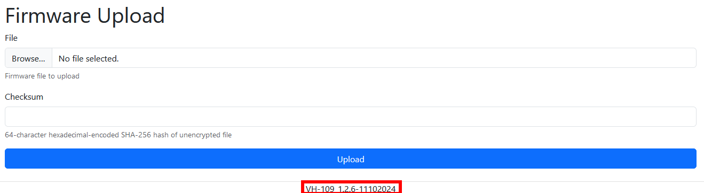
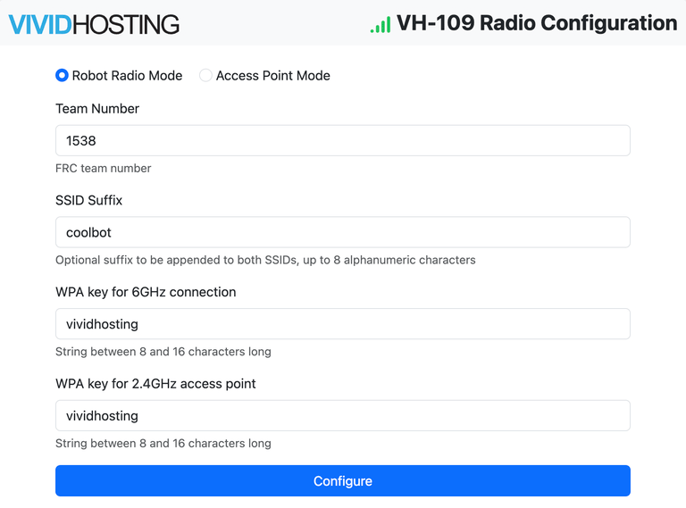

.. include:: <isonum.txt>

# Programming your Radio

This guide will show you how to do a basic setup for controlling your robot "at home" using the VH-109 FRC\ |reg| Radio.  For complete documentation and information please see the [Vivid-Hosting radio site](https://frc-radio.vivid-hosting.net/).

.. note:: If looking for how to use the OpenMesh (OM5P) Radio please see :ref:`docs/zero-to-robot/step-3/openmesh:Using the OpenMesh OM5P Radio`

## Prerequisites

The recommended setup requires: 2 VH-109 radios, 1 VH-117 :term:`PoE` Wall Adapter, and 1 Radio Heatsink.  Available [here](https://wcproducts.com/products/frc-radio).

Please see the :ref:`docs/zero-to-robot/step-3/radio-programming:Alternative Setup Discussion` if you do not currently have this hardware.

.. image:: images/radio-programming/VH-109-2-radios.drawio.svg
   :alt: Connectivity diagram of VH-109 on robot connected to VH-109 on Driver station, powered by VH-117 POE wall adapter, with DS, and programming laptops connected to it
   :width: 500

## Getting to the Web Configuration Page

1. Connect the radio directly to your computer using an Ethernet cable in the :guilabel:`DS` port.

2. Ensure the radio has power either through the Weidmuller connectors or :term:`PoE`.

3. Open a web browser and navigate to :guilabel:`http://radio.local/`.  See :ref:`docs/zero-to-robot/step-3/radio-programming:Troubleshooting` if the connection doesn't work.

## Radio Firmware Update

.. note:: Newer versions of the radio firmware will have the version listed at the bottom.  If you do not see the version listed you have firmware prior to 1.2.0.

You can skip this section if already at version 1.3.0 or later.

1. On the Vivid-Hosting [firmware releases](https://frc-radio.vivid-hosting.net/miscellaneous/firmware-releases) page download the proper firmware for the current firmware version you have.  Always choose the `Radio Variant`.

2. Copy the SHA-256 key below the firmware you downloaded.

3. Paste that key into the :guilabel:`Checksum` box of the :guilabel:`Firmware Upload` section at the bottom of the configuration page we navigated to above.

4. Click :guilabel:`Browse...` and select the firmware file you downloaded.

5. Click the :guilabel:`Upload` button.

.. warning:: The radio will take approximately 2-3 minutes to complete firmware updates. Do not remove power during this process. Damage to the radio can occur.  When the PWR light is solid and the SYS light is slowly blinking at 1 Hz, the firmware upgrade process is complete.

## Robot Radio Configuration (All Teams)

This section is used for configuring the VH-109 radio outside of competition. At competition, configuration will be done by a provided computer and manual configuration using this page **should not be used**.

1. Select :guilabel:`Robot Radio Mode`

2. Enter the team number

3. Enter the suffix, if desired.  This will help identify your robot and distinguish it from other networks.

4. Enter the 6 GHz WPA/SAE key.  This key will need to match the key on the Access Point you configure.

5. Enter the 2.4 GHz WPA/SAE key.  This is the password team members will type in when connecting to the 2.4 GHz network, if available.

## Access Point Radio Configuration

On the Access Point Radio, follow all of the same steps as the robot radio configuration instead choosing :guilabel:`Access Point Mode` at the top of the configuration page. Ensure you use the exact same settings for team number, suffix, and WPA/SAE keys.

## Alternative Setup Discussion

### Optimal Setup: Two VH-109 Radios

For the best experience and to closely simulate field conditions, it is strongly recommended that your team uses two VH-109 radios during testing and preparation. This dual-radio setup mirrors the competition environment, ensuring your robot operates under realistic network conditions. Additionally, having two radios allows you to fully leverage the high-speed, low-latency communication provided by the 6GHz band, which is crucial for optimal robot performance in high-stakes scenarios.

When mounting the access point radio, ensure it is mounted high where it has a clear line of sight to the robot.

### Only 1 VH-109 radio

If your team has access to only one VH-109 radio, there are still viable options to continue testing and preparing for competition. However, these setups require additional considerations:

#### Use an Old Radio for Testing

If your team still has an older radio from a previous season, it can serve as a temporary substitute for the VH-109 on your robot. In this case, you should:

- Reserve a spot on your robot specifically for the VH-109 radio to ensure seamless integration during competition.
- Provide the older radio regulated power with a REV Radio Power Module or a CTRE Voltage Regulator Module.
- Be prepared to connect devices via a network switch if the older radio does not provide enough Ethernet ports. This may add complexity but ensures all devices are networked properly during testing.

Advantages:

- Connection strength similar to previous years.

Disadvantages:

- Requires additional hardware (e.g., the old radio and maybe a network switch).
- The older radio may not offer the same performance as the VH-109, potentially affecting test results.

#### Enable 2.4GHz Wifi on the VH-109

The VH-109 radio includes a standalone mode that can be activated using DIP switch 3. In this configuration, the radio hosts its own 2.4GHz network, enabling direct connections without additional hardware.

To enable standalone mode:

1. Locate the DIP switches on the VH-109 radio, removing the sticker if required.
2. Flip DIP switch 3 to the "ON" position.
3. Connect devices directly to the 2.4GHz network hosted by the radio, using the 2.4 GHz WPA/SAE key from configuration.

Advantages:

- Simple setup with no need for additional hardware.
- Allows immediate use of the VH-109 without extra configuration.

Disadvantages:

- The 2.4GHz band is more prone to congestion and interference, especially in crowded environments.
- Range and accessibility may be limited compared to the 6GHz band.

### No VH-117 :term:`PoE` Wall Adapter

You can power the access point radio with a 12V wall plug connecting wires to the Weidmuller ports.  We recommend trying to find one with a [switch](https://a.co/d/cUsD25n) to simplify turning on and off the radio.  The primary concern will be cord length which will likely not be long enough to run from your wall outlet so you will need to bring the power closer with an extension cord.

### No Radio Heatsink

The access point radio will get hot after being on for a longer than a full match.  This will cause latency to increase.

## Troubleshooting

### Cannot Reach the Configuration Page at radio.local

Disconnect other network connections such as Wi-Fi.

Download and use the [Network Assistant](https://frc-radio.vivid-hosting.net/miscellaneous/network-assistant-tool).  See the instructions below the download for how to use.

Disable :doc:`firewalls </docs/networking/networking-introduction/windows-firewall-configuration>`.

Ensure :doc:`Game Tools </docs/zero-to-robot/step-2/frc-game-tools>` or another :ref:`mdns responder <docs/networking/networking-introduction/networking-basics:mDNS - Providers>` is installed.

Set a [static ip address](https://www.trendnet.com/press/resource-library/how-to-set-static-ip-address) with these parameters:

- IP Address: 192.168.69.2
- Subnet Mask: 255.255.255.0
- Gateway: Leave Blank
- DNS: 192.168.69.1 or Leave Blank

Navigate to :guilabel:`http://192.168.69.1/`

### Setting Up an Entire Field

See the documentation on using the [VH-113 Access Point](https://frc-radio.vivid-hosting.net/overview/practicing-at-home#vh-113-full-field).

### How do I run an Offseason Event?

Use the [Vivid-Hosting radio kiosk](https://frc-radio.vivid-hosting.net/miscellaneous/offseason-kiosk-programmer).

### Additional Radio Problems

Contact WCP support at: [support@westcoastproducts.com](mailto:support@westcoastproducts.com)
