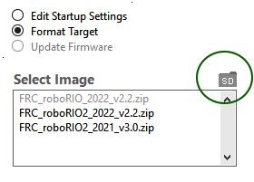
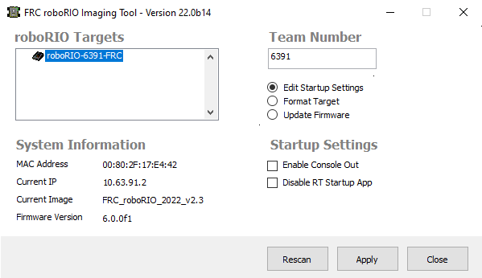

Imaging your roboRIO 2
======================

.. note:: The imaging instructions for the NI roboRIO 1.0 are :ref:`here <docs/zero-to-robot/step-3/imaging-your-roborio:Imaging your roboRIO 1>`.

The NI roboRIO 2.0 boots from a microSD card configured with an appropriate boot image containing the NI Linux Real-Time OS, drivers, and libraries specific to FRC. The microSD card must be imaged with a laptop and an SD burner application per the instructions on this page.

.. important:: Imaging the roboRIO 2 directly with the roboRIO Imaging Tool is not supported.

microSD Requirements
--------------------

The NI roboRIO 2.0 supports all microSD cards.  It is recommended to use a card with 2GB or more of capacity.

Operation Tips
--------------

The NI roboRIO 2.0 requires a fully inserted microSD card containing a valid image in order to boot and operate as intended.

If the microSD card is removed while powered, the roboRIO will hang. Once the microSD card is replaced, the roboRIO will need to be restarted using the reset button, or be power cycled.

No damage will result from microSD card removal or insertion while powered, but best practice is to perform these operations while unpowered.

.. warning:: Before imaging your roboRIO, you must have completed installation of the :doc:`FRC Game Tools</docs/zero-to-robot/step-2/frc-game-tools>`. You also must have the roboRIO power properly wired to the CTRE Power Distribution Panel or REV Power Distribution Hub. Make sure the power wires to the roboRIO are secure and that the connector is secure firmly to the roboRIO (4 total screws to check).

Imaging Directly to the microSD Card
------------------------------------

The image will be transferred to the microSD card using a specialized writing utility, sometimes called a burner. Several utilities are listed below, but most tools that can write arbitrary images for booting a Raspberry Pi or similar dev boards will also produce a bootable SD card for roboRIO 2.0.

Supported image files are named ``FRC_roboRIO2_YEAR_VERSION.img.zip``. You can locate them by clicking the SD button in the roboRIO Imaging tool and then navigating to the ``SD Images`` folder. It is generally best to use the latest version of the image.

If using a non Windows OS you will need to copy this image file to that computer.

A `microSD to USB dongle <https://www.amazon.com/gp/product/B0779V61XB>`__ works well for writing to microSD cards.

.. note:: Raspberry Pi images will not boot on a roboRIO because the OS and drivers are incompatible. Similarly, a roboRIO image is not compatible with Raspberry Pi controller boards.

Writing the image with balenaEtcher
^^^^^^^^^^^^^^^^^^^^^^^^^^^^^^^^^^^

- Download and install `balenaEtcher <https://www.balena.io/etcher/>`__.
- Launch
- :guilabel:`Flash from file` -> locate the image file you want to copy to the microSD card
- :guilabel:`Select target` -> select the destination microSD device
- Press :guilabel:`Flash`

Writing the image with Raspberry Pi Imager
^^^^^^^^^^^^^^^^^^^^^^^^^^^^^^^^^^^^^^^^^^

- Download and install from `Raspberry Pi Imager <https://www.raspberrypi.com/software/>`__.
- Launch
- :guilabel:`Choose OS` -> :guilabel:`Use Custom` -> select the image file you want to copy to the microSD card
- :guilabel:`Choose Storage` -> select the destination microSD device
- Press :guilabel:`Write`

.. warning:: After writing the image, Windows may prompt to format the drive. Do not reformat, or else you will need to write the image again.

Setting the roboRIO Team Number
^^^^^^^^^^^^^^^^^^^^^^^^^^^^^^^

The image writing process above does not set a team number.  To fix this teams will need to insert the microSD card  in the robRIO and connect to the robot.  With the roboRIO Imaging Tool go to :guilabel:`Edit Startup Settings`.  Next, fill out the :guilabel:`Team Number` box and hit :guilabel:`Apply`.

