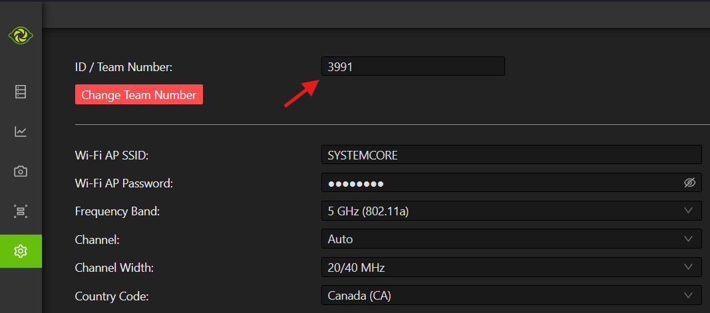

# Imaging your Systemcore

.. important:: Imaging the Systemcore with the roboRIO Imaging Tool is not supported.

## Operation Tips

The Systemcore requires to be powered on while the USB-C cable is plugged in to enter flash mode.

.. warning:: Before imaging your Systemcore, you must have completed installation of the :doc:`FRC Game Tools</docs/zero-to-robot/step-2/frc-game-tools>`. You also must have the Systemcore power properly wired to the CTRE Power Distribution Panel or REV Power Distribution Hub. Make sure the power wires to the Systemcore are secure.

## Imaging the Systemcore

Supported image files are named ``limelightsystemcorecm5-limelightosr-YEAR-VERSION.zip``.

.. note:: Raspberry Pi images will not boot on a Systemcore because the OS and drivers are incompatible. Similarly, a Systemcore image is not compatible with Raspberry Pi controller boards.

### Flashing the Systemcore with the Limelight Hardware Manager

- Download and install [Limelight hardware manager](https://docs.limelightvision.io/docs/resources/downloads).
- Make sure you install version 2.0.0 or higher
- Launch
- :guilabel:`Flash from file` -> locate the image file you want to copy to the Systemcore
- :guilabel:`Select target` -> select the destination Systemcore
- Press :guilabel:`Flash`

### Setting the Systemcore Team Number

The image writing process above does not set a team number. To fix this, teams will need to remove the USB-C cable from the systemcore, and power-cycle the robot. Then, in the web UI located at robot.local in your browser, go to :guilabel:`Edit Startup Settings`. Next, fill out the :guilabel:`Team Number` box and hit :guilabel:`Apply`.

