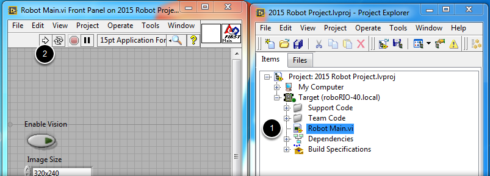

.. include:: <isonum.txt>

Creating your Benchtop Test Program (LabVIEW)
=============================================

This document covers how to create, build and load an FRC\ |reg| LabVIEW program onto a roboRIO. Before beginning, make sure that you have installed LabVIEW for FRC and the FRC Driver Station and that you have configured and imaged your roboRIO as described previously.

Creating a Project
------------------

.. image:: /docs/software/labview/creating-robot-programs/images/creating-building-and-loading-your-benchtop-test-program/creating-a-project.png
   :alt: Creating a new roboRIO project from the LabVIEW home screen.

Launch LabVIEW and click the FRC roboRIO Robot Project link in the Projects window to display the Create New FRC Robot Project dialog box.

Configuring Project
-------------------

.. image:: /docs/software/labview/creating-robot-programs/images/creating-building-and-loading-your-benchtop-test-program/configuring-project.png
   :alt: The different sections of the dialog for configuring a new LabVIEW project.

Fill in the Create New FRC Project Dialog:

1. Pick a name for your project
2. Select a folder to place the project in.
3. Enter your team number
4. Select a project type. If unsure, select Arcade Drive - roboRIO.
5. Click Finish

Running the Program
-------------------

1. In the Project Explorer window, double-click the Robot Main.vi item to open the Robot Main VI.
2. Click the Run button (White Arrow on the top ribbon) of the Robot Main VI to deploy the VI to the roboRIO. LabVIEW deploys the VI, all items required by the VI, and the target settings to memory on the roboRIO. If prompted to save any VIs, click Save on all prompts.
3. Click the Abort button of the Robot Main VI. Notice that the VI stops. When you deploy a program with the Run button, the program runs on the roboRIO, but you can manipulate the front panel objects of the program from the host computer.

.. note:: A program deployed in this manner will not remain on the roboRIO after a power cycle. To deploy a program to run every time the roboRIO starts follow the next step, Deploying the program.

Deploying the program
---------------------

.. image:: /docs/software/labview/creating-robot-programs/images/creating-building-and-loading-your-benchtop-test-program/deploying-the-program.png
   :alt: Right clicking on the robot build specification and choosing "build".  Then right clicking again and choosing "Run as startup".

To run in the competition, you will need to deploy a program to your roboRIO. This allows the program to survive across reboots of the controller, but doesn't allow the same debugging features (front panel, probes, highlight execution) as running from the front panel. To deploy your program:

1. In the Project Explorer, click the + next to Build Specifications to expand it.
2. Right-click on FRC Robot Boot-up Deployment and select Build. Wait for the build to complete.
3. Right-click again on FRC Robot Boot-Up Deployment and select Run as Startup. If you receive a conflict dialog, click OK. This dialog simply indicates that there is currently a program on the roboRIO which will be terminated/replaced.
4. Either check the box to close the deployment window on successful completion or click the close button when the deployment completes.
5. The roboRIO will automatically start running the deployed code within a few seconds of the dialog closing.
