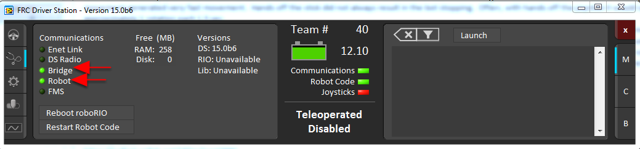

.. include:: <isonum.txt>

Running your Benchtop Test Program
==================================

Overview
--------

You should create and download a Benchtop Test Program as described for your programming language:

:ref:`C++/Java <docs/zero-to-robot/step-4/creating-benchtop-test-program-cpp-java:Creating your Benchtop Test Program (C++/Java)>`

:ref:`LabVIEW <docs/zero-to-robot/step-4/creating-benchtop-test-program-labview:Creating your Benchtop Test Program (LabVIEW)>`

Tethered Operation
------------------

Running your benchtop testing program while tethered to the Driver Station via ethernet or USB cable will confirm the program was successfully deployed and that the driver station and roboRIO are properly configured.

The roboRIO should be powered on and connected to the PC over Ethernet or USB.

Starting the FRC Driver Station
-------------------------------

.. image:: /docs/software/driverstation/images/driver-station/ds-icon.png
    :alt: The Driver Station icon found on the desktop.

The FRC\ |reg| Driver Station can be launched by double-clicking the icon on the Desktop or by selecting Start->All Programs->FRC Driver Station.

Setting Up the Driver Station
-----------------------------

.. image:: /docs/software/driverstation/images/driver-station/ds-setup.png
    :alt: Using the 3rd tab with the gear of the Driver Station to set the team number.

The DS must be set to your team number in order to connect to your robot. In order to do this click the Setup tab then enter your team number in the team number box. Press return or click outside the box for the setting to take effect.

PCs will typically have the correct network settings for the DS to connect to the robot already, but if not, make sure your Network adapter is set to DHCP.

Confirm Connectivity
--------------------

.. figure:: images/run-benchtop-test/confirm-connectivity-tethered.png

    Tethered

    Wireless

Using the Driver Station software, click Diagnostics and confirm that the Enet Link (or Robot Radio led, if operating wirelessly) and Robot leds are green.

Operate the Robot
-----------------

.. image:: images/run-benchtop-test/run-robot.png
    :alt: Highlights the different sections of the Drive Tab (1st)

Click the Operation Tab

1. Confirm that battery voltage is displayed
2. Communications, Robot Code, and Joysticks indicators are green.
3. Put the robot in Teleop Mode
4. Click Enable. Move the joysticks and observe how the robot responds.
5. Click Disable

Wireless Operation
------------------

Before attempting wireless operation, tethered operation should have been confirmed as described in `Tethered Operation`_. Running your benchtop testing program while connected to the Driver Station via WiFi will confirm that the access point is properly configured.

Configuring the Access Point
^^^^^^^^^^^^^^^^^^^^^^^^^^^^

See the article :ref:`Programming your radio <docs/zero-to-robot/step-3/radio-programming:Programming your Radio>` for details on configuring the robot radio for use as an access point.

After configuring the access point, connect the driver station wirelessly to the robot. The SSID will be your team number (as entered in the Bridge Configuration Utility). If you set a key when using the Bridge Configuration Utility you will need to enter it to connect to the network. Make sure the computer network adapter is set to DHCP ("Obtain an IP address automatically").

You can now confirm wireless operation using the same steps in **Confirm Connectivity** and **Operate the Robot** above.
