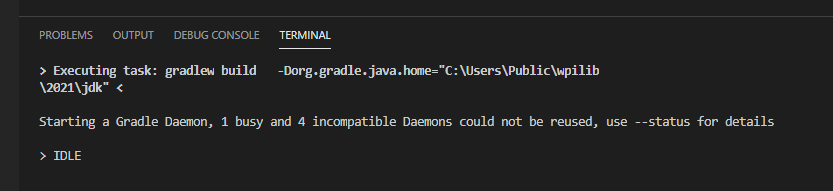
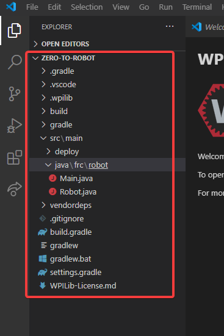

Understanding Your Project
==========================

Before we get into the heart of programming your robot, it is important to understand the structure and classes of the default ``TimedRobot``. 

Initial Build
-------------

When your project is first created, you may notice some text in a commandline box at the bottom of the VS Code window. Projects run a build on first creation, and whenever changes are made to the configuration (like adding a vendordep).

Wait for this window to disappear or show :guilabel:`BUILD SUCCESSFUL` before beginning work on your project.

Left-Hand Sidebar
-----------------

The sidebar is the method we will use to navigate through our project. Content in the ``src`` directory contain classes that we will modify to contain our robot project.

.. danger:: It is important to not modify any of the essential top-level files such as: ``build.gradle``, ``gradlew``, ``gradlew.bat``, etc. Modification of these is only recommended for advanced users!

Next Step
---------

Let's click into ``Robot.java`` or ``Robot.cpp`` and begin programming our robot! Be sure to add any necessary :doc:`3rd-party-libaries <vendordeps>` before continuing!
